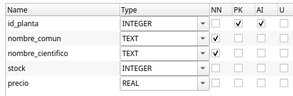

# 2. Acceso a Bases de Datos relacionales

## 2.1. Introducción
Las bases de datos relacionales son esenciales en el desarrollo de aplicaciones modernas. Su integración con una aplicación requiere realizar una  **conexión** al sistema gestor de base de datos (SGBD) desde el lenguaje de programación. Este tema se centra en cómo realizar esa conexión, cómo trabajar con datos mediante sentencias SQL y cómo aplicar buenas prácticas, como el cierre de recursos, el uso de transacciones y procedimientos almacenados.

Una **base de datos relacional** es un sistema de almacenamiento de información que **organiza los datos en tablas**. Cada tabla representa una entidad (por ejemplo, clientes, productos, facturas) y está compuestas por filas y columnas, donde cada fila representa un registro único y cada columna contiene un atributo específico de ese registro. Estas bases de datos (BD) siguen el **Modelo Relacional**, desarrollado por Edgar F. Codd en la década de 1970, y permite establecer vínculos o **relaciones entre diferentes tablas** mediante **claves primarias y foráneas**, facilitando así la integridad, la coherencia y la eficiencia en el manejo de grandes volúmenes de datos.

Ejemplo de tabla `clientes`:

| id_cliente | nombre   | ciudad     |
|------------|----------|------------|
| 1          | Pol      | Castellón  |
| 2          | Eli      | Valencia   |


La **Clave primaria (Primary Key)** es una columna (o conjunto de columnas) que **identifica de forma única** cada fila de una tabla. En el ejemplo: `id_cliente` es clave primaria en la tabla `clientes`.

La **Clave foránea (Foreign Key)** es una columna que **hace referencia a una clave primaria de otra tabla** para establecer una relación. Por ejemplo, en otra tabla llamada `facturas`, el campo `id_cliente` puede ser clave foránea que apunta al campo id_clientes de la tabla `clientes`.

Ejemplo de tabla `facturas`:

| id_factura | id_cliente | fecha     |
|------------|------------|------------|
| 1          | 1          | 2025-09-18  |
| 2          | 1          | 2025-09-18   |

El lenguaje **SQL (Structured Query Language)** se utiliza para gestionar bases de datos relacionales ya que gracias a él se pueden crear, modificar, consultar y eliminar datos de forma sencilla y estandarizada. Es lo que se denomina **CRUD**, es decir, **C**reate (crear), **R**ead (Leer), **U**pdate (Actualizar) y **D**elete (Borrar). Esto lo convierte en la opción preferida para una amplia variedad de aplicaciones empresariales y tecnológicas. 

Algunos de sus comandos básicos son:

- `SELECT`: consultar datos
- `INSERT`: añadir registros
- `UPDATE`: modificar datos existentes
- `DELETE`: eliminar registros
- `CREATE`: definir tablas, claves, relaciones, etc.

 
Un ejemplo sencillo de consulta podría ser:

    SELECT nombre FROM clientes WHERE ciudad = 'Valencia';


<span class="mi_h3">Tipos de SGBD relacionales</span>

Conocer qué **tipo de gestor de base de datos** se está utilizando es esencial para poder **conectar** correctamente desde una aplicación, ya que cada uno necesita su propio conector o driver. Podemos encontrar:

**1. Gestores independientes (cliente-servidor): PostgreSQL, MySQL, Oracle, SQL Server...**

- Sistemas robustos y escalables, ideales para entornos multi-usuario y aplicaciones web.
- Requieren un servidor dedicado y una configuración más compleja.
- Casos de uso: aplicaciones web, servicios empresariales, sistemas con alta demanda de acceso concurrente.
  
  
**2. Gestores embebidos: SQLite, H2, Derby...**

- Base de datos ligera, sin servidor, ideal para aplicaciones móviles o de escritorio donde no se requiere gestión centralizada.
- Fácil de configurar y desplegar, ya que la base de datos reside en un archivo local.
- Casos de uso: aplicaciones de escritorio, móviles, prototipos, pruebas unitarias.

!!! warning "Práctica 1: Crea tu base de datos" 
    A partir del fichero de información utilizado en el proyecto de la unidad anterior, crea una base de datos SQLite **nombre_de_tu_BD.sqlite** con una tabla que contenga la información del fichero.


## 2.2. Conexión a un SGBD

Cuando desarrollamos aplicaciones que trabajan con información persistente, necesitamos acceder a BD para consultar, insertar, modificar o eliminar datos. Existen dos formas principales de hacerlo desde el código: 

  - Acceso mediante ORM (Object-Relational Mapping).
  - Acceso mediante conectores.


<span class="mi_h3">Acceso mediante ORM</span>

Un **ORM** es una herramienta que permite trabajar con la base de datos como si fuera un conjunto de objetos, evitando tener que escribir directamente SQL. El **ORM** se encarga de mapear las tablas a clases y los registros a objetos, y traduce automáticamente las operaciones del código a consultas SQL. Es ideal para trabajar de forma más productiva en aplicaciones complejas. Sus principales características son:

 - Se trabaja con clases en lugar de tablas SQL.
 - Ahorra mucho código repetitivo.
 - Ideal para proyectos medianos o grandes que requieren mantener muchas entidades.

**Algunos ejemplos de ORMs**

ORM / Framework|	Lenguaje|	Descripción
---------------|---------|-----------------
Hibernate|	Java/Kotlin|	El ORM más utilizado con JPA
Exposed|	Kotlin|	ORM ligero y expresivo creado por JetBrains
Spring Data JPA|	Java/Kotlin|	Abstracción que automatiza el acceso a datos
Room|	Java/Kotlin|	ORM oficial para bases de datos SQLite en Android    

**JPA** (Java Persistence API) es una especificación estándar de Java que define cómo se deben mapear objetos Java (o Kotlin) a tablas de bases de datos relacionales. Es decir, permite gestionar la persistencia de datos de forma orientada a objetos, sin necesidad de escribir SQL directamente. Es el estándar utilizado por las herramientas ORM como Hibernate, EclipseLink, o Spring Data JPA.


<span class="mi_h3">Acceso mediante conectores</span>

Un **conector** (también llamado driver) es una librería software que permite que una aplicación se comunique con un gestor de base de datos (SGBD). Actúa como un puente entre nuestro código y la base de datos, traduciendo las instrucciones SQL a un lenguaje que el gestor puede entender y viceversa. Sin un conector, tu aplicación no podría comunicarse con la base de datos.

Una base de datos puede ser accedida desde diferentes orígenes o herramientas, siempre que tengamos:

- Las credenciales de acceso (usuario y contraseña)
- El host/servidor donde se encuentra la base de datos
- El motor de base de datos (PostgreSQL, MySQL, SQLite, etc.)
- Los puertos habilitados y los permisos correctos


Las principales formas de conectarse a una base de datos son las siguientes:

| Medio de conexión                         | Descripción                                                                 |
|-------------------------------------------|-----------------------------------------------------------------------------|
| Aplicaciones de escritorio             | Herramientas gráficas como **DBeaver**, **pgAdmin**, **MySQL Workbench**, **DB Browser for SQLite**. Permiten explorar, consultar y administrar BD de forma visual. |
| Aplicaciones desarrolladas en código   | Programas en **Kotlin**, **Java**, **Python**, **C#**, etc., mediante **conectores** como **JDBC**, **psycopg2**, **ODBC**, etc. para acceder a BD desde código. |
| Línea de comandos                      | Clientes como `psql` (PostgreSQL), `mysql`, `sqlite3`. Permiten ejecutar comandos SQL directamente desde terminal. |
| Aplicaciones web                        | Sitios web que acceden a BD desde el backend (por ejemplo, en Spring Boot, Node.js, Django, etc.). |
| APIs REST o servidores intermedios     | Servicios web que conectan la BD con otras aplicaciones, actuando como puente o capa de seguridad. |
| Aplicaciones móviles                   | Apps Android/iOS que acceden a BD locales (como **SQLite**) o remotas (vía **Firebase**, API REST, etc.). |
| Herramientas de integración de datos   | Software como **Talend**, **Pentaho**, **Apache Nifi** para migrar, transformar o sincronizar datos entre sistemas. |

De todas las formas posibles de interactuar con una base de datos, nos vamos a centrar en el uso de **conectores JDBC (Java Database Connectivity)**. Una aplicación (escrita en Kotlin, Java u otro lenguaje) puede leer, insertar o modificar información almacenada en una base de datos relacional si previamente se ha conectado al sitema gestor de base de datos (SGBD). **JDBC** es una API estándar de Java (y compatible con Kotlin) que permite conectarse a una BD, enviar instrucciones SQL y procesar los resultados manualmente. Es el método de más bajo nivel, pero ofrece un control total sobre lo que ocurre en la BD. Es ideal para aprender los fundamentos del acceso a datos y aprenderlo ayuda a entender mejor lo que hace un ORM por debajo. 

Sus principales características son:

 - El programador escribe directamente las consultas SQL.
 - Requiere gestionar manualmente conexiones, sentencias y resultados.
 - Se necesita un driver específico (conector) para cada SGBD:


A continuación se muestra su sintaxis general. Aunque puede variar según el SGBD con el que se trabaje. Por ejemplo en SQLite no se necesita usuario ni contraseña ya que es una base de datos local y embebida:

    jdbc:<gestor>://<host>:<puerto>/<nombre_base_datos>


**Algunos ejemplos de conectores según el SGBD**

SGBD|	Conector (Driver JDBC)|	URL de conexión típica 
----|-------------------------|-----------------------
PostgreSQL|	org.postgresql.Driver| jdbc:postgresql://host:puerto/nombreBD
MySQL / MariaDB|	com.mysql.cj.jdbc.Driver| jdbc:mysql://host:puerto/nombreBD
SQLite (embebido)|	org.sqlite.JDBC	|jdbc:sqlite:nombreBD

También dependiendo del SGBD será necesario utilizar un **conector JDBC** u otro. Para ello indicaremos la dependencia adecuada en **Gradle** añadiendo las líneas correspondientes en el fichero **build.gradle.kts**. A continuación se muestran las líneas para los SGBD PostgreSQL, MySQL y SQLite.

```
dependencies {
    implementation("org.postgresql:postgresql:42.7.1") //Postgres
    implementation("mysql:mysql-connector-java:8.3.0") //MySQL
    implementation("org.xerial:sqlite-jdbc:3.43.0.0") //SQLite
}
```

<!-- <span class="mi_h2">Conexión a SQLite</span> 
-->


<span class="mis_ejemplos">Ejemplo 1: Conexión a SQLite</span> 

El siguiente ejemplo muestra como conectar a una base de datos **SQLite** llamada `florabotanica.sqlite` que se encuentra en la carpeta `datos` dentro de un proyecto en **Kotlin**.


``` kotlin
import java.io.File
import java.sql.DriverManager

fun main() {
    // Ruta al archivo de base de datos SQLite
    val dbPath = "datos/florabotanica.sqlite"
    val dbFile = File(dbPath)
    println("Ruta de la BD: ${dbFile.absolutePath}")
    val url = "jdbc:sqlite:${dbFile.absolutePath}"

    // Conexión y prueba
    DriverManager.getConnection(url).use { conn ->
        println("Conexión establecida correctamente con SQLite.")
    }
}
```

!!! success "Realiza lo siguiente" 
    1. Crea un proyecto kotlin con gradle o utiliza uno que ya tengas.
    2. Añade las dependencias para trabajar con SQLite.
    3. Descarga el fichero con la base de datos de ejemplo desde el siguiente enlace:
    [florabotanica.sqlite](material/florabotanica.sqlite){:florabotanica.sqlite}
    4. Copia el fichero en la carpeta correcta del proyecto.
    5. Ejecuta el programa y comprueba que la salida por consola es la siguiente:

        <span class="mi_consola">Ruta de la BD: F:\...\src\main\resources\florabotanica.sqlite</span>

        <span class="mi_consola">Conexión establecida correctamente con SQLite</span>


!!! warning "Práctica 2: Crea tu proyecto Gradle y conecta a tu base de datos" 
    1. Crea un nuevo proyecto en Kotlin con Gradle.
    2. Añade las dependencias para trabajar con SQLite.
    3. Crea una carpeta **datos** dentro de tu proyecto y copia en ella la base de datos creada en la práctica anterior.
    4. Añade las líneas de código necesarias para conectar con la BD y muestra un mensaje indicando si se ha conectado correctamente con la BD.


<span class="mi_h3">Organización del código</span>

Cuando se trabaja con bases de datos, una buena opción para organizar el código es tener el código que maneja toda la lógica de BD en un mismo sitio En Kotlin se puede crear un objeto con funciones para que estén disponibles de forma directa en otras partes del programa.

Una de las ventajas de trabajar de esta forma es que evitas repetir código para abrir y cerrar conexiones y, además, si la base de datos cambia de ubicación, solo habrá que actualizar la ruta dentro del código de este objeto no en varios sitios.

También es muy recomendable utilizar los bloques **try-catch-finally** para capturar posibles errores y excepciones.

<span class="mis_ejemplos">Ejemplo 2: Objeto para manejar la conexión</span> 

El siguiente ejemplo es un objeto que maneja la conexión a la BD, en este caso llamado **FlorabotanicaBD.kt** en el que hay tres funciones, una para abrir la conexión, otra para testearla y la última para cerrarla:

``` kotlin
import java.io.File
import java.sql.Connection
import java.sql.DriverManager
import java.sql.SQLException

object FlorabotanicaBD {
    // Ruta al archivo de base de datos SQLite
    private val dbPath = "datos/florabotanica.sqlite"
    private val dbFile = File(dbPath)
    private val url = "jdbc:sqlite:${dbFile.absolutePath}"

    // Obtener conexión
    fun getConnection(): Connection? {
        return try {
            DriverManager.getConnection(url)
        } catch (e: SQLException) {
            e.printStackTrace()
            null
        }
    }

    // Función de prueba: verificar conexión
    fun testConnection(): Boolean {
        return getConnection()?.use { conn ->
            println("Conexión establecida con éxito a ${dbFile.absolutePath}")
            true
        } ?: false
    }

    // Cerrar conexión (para los casos en los que no se utiliza .use)
    fun closeConnection(conn: Connection?) {
        try {
            conn?.close()
            println("Conexión cerrada correctamente.")
        } catch (e: SQLException) {
            println("Error al cerrar la conexión: ${e.message}")
        }
    }
}
```

De esta forma, cuando el programa necesite acceder a la BD llamará a la función de conexión y cuando termine llamará a la función que cierra la conexión. Un ejemplo de estas llamadas podría ser:

``` kotlin
fun main() {
    val conn = FlorabotanicaBD.getConnection()
    if (conn != null) {
        println("Conectado a la BD correctamente.")
        FlorabotanicaBD.closeConnection(conn)
    }
}
```

!!! success "Realiza lo siguiente" 
    Prueba el código de ejemplo y verifica que funciona correctemente.
      
!!! warning "Práctica 3: Organiza el código de tu aplicación" 
    Añade a tu proyecto un fichero .kt (con el nombre que quieras) para crear un objeto que maneje la conexión a la BD, con las tres funciones que has visto en el ejemplo anterior.


<!-- 

## Conexión a PostgreSQL remoto


En entornos reales y profesionales, lo más habitual es trabajar con SGBD más potentes y completos, como **PostgreSQL**.

A continuación, aplicaremos lo aprendido en SQLite, pero ahora trabajando con **PostgreSQL** en **dos contextos distintos**:

- Base de datos **remota**: alojada en un servidor accesible mediante una dirección IP y credenciales.
- Base de datos **local**: replicada en un contenedor **Docker**, lo que resulta ideal para pruebas, desarrollo y aprendizaje en un entorno controlado.

En ambos casos utilizaremos la misma base de datos, llamada geo_ad. Su versión remota estará disponible desde cualquier ubicación, mientras que la local se generará a partir de ella siguiendo unas instrucciones que se os facilitarán. El esquema relacional de `geo_ad` es el siguiente:

**Esquema de la BD geo_ad**


!!!Note "Datos de conexión al servido remoto"      
    **Servidor (host)**: 89.36.214.106  
    **Port**: 5432 (és el port per defecte)  
    **Usuari**: geo_ad  
    **Contrasenya**: geo_ad  
    **Base de dades**: geo_ad  


!!!Note "Intrucciones para replicar la BD en local (Docker)"   
    Las instrucciones para replicar la base de datos en Docker las podéis encontrar en el siguiente enlace: [Instrucciones](https://docs.google.com/document/d/1uU5B9MonTf1KhIOP5PkECIfP-NCSkdzDAo2W33P81Js/edit?tab=t.0)


**Configuración de Dependencias (Gradle)**

Lo primero será incluir las dependencia necesarias en **build.gradle.kts**

        // build.gradle.kts (para PostgreSQL)
        dependencies {
            implementation("org.postgresql:postgresql:42.6.0")
        }

**Conexión al servidor**


**Postgres remoto**

**Ejemplo_conexion_Postgres_remota.kt**

        package Postgres
        import java.sql.DriverManager
        object DatabaseRemota {

            private const val URL =  "jdbc:postgresql://89.36.214.106:5432/geo_ad"
            private const val USER = "geo_ad"
            private const val PASSWORD = "geo_ad"

            fun getConnection() = DriverManager.getConnection(URL, USER, PASSWORD)
        }


## Conexión a PostgreSQL en Docker


**Ejemplo_conexion_Postgres_local.kt**
        
        package Postgres
        import java.sql.DriverManager
        object DatabaseLocal {

            private const val URL =  "jdbc:postgresql://localhost:5432/geo"
            private const val USER = "postgres"
            private const val PASSWORD = "postgres"

            fun getConnection() = DriverManager.getConnection(URL, USER, PASSWORD)
        }


-->

## 2.3. Operaciones sobre la BD

En **JDBC** (Java Database Connectivity), las operaciones sobre la base de datos se realizan  utilizando los siguientes objetos y métodos:

- **Connection**, establece el canal de comunicación con el SGBD (PostgreSQL, MySQL, etc.)

- Los objetos **PreparedStatement** y **CreateStatement** se utlizan para enviar consultas SQL desde el programa a la base de datos. A continuación se muestra una tabla con el uso de cada uno:


| Si necesitas...                                     | Usa...            |
|-----------------------------------------------------|-------------------|
| Consultas sin parámetros                            | `CreateStatement`       |
| Consultas con datos del usuario                     | `PreparedStatement` |
| Seguridad frente a inyecciones SQL                  | `PreparedStatement` |
| Ejecutar muchas veces con distintos valores         | `PreparedStatement` |
| Crear tablas o sentencias SQL complejas que no cambian | `CreateStatement`


- Los métodos **executeQuery()**, **executeUpdate()** y **execute()** se utilizan para ejecutar sentencias SQL, pero se usan en contextos diferentes. A continuación se muestra una tabla con el uso de cada uno:


Método|	Uso principal|	Tipo de sentencia SQL|	Resultado que devuelve
------|--------------|-----------------------|------------------------
**executeQuery()**|	Realizar consultas|	SELECT|	Objeto  **ResultSet** con el resultado de la consulta SQL. Permite recorrer fila a fila el conjunto de resultados, accediendo a cada campo por nombre o por posición
**executeUpdate()**|Realizar modificaciones|	INSERT, UPDATE, DELETE, DDL (CREATE, DROP, etc.)|	Entero con el número de filas afectadas
**execute()**|No se sabe de antemano qué tipo de sentencia SQL se va a ejecutar (consulta o modificación)| Sentencias SQL que pueden devolver varios resultados| Booleano **true** si el resultado es un ResultSet (SELECT) y **false** si el resultado es un entero (INSERT, UPDATE, DELETE,CREATE, ALTER)


<span class="mi_h3">Buenas prácticas</span>

**Liberación de recursos**

Cuando una aplicación accede a una base de datos, abre varios recursos internos que consumen memoria y conexiones activas en el sistema:

- La conexión con el servidor de base de datos (Connection).
- Las sentencias SQL preparadas (Statement o PreparedStatement).
- El resultado de la consulta (ResultSet).

Estos recursos no se liberan automáticamente cuando se termina su uso (especialmente en Java o Kotlin con JDBC). Si no se cierran correctamente, se pueden producir problemas como:

- Fugas de memoria.
- Bloqueo de conexiones (demasiadas conexiones abiertas).
- Degradación del rendimiento.
- Errores inesperados en la aplicación.

Para liberar estos recursos hay dos opciones:

**1. Utilización de .use { ... }**

Se recomienda utilizarlo si:

- Estás trabajando con un recurso que implementa AutoCloseable (Connection, Statement, ResultSet, File, etc.).

- Solo necesitas abrir, usar y cerrar el recurso de forma automática.

- No necesitas lógica compleja de manejo de excepciones dentro del mismo bloque.

Ventajas:

- Código más limpio y legible.

- Cierra automáticamente el recurso aunque ocurra una excepción.

- Evita errores de olvidar close().


**2. Usar try–catch–finally manual**

Cuándo:

- No estás en Kotlin o no puedes usar .use.

- Necesitas capturar y manejar excepciones dentro del mismo método.

- Necesitas lógica extra antes o después de cerrar el recurso (por ejemplo, reintentos, logging detallado, liberar múltiples recursos en un orden específico).

- Estás trabajando en un proyecto que sigue un estilo más clásico de Java.


<span class="mis_ejemplos">Ejemplo 3: Utilización de .use</span> 

A continuación se muestra un **ejemplo con .use (sin necesidad de closeConnection)** que utiliza la función `getConnection` declarada en **FlorabotanicaBD.kt** para abrir la conexión de forma que:

- **conn.use { ... }** cierra la conexión automáticamente al final del bloque.

- **stmt.use { ... }** cierra el Statement automáticamente.

- **ResultSet** se cierra cuando cierras el Statement.

``` kotlin
fun main() {
    FlorabotanicaBD.getConnection()?.use { conn ->
        println("Conectado a la BD")

        conn.createStatement().use { stmt ->
            val rs = stmt.executeQuery("SELECT * FROM plantas")
            while (rs.next()) {
                println("${rs.getString("nombre_comun")}")
            }
        }
    } ?: println("No se pudo conectar")
}
```

!!! success "Realiza lo siguiente" 
    Prueba el código de ejemplo y verifica que funciona correctemente.


<span class="mis_ejemplos">Ejemplo 4: Utilización de close()</span> 

Si no utilizas **use {}** en Kotlin, entonces debes cerrar manualmente cada uno de los recursos abiertos (ResultSet, Statement y Connection) utilizando **close()**, y normalmente deberías hacerlo dentro de un bloque **finally** para garantizar su cierre incluso si ocurre un error. El orden correcto de cierre es del más interno al más externo. A continuación tienes un ejemplo equivalente al ejemplo anterior pero sin utilizar **.use**:

``` kotlin
import java.sql.Connection
import java.sql.Statement
import java.sql.ResultSet

fun main() {
    var conn: Connection? = null
    var stmt: Statement? = null
    var rs: ResultSet? = null

    try {
        conn = FlorabotanicaBD.getConnection()
        if (conn != null) {
            println("Conectado a la BD")

            stmt = conn.createStatement()
            rs = stmt.executeQuery("SELECT * FROM plantas")

            while (rs.next()) {
                println("${rs.getString("nombre_comun")}")
            }
        } else {
            println("No se pudo conectar")
        }
    } catch (e: Exception) {
        e.printStackTrace()
    } finally {
        try {
            rs?.close()
            stmt?.close()
            conn?.close()
            println("Conexión cerrada correctamente")
        } catch (e: Exception) {
            println("Error al cerrar los recursos: ${e.message}")
        }
    }
}
```


!!! success "Realiza lo siguiente" 
    Prueba el código de ejemplo y verifica que funciona correctemente.


**Objetos de acceso a datos (DAO)**
Otra buena práctica es crear un objeto para manejar las diferentes operaciones CRUD de acceso a los datos. Es el Data Access Object (DAO) y algunas de las ventajas de utilizar estos objetos son las siguientes:

- Organización: todo el código SQL está en un único lugar.
- Reutilización: puedes llamar a PlantasDAO.listarPlantas() desde distintos sitios sin repetir la consulta.
- Mantenibilidad: si cambia la base de datos, solo tocas el DAO.
- Claridad: el resto de tu app se lee mucho más limpio, sin SQL mezclado.


<span class="mis_ejemplos">Ejemplo 5: DAO en SQlite</span> 

El siguiente ejemplo es el DAO para la tabla `plantas` de la BD `florabotanica.sqlite` en la que se utiliza el código de conexión del objeto **FlorabotanicaBD.kt**. La estructura de la tabla `plantas` es la siguiente:



Se utiliza un data class con la misma estructura que la tabla `plantas` y su código se guarda en el archivo **Planta.kt**:

``` kotlin
data class Planta(
    val id_planta: Int? = null, // lo genera SQLite automáticamente
    val nombreComun: String,
    val nombreCientifico: String,
    val stock: Int,
    val precio: Double
)
```

También se declaran funciones para leer la información de la tabla, añdir registros nuevos, modificar la información existenete y borrarla. El código se escribe en el archivo **PlantasDAO.kt** y es el siguiente:

``` kotlin
object PlantasDAO {

    fun listarPlantas(): List<Planta> {
        val lista = mutableListOf<Planta>()
        FlorabotanicaBD.getConnection()?.use { conn ->
            conn.createStatement().use { stmt ->
                val rs = stmt.executeQuery("SELECT * FROM plantas")
                while (rs.next()) {
                    lista.add(
                        Planta(
                            id_planta = rs.getInt("id_planta"),
                            nombreComun = rs.getString("nombre_comun"),
                            nombreCientifico = rs.getString("nombre_cientifico"),
                            stock = rs.getInt("stock"),
                            precio = rs.getDouble("precio")
                        )
                    )
                }
            }
        } ?: println("No se pudo establecer la conexión.")
        return lista
    }


    // Consultar planta por ID
    fun consultarPlantaPorId(id: Int): Planta? {
        var planta: Planta? = null
        FlorabotanicaBD.getConnection()?.use { conn ->
            conn.prepareStatement("SELECT * FROM plantas WHERE id_planta = ?").use { pstmt ->
                pstmt.setInt(1, id)
                val rs = pstmt.executeQuery()
                if (rs.next()) {
                    planta = Planta(
                        id_planta = rs.getInt("id_planta"),
                        nombreComun = rs.getString("nombre_comun"),
                        nombreCientifico = rs.getString("nombre_cientifico"),
                        stock = rs.getInt("stock"),
                        precio = rs.getDouble("precio")
                    )
                }
            }
        } ?: println("No se pudo establecer la conexión.")
        return planta
    }


    fun insertarPlanta(planta: Planta) {
        FlorabotanicaBD.getConnection()?.use { conn ->
            conn.prepareStatement(
                "INSERT INTO plantas(nombre_comun, nombre_cientifico, stock, precio) VALUES (?, ?, ?, ?)"
            ).use { pstmt ->
                pstmt.setString(1, planta.nombreComun)
                pstmt.setString(2, planta.nombreCientifico)
                pstmt.setInt(3, planta.stock)
                pstmt.setDouble(4, planta.precio)
                pstmt.executeUpdate()
                println("Planta '${planta.nombreComun}' insertada con éxito.")
            }
        } ?: println("No se pudo establecer la conexión.")
    }

    fun actualizarPlanta(planta: Planta) {
        if (planta.id_planta == null) {
            println("No se puede actualizar una planta sin id.")
            return
        }
        FlorabotanicaBD.getConnection()?.use { conn ->
            conn.prepareStatement(
                "UPDATE plantas SET nombre_comun = ?, nombre_cientifico = ?, stock = ?, precio = ? WHERE id_planta = ?"
            ).use { pstmt ->
                pstmt.setString(1, planta.nombreComun)
                pstmt.setString(2, planta.nombreCientifico)
                pstmt.setInt(3, planta.stock)
                pstmt.setDouble(4, planta.precio)
                pstmt.setInt(5, planta.id_planta)
                val filas = pstmt.executeUpdate()
                if (filas > 0) {
                    println("Planta con id=${planta.id_planta} actualizada con éxito.")
                } else {
                    println("No se encontró ninguna planta con id=${planta.id_planta}.")
                }
            }
        } ?: println("No se pudo establecer la conexión.")
    }

    fun eliminarPlanta(id: Int) {
        FlorabotanicaBD.getConnection()?.use { conn ->
            conn.prepareStatement("DELETE FROM plantas WHERE id_planta = ?").use { pstmt ->
                pstmt.setInt(1, id)
                val filas = pstmt.executeUpdate()
                if (filas > 0) {
                    println("Planta con id=$id eliminada correctamente.")
                } else {
                    println("No se encontró ninguna planta con id=$id.")
                }
            }
        } ?: println("No se pudo establecer la conexión.")
    }
}

```

La llamada a estas funciones desde **main.kt** podría ser:

``` kotlin
fun main() {

    // Listar todas las plantas
    println("Lista de plantas:")
    PlantasDAO.listarPlantas().forEach {
        println(" - [${it.id_planta}] ${it.nombreComun} (${it.nombreCientifico}), stock ${it.stock} unidades, precio: ${it.precio} €")
    }

    // Consultar planta por ID
    val planta = PlantasDAO.consultarPlantaPorId(3)
    if (planta != null) {
        println("Planta encontrada: [${planta.id_planta}] ${planta.nombreComun} (${planta.nombreCientifico}), stock ${planta.stock} unidades, precio: ${planta.precio} €")
    } else {
        println("No se encontró ninguna planta con ese ID.")
    }

    // Insertar plantas
    PlantasDAO.insertarPlanta(
        Planta(
            nombreComun = "Palmera",
            nombreCientifico = "Arecaceae",
            stock = 2,
            precio = 50.5
        )
    )

    // Actualizar planta con id=1
    PlantasDAO.actualizarPlanta(
        Planta(
            id_planta = 1,
            nombreComun = "Aloe Arborescens",
            nombreCientifico = "Aloe barbadensis miller",
            stock = 20,
            precio = 5.8
        )
    )

    // Eliminar planta con id=2
    PlantasDAO.eliminarPlanta(2)
}


```

!!! success "Realiza lo siguiente" 
    Prueba el código de ejemplo y verifica que funciona correctemente.

!!! warning "Práctica 4: Trabaja con tu base de datos" 
    1. Añade a tu proyecto un objetos de acceso a datos (DAO) para manejar las diferentes operaciones CRUD de tu aplicación.
    2. Utiliza .use en todas tus operaciones para asegurarte de que se cierran correctamente todos los recursos.
    3. Añade llamadas desde tu función **main** a todas las operaciones CRUD que acabas de crear y comrpueba que todas funcionan correctamente.


<!--


**Consultas complejas: JOIN, filtros y ordenaciones**

**Ejemplo_join.kt**: Este ejemplo obtiene las líneas de factura con nombre del artículo y ordenado por numero de factura y línea.

        package SQLite
        import java.sql.DriverManager

        fun main() {
            val dbPath = "src/main/resources/Tienda.sqlite"
            val dbFile = java.io.File(dbPath)
            val url = "jdbc:sqlite:${dbFile.absolutePath}"

            DriverManager.getConnection(url).use { conn ->

                val sql = """
                    SELECT lf.num_f, lf.num_l, lf.cod_a, a.descrip, lf.quant, lf.preu
                    FROM linia_fac lf
                    JOIN article a ON lf.cod_a = a.cod_a
                    ORDER BY lf.num_f, lf.num_l
                """.trimIndent()

                conn.prepareStatement(sql).use { stmt ->
                    stmt.executeQuery().use { rs ->
                        println("Líneas de factura:")
                        println("Factura | Línea | Artículo | Descripción | Cantidad | Precio")

                        while (rs.next()) {
                            val numF = rs.getInt("num_f")
                            val numL = rs.getInt("num_l")
                            val codA = rs.getString("cod_a")
                            val descrip = rs.getString("descrip")
                            val quant = rs.getInt("quant")
                            val preu = rs.getDouble("preu")

                            println("$numF\t$numL\t$codA\t$descrip\t$quant\t$preu")
                        }
                    }
                }
            }
        }


-->


<!--

## Ejemplos en PostgreSQL


!!!Tip "Kotlin - Instrucciones"
    En el proyecto `BDRelacionales` crearemos un **paquete** llamado `Postgres`, donde incluiremos los ejemplos de este apartado.   
   
    


**Read (SELECT)**   

**Ejemplo_Select.kt**

            package Postgres
            fun main(args: Array<String>) {
            val sql = "SELECT * FROM institut"

            DatabaseLocal.getConnection().use { conn ->    // DatabaseRemota si se conecta al servidor del instituto
                    conn.prepareStatement(sql).use { stmt ->
                    stmt.executeQuery().use { rs ->

                        while (rs.next()) {
                            print("" + rs.getString(1) + "\t")
                            println(rs.getString(2))
                        }
                    }
                }
                }
             }


---

**Create (INSERT)**{.verde}  
El siguiente ejemplo inserta un istituto de prueba.

**Ejemplo_Insert.kt**

        package Postgres
        fun main(args: Array<String>) {

            val sql ="INSERT INTO institut (codi,nom,adreca,numero,codpostal,cod_m) VALUES(?,?,?,?,?,?)"

            DatabaseLocal.getConnection().use { conn ->

                conn.prepareStatement(sql).use { stmt ->
                    stmt.setString(1, "00000000")
                    stmt.setString(2, "IES PRUEBA")
                    stmt.setString(3, "CASTELLÓN")
                    stmt.setString(4, "S/N")
                    stmt.setInt(5, 12560)
                    stmt.setInt(6, 12040)
                    stmt.executeUpdate()
                }
            }
        }


**Update (UPDATE)**{.verde}    
El siguiente ejemplo actualiza el campo nombre del instituto de prueba insertado. 

**Ejemplo_Update.kt**

        package Postgres
        fun main() {
            val sql = "UPDATE institut SET nom = ? WHERE codi = ?"

            DatabaseLocal.getConnection().use { conn ->

                conn.prepareStatement(sql).use { stmt ->
                    stmt.setString(1, "IES PRUEBA 2")
                    stmt.setString(2, "00000000")
                    stmt.executeUpdate()
                }
            }
        }


**Delete (DELETE)**{.verde}   
El siguiente ejemplo elimina el instituto de prueba insertado.  

**Ejemplo_Delete.kt**
        
        package Postgres
        fun main() {
            val sql = "DELETE FROM institut WHERE codi = ?"

            DatabaseLocal.getConnection().use { conn ->

                conn.prepareStatement(sql).use { stmt ->
                    stmt.setString(1, "00000000")
                    stmt.executeUpdate()
                }
            }
        }


-->


## 2.4. Transacciones y excepciones

<span class="mi_h3">Transacciones</span>

Una transacción es una secuencia de una o más operaciones sobre una base de datos que deben ejecutarse como una unidad indivisible. El objetivo es asegurar que todas las operaciones se completen con éxito o, en caso de fallo, ninguna de ellas se aplique, manteniendo así la base de datos en un estado consistente. Por ejemplo, en una transferencia bancaria, si falla el abono en una cuenta, se cancela el débito en la otra.

Las transacciones se gestionan mediante comandos como BEGIN TRANSACTION (para iniciar), COMMIT (para confirmar los cambios) y ROLLBACK (para deshacer los cambios en caso de error). Este mecanismo protege la base de datos frente a fallos parciales y situaciones de concurrencia, asegurando que los datos siempre reflejen una realidad válida y coherente.


**Propiedades de una transacción (ACID)**

Las transacciones garantizan propiedades fundamentales, conocidas por el acrónimo ACID:

Propiedad|	Significado breve
---------|-------------------
Atomicidad|	Todas las operaciones se ejecutan o ninguna lo hace
Consistencia|	El sistema pasa de un estado válido a otro
Isolación|	No interfiere con otras transacciones simultáneas
Durabilidad| Una vez confirmada, el cambio permanece


**Comandos clave**

Para controlar correctamente una transacción desde el código, necesitamos usar tres comandos clave:


- **commit()**: Confirma los cambios realizados por la transacción, haciéndolos permanentes.
- **rollback()**: Revierte todos los cambios realizados durante la transacción actual, volviendo al estado anterior.

Por defecto, muchas conexiones JDBC están en modo **auto-commit**, es decir, cada operación se ejecuta y confirma automáticamente. Para usar transacciones de forma manual, debes desactivar este modo:

        conexion.autoCommit = false


<span class="mi_h3">Excepciones</span>

El manejo de excepciones en las transacciones es absolutamente necesario para garantizar que los datos de la base de datos no queden en un estado inconsistente o corrupto cuando ocurre un error durante una operación.

Una transacción sin control de errores no es una transacción segura. Siempre hay que estar preparado para deshacer todo si algo sale mal.

Cuando realizamos varias operaciones dentro de una misma transacción (por ejemplo, una transferencia bancaria), pueden ocurrir errores como:

- un fallo de conexión,
- un ID incorrecto,
- un valor nulo inesperado,
- un error lógico como saldo insuficiente.
  
Si no controlamos esos errores, la base de datos podría:

- Aplicar solo algunas de las operaciones
- Dejar datos parcialmente modificados
- Generar resultados incorrectos para otros usuarios

Para evitarlo se utiliza un bloque **try-catch** que:

- Llama a commit() si todo sale bien
- Llama a rollback() si ocurre cualquier excepción

``` kotlin
        try {
            conexion.autoCommit = false

            // Varias operaciones SQL...
            conexion.commit()  // Todo bien
        } catch (e: Exception) {
            conexion.rollback()  // Algo falló → revertir
            println("Error en la transacción. Cambios anulados.")
        }
``` 


<span class="mis_ejemplos">Ejemplo 6: commit y rollback</span> 

Para el siguiente ejemplo se ha ampliado la BD con dos tablas: `jardines`y  `jardines_plantas` la estructura de estas tablas es la siguiente:


Supongamos que queremos llevar varias unidades de una planta a un jardín. El programa debe actualizar el stock en la tabla `plantas` (restando las unidades que llevamos al jardín) en la `tabla` y añadir un registro en la tabla `jardines_plantas` indicando el jadín, la planta y la cantidad. Ambas operaciones deben realizarse juntas, o no realizarse ninguna. El código sería el siguiente:

``` kotlin
import java.sql.SQLException

fun llevarPlantasAJardin(id_jardin: Int, id_planta: Int, cantidad: Int) {
    FlorabotanicaBD.getConnection()?.use { conn ->
        try {
            conn.autoCommit = false  // Iniciar transacción manual

            // Restar stock a la planta
            val stock = conn.prepareStatement("UPDATE plantas SET stock = stock - $cantidad WHERE id_planta = ?")
            stock.setInt(1, id_planta)
            stock.executeUpdate()

            // Añadir línea en tabla jardines_plantas
            val plantar = conn.prepareStatement("INSERT INTO jardines_plantas(id_jardin, id_planta, cantidad) VALUES (?, ?, ?)")
            plantar.setInt(1, id_jardin)
            plantar.setInt(2, id_planta)
            plantar.setInt(3, cantidad)
            plantar.executeUpdate()

            // Confirmar cambios
            conn.commit()
            println("Transferencia realizada con éxito.")
        } catch (e: SQLException) {
            if (e.message?.contains("UNIQUE constraint failed") == true) {
                println("Error: intento de insertar clave duplicada")
                conn.rollback()
                println("Transacción revertida.")
            } else {
                throw e // otros errores, relanzamos
            }
        }
    }
}
```

La llamada sería:

``` kotlin
llevarPlantasAJardin(1,5,2)
```

Si no se produce ningún error se hará el `commit` y en caso contrario el `rollback`

!!! success "Realiza lo siguiente" 
    Prueba el código de ejemplo y verifica que funciona correctemente.

!!! warning "Práctica 5: Trabaja con tu base de datos" 
    Añade a tu aplicación alguna funcionalidad parecida a la del ejemplo para poder probar las transacciones sobre tu base de datos.


## 2.5. Funciones y procedimientos almacenados 

Las funciones (FUNCTION) y los procedimientos (PROCEDURE) **no se crean desde el lenguaje Kotlin**, ya que son elementos propios del SGBD. Para definirlos, se utiliza **SQL** y se ejecutan **directamente sobre la base de datos** a través de un cliente SQL.

Tanto **las funciones** como **los procedimientos almacenados** son bloques de código que se guardan en el servidor de la base de datos y que encapsulan una serie de instrucciones SQL.

Se usan para:

- Reutilizar operaciones complejas
- Organizar mejor la lógica de negocio
- Mejorar el rendimiento (menos tráfico entre app y BD)
- Mantener la integridad de datos


**Diferencia entre Funciones y Procedimientos**

Una **función** está diseñada para **calcular y devolver un resultado**. Se puede usar directamente dentro de una consulta SQL como parte de un SELECT, WHERE, ORDER BY, etc. Las funciones siempre devuelven un valor, que puede ser escalar (un número, texto...), una fila o una tabla.

Un **procedimiento** sirve para **ejecutar acciones** dentro de la base de datos, como insertar registros, modificar datos o gestionar operaciones en bloque. **No devuelve un valor directamente** (aunque puede usar parámetros de salida).

Una vez que las funciones o procedimientos están creados en la base de datos, se pueden **utilizar perfectamente desde Kotlin** a través de **JDBC**, igual que se hace con cualquier consulta SQL:

- Las funciones se invocan con **SELECT nombre_funcion(...)**
- Los procedimientos se llaman con **CALL nombre_procedimiento(...)**

Y desde Kotlin, se gestionan mediante objetos como **PreparedStatement** y **CallableStatement**.


!!!Note ""
    **SQLite** no soporta funciones ni procedimientos almacenados como lo hacen bases de datos como PostgreSQL, MySQL u Oracle. Sin embargo, puedes simular su comportamiento mediante funciones definidas en la aplicación, o vistas y triggers.


<!--
## 🔹Funciones (FUNCTION)

Una función en PostgreSQL es un bloque que:

- Puede aceptar parámetros
- Devuelve siempre un valor (escalar, tabla o compuesto)
- Se puede usar en consultas SQL (SELECT, WHERE, etc.)
- Puede tener IN, OUT, INOUT


!!!Warning "Sintaxis básica en PostgreSql"
        CREATE [OR REPLACE] FUNCTION nombre_funcion(parámetros)
        RETURNS tipo_de_dato
        LANGUAGE plpgsql
        AS $$
        BEGIN
            -- instrucciones
            RETURN valor;
        END;
        $$;

| Tipo de retorno                | ¿Qué devuelve?                                        | Ejemplo de uso                                           |
|-------------------------------|--------------------------------------------------------|-----------------------------------------------------------|
| `INTEGER`, `TEXT`, etc.       | Un único valor escalar                                | `RETURNS INTEGER`<br>`RETURN x * x;`                      |
| `TABLE(...)`                  | Una tabla (varias columnas y filas)                   | `RETURNS TABLE(codi TEXT, nom TEXT)`<br>`RETURN QUERY ...`|
| `SETOF INTEGER`               | Un conjunto de valores escalares                      | `RETURNS SETOF INTEGER`<br>`RETURN NEXT i;`              |
| `SETOF RECORD`                | Muchas filas con estructura dinámica                  | `RETURNS SETOF RECORD`                                    |
| `%ROWTYPE`                    | Una fila con la estructura de una tabla existente     | `RETURNS institut%ROWTYPE`<br>`SELECT * INTO reg ...`    |
| `RECORD`                      | Una sola fila con columnas genéricas                  | `RETURNS RECORD`<br>`SELECT ... INTO resultado;`         |
| Tipo personalizado            | Una estructura definida con `CREATE TYPE`             | `RETURNS tipo_personalizado`                             |


!!!Tip ""   
    Los siguientes ejemplos  se han creado utilizando el cliente **SQL DBeaver** y la BD **Geo_docker**.


**Funciones que devuelve un valor**{.azul}:

**Ejemplo en SQL:**{.verde} Función que devuelve el cuadrado de un número.

    CREATE OR REPLACE FUNCTION cuadrado(x INTEGER)
    RETURNS INTEGER
    AS $$
    BEGIN
        RETURN x * x;
    END;
    $$ LANGUAGE plpgsql;

La llamada desde **SQL** sería:

    SELECT cuadrado(5);  --Devuelve 25

**En Kotlin**{.verde} la llamda a la función sería:


**Ejemplo_cuadrado.kt**

       fun main() {

            DatabaseLocal.getConnection().use { conn ->
                val sql = "SELECT cuadrado(?)"

                conn.prepareStatement(sql).use { stmt ->
                    stmt.setInt(1, 6) // por ejemplo: x = 6
                    val rs = stmt.executeQuery()

                    if (rs.next()) {
                        val resultado = rs.getInt(1)
                        println("El cuadrado de 6 es: $resultado")
                    }
                }
            }
        }

**Fucniones que devuelven una tabla**{.azul}

**Ejemplo en SQL:**{.verde} Función que devuelve todos los institutos junto con su población y comarca.


        CREATE OR REPLACE FUNCTION obtener_instituts()
        RETURNS TABLE (
            codi TEXT,
            nom TEXT,
            municipi TEXT,
            comarca TEXT
        )
        AS $$
            SELECT 
                i.codi,
                i.nom,
                p.nom AS municipi,
                c.nom_c AS comarca
            FROM institut i
            JOIN poblacio p ON i.cod_m = p.cod_m
            JOIN comarca c ON p.nom_c = c.nom_c
            ORDER BY comarca, municipi;
        $$ LANGUAGE sql;

La llamada desde **SQL** sería:

        SELECT * FROM obtener_instituts();

**En Kotlin**{.verde} la llamda a la función sería:

**Ejemplo_fun_obtener_institutos.kt**

        fun main() {

           DatabaseLocal.getConnection().use { conn ->
                val sql = "SELECT * FROM obtener_instituts()"

                conn.prepareStatement(sql).use { stmt ->
                    val rs = stmt.executeQuery()
                    while (rs.next()) {
                        val codi = rs.getString("codi")
                        val nom = rs.getString("nom")
                        val municipi = rs.getString("municipi")
                        val comarca = rs.getString("comarca")

                        println("Institut: $codi - $nom ($municipi, $comarca)")
                    }
                }
            }
        }


**Fucniones que aceptan filtros como parámetros**{.azul}

**Ejemplo en SQL:**{.verde} Función que devuelve los institutos de una comarca.


        CREATE OR REPLACE FUNCTION instituts_de_comarca(p_nom_c TEXT)
        RETURNS TABLE (
            codi TEXT,
            nom TEXT,
            municipi TEXT,
            comarca TEXT
        )
        AS $$
            SELECT 
                i.codi,
                i.nom,
                p.nom AS municipi,
                c.nom_c AS comarca
            FROM institut i
            JOIN poblacio p ON i.cod_m = p.cod_m
            JOIN comarca c ON p.nom_c = c.nom_c
            WHERE c.nom_c = p_nom_c
            ORDER BY municipi;
        $$ LANGUAGE sql;

La llamada desde **SQL** sería:

    
        SELECT * FROM instituts_de_comarca('Plana Baixa');

**En Kotlin**{.verde} la llamda a la función sería:
      
**Ejemplo_fun_instituts_de_comarca.kt**

        fun main() {

            DatabaseLocal.getConnection().use { conn ->
                val sql = "SELECT * FROM instituts_de_comarca(?)"

                conn.prepareStatement(sql).use { stmt ->
                    stmt.setString(1, "Plana Baixa") // Parámetro de entrada
                    val rs = stmt.executeQuery()
                    while (rs.next()) {
                        val codi = rs.getString("codi")
                        val nom = rs.getString("nom")
                        val municipi = rs.getString("municipi")
                        val comarca = rs.getString("comarca")

                        println("Institut: $codi - $nom ($municipi, $comarca)")
                    }
                }
            }
        }

## 🔹Procedimientos (PROCEDURE)


Los procedimientos no devuelven valores directamente, a diferencia de las funciones, pero pueden tener parámetros de entrada (IN), salida (OUT) o ambos (INOUT). Se utilizan para realizar tareas como:

- Inserciones o actualizaciones complejas
- Validaciones
- Operaciones en bloque
- Ejecución de lógica con control de flujo
- Agrupación de instrucciones dentro de una transacción

!!!Warning "Sintaxis básica en PostgreSql"
        CREATE [OR REPLACE] PROCEDURE nombre_procedimiento(
            [parámetro1 tipo [IN|OUT|INOUT]],
            ...
        )
        AS $$
        BEGIN
            -- cuerpo del procedimiento
        END;
        $$ LANGUAGE plpgsql;

**Ejemplo en SQL:**{.verde} Procedimiento que inserta un nuevo instituto y muestra un aviso.

        CREATE OR REPLACE PROCEDURE insertar_institut_resultado(
            IN p_codi VARCHAR,
            IN p_nom VARCHAR,
            IN p_cod_m INTEGER,
            OUT resultado TEXT
        )
        AS $$
        BEGIN
            -- ¿Municipio existe?
            IF NOT EXISTS (SELECT 1 FROM poblacio WHERE cod_m = p_cod_m) THEN
                resultado := 'MUNICIPIO_NO_ENCONTRADO';
                RETURN;
            END IF;

            -- ¿Instituto ya existe?
            IF EXISTS (SELECT 1 FROM institut WHERE codi = p_codi) THEN
                resultado := 'EXISTENTE';
                RETURN;
            END IF;

            -- Insertar instituto
            INSERT INTO institut (codi, nom, cod_m)
            VALUES (p_codi, p_nom, p_cod_m);

            resultado := 'INSERTADO';
        END;
        $$ LANGUAGE plpgsql;

La llamada desde **SQL** sería:

        CALL insertar_institut_resultado('I999', 'Institut Experimental', 12028, NULL);


**En Kotlin**{.verde} la llamda a la función sería:
      
**Ejemplo_pro_insertar_institut_resultado.kt**

        import java.sql.Types

        fun main() {
           DatabaseLocal.getConnection().use { conn ->
                val sql = "Call insertar_institut_resultado(?, ?, ?, ?)"

                conn.prepareCall(sql).use { stmt ->
                    stmt.setString(1, "I999")
                    stmt.setString(2, "Institut Experimental")
                    stmt.setInt(3, 12028)
                    stmt.registerOutParameter(4, Types.VARCHAR)

                    stmt.execute()

                    val resultado = stmt.getString(4)
                    println("Resultado: $resultado")
                }
            }
        }


## 📊 Resumen diferencias entre función y procedimiento en PostgreSQL

| Característica                    | FUNCIÓN (`FUNCTION`)                             | PROCEDIMIENTO (`PROCEDURE`)                        |
|----------------------------------|--------------------------------------------------|----------------------------------------------------|
| 🔁 Devuelve un valor             | ✅ Sí (con `RETURN`)                             | ❌ No directamente                                 |
| 📥 Parámetros de entrada (`IN`)  | ✅ Sí                                             | ✅ Sí                                               |
| 📤 Parámetros de salida (`OUT`)  | ✅ Sí (como `OUT`, `INOUT`, o `RETURNS`)         | ✅ Sí (`OUT`, `INOUT`)                             |
| 📌 Se invoca con…                | `SELECT nombre_funcion(...)`                     | `CALL nombre_procedimiento(...)`                  |
| 📊 Usable en consultas SQL       | ✅ Sí (puede ir en `SELECT`, `WHERE`, etc.)      | ❌ No                                               |
| 🔄 Puede devolver tablas         | ✅ Sí (`RETURNS TABLE` o `SETOF`)                | ❌ No directamente                                 |
| 🔁 Puede usar `RETURN`           | ✅ Obligatorio                                   | ❌ No se usa `RETURN`, sino solo `CALL`            |
| 🧱 Uso típico                    | Cálculos, validaciones, funciones reutilizables | Procesos complejos, lógica de negocio, transacciones |


-->