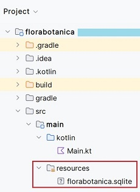
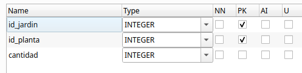
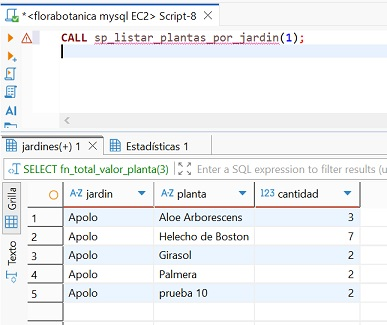

# Unidad 2. Acceso a Bases de Datos relacionales

<span class="mi_h3">Revisiones</span>

| Revisión | Fecha      | Descripción                                  |
|----------|------------|----------------------------------------------|
| 1.0      | 05-10-2025 | Adaptación de los materiales a markdown      |
| 1.1      | 16-10-2025 | Ampliación de ejemplos y prácticas           |


## 2.1. Introducción
Las bases de datos relacionales son esenciales en el desarrollo de aplicaciones modernas. Su integración con una aplicación requiere realizar una  **conexión** al sistema gestor de base de datos (SGBD) desde el lenguaje de programación. Este tema se centra en cómo realizar esa conexión, cómo trabajar con datos mediante sentencias SQL y cómo aplicar buenas prácticas, como el cierre de recursos, el uso de transacciones y procedimientos almacenados.

Una **base de datos relacional** es un sistema de almacenamiento de información que **organiza los datos en tablas**. Cada tabla representa una entidad (por ejemplo, clientes, productos, facturas) y está compuestas por filas y columnas, donde cada fila representa un registro único y cada columna contiene un atributo específico de ese registro. Estas bases de datos (BD) siguen el **Modelo Relacional**, desarrollado por Edgar F. Codd en la década de 1970, y permite establecer vínculos o **relaciones entre diferentes tablas** mediante **claves primarias y foráneas**, facilitando así la integridad, la coherencia y la eficiencia en el manejo de grandes volúmenes de datos.

Ejemplo de tabla `clientes`:

| id_cliente | nombre   | ciudad     |
|------------|----------|------------|
| 1          | Pol      | Castellón  |
| 2          | Eli      | Valencia   |


La **Clave primaria (Primary Key)** es una columna (o conjunto de columnas) que **identifica de forma única** cada fila de una tabla. En el ejemplo: `id_cliente` es clave primaria en la tabla `clientes`.

La **Clave foránea (Foreign Key)** es una columna que **hace referencia a una clave primaria de otra tabla** para establecer una relación. Por ejemplo, en otra tabla llamada `facturas`, el campo `id_cliente` puede ser clave foránea que apunta al campo id_clientes de la tabla `clientes`.

Ejemplo de tabla `facturas`:

| id_factura | id_cliente | fecha     |
|------------|------------|------------|
| 1          | 1          | 2025-09-18  |
| 2          | 1          | 2025-09-18   |

El lenguaje **SQL (Structured Query Language)** se utiliza para gestionar bases de datos relacionales ya que gracias a él se pueden crear, modificar, consultar y eliminar datos de forma sencilla y estandarizada. Es lo que se denomina **CRUD**, es decir, **C**reate (crear), **R**ead (Leer), **U**pdate (Actualizar) y **D**elete (Borrar). Esto lo convierte en la opción preferida para una amplia variedad de aplicaciones empresariales y tecnológicas. 

Algunos de sus comandos básicos son:

- `SELECT`: consultar datos
- `INSERT`: añadir registros
- `UPDATE`: modificar datos existentes
- `DELETE`: eliminar registros
- `CREATE`: definir tablas, claves, relaciones, etc.

 
Un ejemplo sencillo de consulta podría ser:

    SELECT nombre FROM clientes WHERE ciudad = 'Valencia';


<span class="mi_h3">Tipos de SGBD relacionales</span>

Conocer qué **tipo de gestor de base de datos** se está utilizando es esencial para poder **conectar** correctamente desde una aplicación, ya que cada uno necesita su propio conector o driver. Podemos encontrar:

**1. Gestores independientes (cliente-servidor): PostgreSQL, MySQL, Oracle, SQL Server...**

- Sistemas robustos y escalables, ideales para entornos multi-usuario y aplicaciones web.
- Requieren un servidor dedicado y una configuración más compleja.
- Casos de uso: aplicaciones web, servicios empresariales, sistemas con alta demanda de acceso concurrente.
  
  
**2. Gestores embebidos: SQLite, H2, Derby...**

- Base de datos ligera, sin servidor, ideal para aplicaciones móviles o de escritorio donde no se requiere gestión centralizada.
- Fácil de configurar y desplegar, ya que la base de datos reside en un archivo local.
- Casos de uso: aplicaciones de escritorio, móviles, prototipos, pruebas unitarias.

!!! warning "Práctica 1: Crea tu base de datos" 
    A partir del fichero de información utilizado en el proyecto de la unidad anterior, crea una base de datos SQLite **nombre_de_tu_BD.sqlite** con una tabla que contenga la información del fichero. Puedes utilizar [DB Browser for SQLite](db_browser_sqlite.html)


## 2.2. Conexión a un SGBD

Cuando desarrollamos aplicaciones que trabajan con información persistente, necesitamos acceder a BD para consultar, insertar, modificar o eliminar datos. Existen dos formas principales de hacerlo desde el código: 

  - Acceso mediante ORM (Object-Relational Mapping).
  - Acceso mediante conectores.


<span class="mi_h3">Acceso mediante ORM</span>

Un **ORM** es una herramienta que permite trabajar con la base de datos como si fuera un conjunto de objetos, evitando tener que escribir directamente SQL. El **ORM** se encarga de mapear las tablas a clases y los registros a objetos, y traduce automáticamente las operaciones del código a consultas SQL. Es ideal para trabajar de forma más productiva en aplicaciones complejas. Sus principales características son:

 - Se trabaja con clases en lugar de tablas SQL.
 - Ahorra mucho código repetitivo.
 - Ideal para proyectos medianos o grandes que requieren mantener muchas entidades.

**Algunos ejemplos de ORMs**

ORM / Framework|	Lenguaje|	Descripción
---------------|---------|-----------------
Hibernate|	Java/Kotlin|	El ORM más utilizado con JPA
Exposed|	Kotlin|	ORM ligero y expresivo creado por JetBrains
Spring Data JPA|	Java/Kotlin|	Abstracción que automatiza el acceso a datos
Room|	Java/Kotlin|	ORM oficial para bases de datos SQLite en Android    

**JPA** (Java Persistence API) es una especificación estándar de Java que define cómo se deben mapear objetos Java (o Kotlin) a tablas de bases de datos relacionales. Es decir, permite gestionar la persistencia de datos de forma orientada a objetos, sin necesidad de escribir SQL directamente. Es el estándar utilizado por las herramientas ORM como Hibernate, EclipseLink, o Spring Data JPA.


<span class="mi_h3">Acceso mediante conectores</span>

Un **conector** (también llamado driver) es una librería software que permite que una aplicación se comunique con un gestor de base de datos (SGBD). Actúa como un puente entre nuestro código y la base de datos, traduciendo las instrucciones SQL a un lenguaje que el gestor puede entender y viceversa. Sin un conector, tu aplicación no podría comunicarse con la base de datos.

Una base de datos puede ser accedida desde diferentes orígenes o herramientas, siempre que tengamos:

- Las credenciales de acceso (usuario y contraseña)
- El host/servidor donde se encuentra la base de datos
- El motor de base de datos (PostgreSQL, MySQL, SQLite, etc.)
- Los puertos habilitados y los permisos correctos


Las principales formas de conectarse a una base de datos son las siguientes:

| Medio de conexión                         | Descripción                                                                 |
|-------------------------------------------|-----------------------------------------------------------------------------|
| Aplicaciones de escritorio             | Herramientas gráficas como **DBeaver**, **pgAdmin**, **MySQL Workbench**, **DB Browser for SQLite**. Permiten explorar, consultar y administrar BD de forma visual. |
| Aplicaciones desarrolladas en código   | Programas en **Kotlin**, **Java**, **Python**, **C#**, etc., mediante **conectores** como **JDBC**, **psycopg2**, **ODBC**, etc. para acceder a BD desde código. |
| Línea de comandos                      | Clientes como `psql` (PostgreSQL), `mysql`, `sqlite3`. Permiten ejecutar comandos SQL directamente desde terminal. |
| Aplicaciones web                        | Sitios web que acceden a BD desde el backend (por ejemplo, en Spring Boot, Node.js, Django, etc.). |
| APIs REST o servidores intermedios     | Servicios web que conectan la BD con otras aplicaciones, actuando como puente o capa de seguridad. |
| Aplicaciones móviles                   | Apps Android/iOS que acceden a BD locales (como **SQLite**) o remotas (vía **Firebase**, API REST, etc.). |
| Herramientas de integración de datos   | Software como **Talend**, **Pentaho**, **Apache Nifi** para migrar, transformar o sincronizar datos entre sistemas. |

De todas las formas posibles de interactuar con una base de datos, nos vamos a centrar en el uso de **conectores JDBC (Java Database Connectivity)**. Una aplicación (escrita en Kotlin, Java u otro lenguaje) puede leer, insertar o modificar información almacenada en una base de datos relacional si previamente se ha conectado al sitema gestor de base de datos (SGBD). **JDBC** es una API estándar de Java (y compatible con Kotlin) que permite conectarse a una BD, enviar instrucciones SQL y procesar los resultados manualmente. Es el método de más bajo nivel, pero ofrece un control total sobre lo que ocurre en la BD. Es ideal para aprender los fundamentos del acceso a datos y aprenderlo ayuda a entender mejor lo que hace un ORM por debajo. 

Sus principales características son:

 - El programador escribe directamente las consultas SQL.
 - Requiere gestionar manualmente conexiones, sentencias y resultados.
 - Se necesita un driver específico (conector) para cada SGBD:


A continuación se muestra su sintaxis general. Aunque puede variar según el SGBD con el que se trabaje. Por ejemplo en SQLite no se necesita usuario ni contraseña ya que es una base de datos local y embebida:

    jdbc:<gestor>://<host>:<puerto>/<nombre_base_datos>


**Algunos ejemplos de conectores según el SGBD**

SGBD|	Conector (Driver JDBC)|	URL de conexión típica 
----|-------------------------|-----------------------
PostgreSQL|	org.postgresql.Driver| jdbc:postgresql://host:puerto/nombreBD
MySQL / MariaDB|	com.mysql.cj.jdbc.Driver| jdbc:mysql://host:puerto/nombreBD
SQLite (embebido)|	org.sqlite.JDBC	|jdbc:sqlite:nombreBD

También dependiendo del SGBD será necesario utilizar la dependencia adecuada en **Gradle** añadiendo las líneas correspondientes en el fichero **build.gradle.kts**. A continuación se muestran las líneas para los SGBD PostgreSQL, MySQL y SQLite.

```
dependencies {
    implementation("org.postgresql:postgresql:42.7.1") //Postgres 
    implementation("com.mysql:mysql-connector-j:8.3.0") //MySQL
    implementation("org.xerial:sqlite-jdbc:3.43.0.0") //SQLite
}
```

Hemos visto SQLite es una BD local y por tanto debe de estar dentro del proyecto, la ubicaremos en la carpeta `resources` ya que esta carpeta forma parte del classpath del proyecto y al compilarlo su contenido se copiará dentro del jar o build final. Así, si se comparte el proyecto, la BD viaja con él. 


<span class="mis_ejemplos">Ejemplo 1: Conexión a SQLite</span> 

El siguiente ejemplo muestra como conectar a una BD **SQLite** llamada `florabotanica.sqlite` que se encuentra en la carpeta `resources` dentro de un proyecto en **Kotlin**.



``` kotlin
import java.io.File
import java.sql.DriverManager

fun main() {
    val dbPath = "src/main/resources/florabotanica.sqlite"
    println("Ruta de la BD: $dbPath")
    val url = "jdbc:sqlite:${dbPath}"
    DriverManager.getConnection(url).use { conn ->
        println("Conexión establecida correctamente")
    }
}
```

!!! success "Prueba y analiza el ejemplo 1" 
    1. Crea un proyecto kotlin con gradle o utiliza uno que ya tengas.
    2. Añade las dependencias para trabajar con SQLite.
    3. Descarga el fichero con la BD de ejemplo desde el siguiente enlace:
    [florabotanica.sqlite](material/florabotanica.sqlite){:florabotanica.sqlite}
    4. Copia el fichero en la carpeta correcta del proyecto.
    5. Ejecuta el programa y comprueba que la salida por consola es la siguiente:

        <span class="mi_consola">Ruta de la BD: F:\...\src\main\resources\florabotanica.sqlite</span>

        <span class="mi_consola">Conexión establecida correctamente con SQLite</span>


!!! warning "Práctica 2: Crea tu proyecto Gradle y conecta a tu base de datos" 
    1. Crea un nuevo proyecto en Kotlin con Gradle.
    2. Añade las dependencias para trabajar con SQLite.
    3. Copia la BD creada en la práctica anterior en la carpeta `resources`. Tu proyecto debe tener los mismos archivos que en la imagen del ejemplo anterior.
    4. Añade las líneas de código necesarias para conectar con tu BD y muestra un mensaje indicando si se ha establecido la conexión correctamente o no.


## 2.3. Operaciones sobre la BD

En **JDBC** (Java Database Connectivity), las operaciones sobre la base de datos se realizan  utilizando los siguientes objetos y métodos:

- **Connection**, establece el canal de comunicación con el SGBD (PostgreSQL, MySQL, etc.)

- Los objetos **PreparedStatement** y **CreateStatement** se utlizan para enviar consultas SQL desde el programa a la base de datos. A continuación se muestra una tabla con el uso de cada uno:


| Si necesitas...                                     | Usa...            |
|-----------------------------------------------------|-------------------|
| Consultas sin parámetros                            | `CreateStatement`       |
| Consultas con datos del usuario                     | `PreparedStatement` |
| Seguridad frente a inyecciones SQL                  | `PreparedStatement` |
| Ejecutar muchas veces con distintos valores         | `PreparedStatement` |
| Crear tablas o sentencias SQL complejas que no cambian | `CreateStatement`


- Los métodos **executeQuery()**, **executeUpdate()** y **execute()** se utilizan para ejecutar sentencias SQL, pero se usan en contextos diferentes. A continuación se muestra una tabla con el uso de cada uno:


Método|	Uso principal|	Tipo de sentencia SQL|	Resultado que devuelve
------|--------------|-----------------------|------------------------
**executeQuery()**|	Realizar consultas|	SELECT|	Objeto  **ResultSet** con el resultado de la consulta SQL. Permite recorrer fila a fila el conjunto de resultados, accediendo a cada campo por nombre o por posición
**executeUpdate()**|Realizar modificaciones|	INSERT, UPDATE, DELETE, DDL (CREATE, DROP, etc.)|	Entero con el número de filas afectadas
**execute()**|No se sabe de antemano qué tipo de sentencia SQL se va a ejecutar (consulta o modificación)| Sentencias SQL que pueden devolver varios resultados| Booleano **true** si el resultado es un ResultSet (SELECT) y **false** si el resultado es un entero (INSERT, UPDATE, DELETE,CREATE, ALTER)


<span class="mi_h3">Liberación de recursos</span>

Cuando una aplicación accede a una base de datos, abre varios recursos internos que consumen memoria y conexiones activas en el sistema:

- La conexión con el servidor de base de datos (Connection).
- Las sentencias SQL preparadas (Statement o PreparedStatement).
- El resultado de la consulta (ResultSet).

Estos recursos no se liberan automáticamente cuando se termina su uso (especialmente en Java o Kotlin con JDBC). Si no se cierran correctamente, se pueden producir problemas como:

- Fugas de memoria.
- Bloqueo de conexiones (demasiadas conexiones abiertas).
- Degradación del rendimiento.
- Errores inesperados en la aplicación.

Para liberar estos recursos hay dos opciones:

**1. Usar try–catch–finally manual**

Cuándo:

- No estás en Kotlin o no puedes usar .use.

- Necesitas capturar y manejar excepciones dentro del mismo método.

- Necesitas lógica extra antes o después de cerrar el recurso (por ejemplo, reintentos, logging detallado, liberar múltiples recursos en un orden específico).

- Estás trabajando en un proyecto que sigue un estilo más clásico de Java.


**2. Utilización de .use { ... }**

Es la que utilizaremos en nuestros proyectos.

Se recomienda utilizarlo si:

- Estás trabajando con un recurso que implementa AutoCloseable (Connection, Statement, ResultSet, File, etc.).

- Solo necesitas abrir, usar y cerrar el recurso de forma automática.

- No necesitas lógica compleja de manejo de excepciones dentro del mismo bloque.

Ventajas:

- Código más limpio y legible.

- Cierra automáticamente el recurso aunque ocurra una excepción.

- Evita errores de olvidar close().


<span class="mis_ejemplos">Ejemplo 2: Utilización de close()</span>

A continuación tienes un ejemplo en el que se declara una constante con la ruta a la BD, se establece la conexión, se consultan datos y se cierran los recursos abiertos (ResultSet, Statement y Connection) utilizando **close()** dentro de un bloque **finally** para garantizar su cierre incluso si ocurre un error. El orden correcto de cierre es del más interno al más externo:

``` kotlin
import java.sql.Connection
import java.sql.Statement
import java.sql.ResultSet
import java.sql.DriverManager
import java.sql.SQLException

// Ruta al archivo de base de datos SQLite
const val URL_BD = "jdbc:sqlite:src/main/resources/florabotanica.sqlite"

fun main() {
    var conn: Connection? = null
    var stmt: Statement? = null
    var rs: ResultSet? = null

    try {
        conn = DriverManager.getConnection(URL_BD)
        println("Conectado a la BD")

        stmt = conn.createStatement()
        rs = stmt.executeQuery("SELECT * FROM plantas")

        while (rs.next()) {
            println(rs.getString("nombre_comun"))
        }
    } catch (e: SQLException) {
        println("Error al conectar o consultar la base de datos: ${e.message}")
    } catch (e: Exception) {
        e.printStackTrace()
    } finally {
        try {
            rs?.close()
            stmt?.close()
            conn?.close()
            println("Conexión cerrada correctamente")
        } catch (e: Exception) {
            println("Error al cerrar los recursos: ${e.message}")
        }
    }
}
```


!!! success "Prueba y analiza el ejemplo 2"
    Prueba el código de ejemplo y verifica que funciona correctamente.


<span class="mis_ejemplos">Ejemplo 3: Utilización de .use</span> 

A continuación se muestra un **ejemplo con .use (sin necesidad de cerrar recursos manualmente)** que realiza la misma consulta que el ejemplo anterior. Ahora los recursos abiertos de cerrarán automáticamente. Además, por organización del código, se ha declarado una función para conectar a la BD:

- **conn.use { ... }** cierra la conexión automáticamente al final del bloque.

- **stmt.use { ... }** cierra el Statement automáticamente.

- **ResultSet** se cierra cuando cierras el Statement.

``` kotlin
import java.sql.Connection
import java.sql.DriverManager
import java.sql.SQLException

// Ruta al archivo de base de datos SQLite
const val URL_BD = "jdbc:sqlite:src/main/resources/florabotanica.sqlite"

// Obtener conexión
fun conectarBD(): Connection? {
    return try {
        DriverManager.getConnection(URL_BD)
    } catch (e: SQLException) {
        e.printStackTrace()
        null
    }
}

fun main() {
    conectarBD()?.use { conn ->
        println("Conectado a la BD")

        conn.createStatement().use { stmt ->
            stmt.executeQuery("SELECT * FROM plantas").use { rs ->
                while (rs.next()) {
                    println(rs.getString("nombre_comun"))
                }
            }
        }
    } ?: println("No se pudo conectar")
}
```

!!! success "Prueba y analiza el ejemplo 3" 
    Prueba el código de ejemplo y verifica que funciona correctamente.

!!! warning "Práctica 3: Mejora tu proyecto"
    1. Declara una constante con la ruta a la BD.
    2. Declara una función para conectar a la BD.
    3. En el main conecta con la BD y realiza una consulta sobre tus datos utilizando .use (para no tener que cerrar recursos manualmente).


## 2.4. Objetos de acceso a datos (DAO)
Los objetos de acceso a datos son una buena forma de organizar nuestro código para manejar las diferentes operaciones CRUD de acceso a los datos. Es el Data Access Object (DAO) y algunas de las ventajas de utilizar estos objetos son las siguientes:

- Organización: todo el código SQL está en un único lugar.
- Reutilización: puedes llamar a PlantasDAO.listarPlantas() desde distintos sitios sin repetir la consulta.
- Mantenibilidad: si cambia la base de datos, solo tocas el DAO.
- Claridad: el resto de tu app se lee mucho más limpio, sin SQL mezclado.


<span class="mis_ejemplos">Ejemplo 4: DAO</span> 

El siguiente ejemplo es el DAO para la tabla `plantas` de la BD `florabotanica.sqlite`. La estructura de la tabla `plantas` es la siguiente:


Creamos un archivo **PlantasDAO.kt** en el que declararemos una data class con la misma estructura que la tabla `plantas` y las funciones para leer la información de la tabla, añadir registros nuevos, modificar la información existente y borrarla. El código fuente es:

``` kotlin
data class Planta(
    val id_planta: Int? = null, // lo genera SQLite automáticamente
    val nombreComun: String,
    val nombreCientifico: String,
    val stock: Int,
    val precio: Double
)

object PlantasDAO {
    fun listarPlantas(): List<Planta> {
        val lista = mutableListOf<Planta>()
        conectarBD()?.use { conn ->
            conn.createStatement().use { stmt ->
                stmt.executeQuery("SELECT * FROM plantas").use { rs ->
                    while (rs.next()) {
                        lista.add(
                            Planta(
                                id_planta = rs.getInt("id_planta"),
                                nombreComun = rs.getString("nombre_comun"),
                                nombreCientifico = rs.getString("nombre_cientifico"),
                                stock = rs.getInt("stock"),
                                precio = rs.getDouble("precio")
                            )
                        )
                    }
                }
            }
        } ?: println("No se pudo establecer la conexión.")
        return lista
    }

    // Consultar planta por ID
    fun consultarPlantaPorId(id: Int): Planta? {
        var planta: Planta? = null
        conectarBD()?.use { conn ->
            conn.prepareStatement("SELECT * FROM plantas WHERE id_planta = ?").use { pstmt ->
                pstmt.setInt(1, id)
                pstmt.executeQuery().use { rs ->
                    if (rs.next()) {
                        planta = Planta(
                            id_planta = rs.getInt("id_planta"),
                            nombreComun = rs.getString("nombre_comun"),
                            nombreCientifico = rs.getString("nombre_cientifico"),
                            stock = rs.getInt("stock"),
                            precio = rs.getDouble("precio")
                        )
                    }
                }
            }
        } ?: println("No se pudo establecer la conexión.")
        return planta
    }

    fun insertarPlanta(planta: Planta) {
        conectarBD()?.use { conn ->
            conn.prepareStatement(
                "INSERT INTO plantas(nombre_comun, nombre_cientifico, stock, precio) VALUES (?, ?, ?, ?)"
            ).use { pstmt ->
                pstmt.setString(1, planta.nombreComun)
                pstmt.setString(2, planta.nombreCientifico)
                pstmt.setInt(3, planta.stock)
                pstmt.setDouble(4, planta.precio)
                pstmt.executeUpdate()
                println("Planta '${planta.nombreComun}' insertada con éxito.")
            }
        } ?: println("No se pudo establecer la conexión.")
    }

    fun actualizarPlanta(planta: Planta) {
        if (planta.id_planta == null) {
            println("No se puede actualizar una planta sin id.")
            return
        }
        conectarBD()?.use { conn ->
            conn.prepareStatement(
                "UPDATE plantas SET nombre_comun = ?, nombre_cientifico = ?, stock = ?, precio = ? WHERE id_planta = ?"
            ).use { pstmt ->
                pstmt.setString(1, planta.nombreComun)
                pstmt.setString(2, planta.nombreCientifico)
                pstmt.setInt(3, planta.stock)
                pstmt.setDouble(4, planta.precio)
                pstmt.setInt(5, planta.id_planta)
                val filas = pstmt.executeUpdate()
                if (filas > 0) {
                    println("Planta con id=${planta.id_planta} actualizada con éxito.")
                } else {
                    println("No se encontró ninguna planta con id=${planta.id_planta}.")
                }
            }
        } ?: println("No se pudo establecer la conexión.")
    }

    fun eliminarPlanta(id: Int) {
        conectarBD()?.use { conn ->
            conn.prepareStatement("DELETE FROM plantas WHERE id_planta = ?").use { pstmt ->
                pstmt.setInt(1, id)
                val filas = pstmt.executeUpdate()
                if (filas > 0) {
                    println("Planta con id=$id eliminada correctamente.")
                } else {
                    println("No se encontró ninguna planta con id=$id.")
                }
            }
        } ?: println("No se pudo establecer la conexión.")
    }
}
```

La llamada a estas funciones desde **main.kt** podría ser:

``` kotlin
fun main() {

    // Listar todas las plantas
    println("Lista de plantas:")
    PlantasDAO.listarPlantas().forEach {
        println(" - [${it.id_planta}] ${it.nombreComun} (${it.nombreCientifico}), stock ${it.stock} unidades, precio: ${it.precio} €")
    }

    // Consultar planta por ID
    val planta = PlantasDAO.consultarPlantaPorId(3)
    if (planta != null) {
        println("Planta encontrada: [${planta.id_planta}] ${planta.nombreComun} (${planta.nombreCientifico}), stock ${planta.stock} unidades, precio: ${planta.precio} €")
    } else {
        println("No se encontró ninguna planta con ese ID.")
    }

    // Insertar plantas
    PlantasDAO.insertarPlanta(
        Planta(
            nombreComun = "Palmera",
            nombreCientifico = "Arecaceae",
            stock = 2,
            precio = 50.5
        )
    )

    // Actualizar planta con id=1
    PlantasDAO.actualizarPlanta(
        Planta(
            id_planta = 1,
            nombreComun = "Aloe Arborescens",
            nombreCientifico = "Aloe barbadensis miller",
            stock = 20,
            precio = 5.8
        )
    )

    // Eliminar planta con id=2
    PlantasDAO.eliminarPlanta(2)
}
```

!!! success "Prueba y analiza el ejemplo 4" 
    Prueba el código de ejemplo y verifica que funciona correctamente.

!!! warning "Práctica 4: Trabaja con tu base de datos" 
    1. Añade a tu proyecto un objetos de acceso a datos (DAO) para manejar las diferentes operaciones CRUD de la primera tabla de tu BD.
    2. Utiliza .use en todas tus operaciones para asegurarte de que se cierran correctamente todos los recursos.
    3. Añade a tu proyecto un menú en tu función **main** para llamar a todas las operaciones CRUD que acabas de crear (pide la información por consola para las funciones que requieran el paso de información como parámetro) y comprueba que todas funcionan correctamente.
    4. Añade otras dos tablas a tu BD y sus correspondientes DAO a tu proyecto.
    5. Amplía el menú para poder gestionar los datos de todas las tablas.


## 2.5. Transacciones y excepciones

<span class="mi_h3">Transacciones</span>

Una transacción es una secuencia de una o más operaciones sobre una base de datos que deben ejecutarse como una unidad indivisible. El objetivo es asegurar que todas las operaciones se completen con éxito o, en caso de fallo, ninguna de ellas se aplique, manteniendo así la base de datos en un estado consistente. Por ejemplo, en una transferencia bancaria, si falla el abono en una cuenta, se cancela el débito en la otra.

Las transacciones se gestionan mediante comandos como BEGIN TRANSACTION (para iniciar), COMMIT (para confirmar los cambios) y ROLLBACK (para deshacer los cambios en caso de error). Este mecanismo protege la base de datos frente a fallos parciales y situaciones de concurrencia, asegurando que los datos siempre reflejen una realidad válida y coherente.


**Propiedades de una transacción (ACID)**

Las transacciones garantizan propiedades fundamentales, conocidas por el acrónimo ACID:

Propiedad|	Significado breve
---------|-------------------
Atomicidad|	Todas las operaciones se ejecutan o ninguna lo hace
Consistencia|	El sistema pasa de un estado válido a otro
Isolación|	No interfiere con otras transacciones simultáneas
Durabilidad| Una vez confirmada, el cambio permanece


**Comandos clave**

Para controlar correctamente una transacción desde el código, necesitamos usar tres comandos clave:


- **commit()**: Confirma los cambios realizados por la transacción, haciéndolos permanentes.
- **rollback()**: Revierte todos los cambios realizados durante la transacción actual, volviendo al estado anterior.

Por defecto, muchas conexiones JDBC están en modo **auto-commit**, es decir, cada operación se ejecuta y confirma automáticamente. Para usar transacciones de forma manual, debes desactivar este modo:

        conexion.autoCommit = false


<span class="mi_h3">Excepciones</span>

El manejo de excepciones en las transacciones es absolutamente necesario para garantizar que los datos de la base de datos no queden en un estado inconsistente o corrupto cuando ocurre un error durante una operación.

Una transacción sin control de errores no es una transacción segura. Siempre hay que estar preparado para deshacer todo si algo sale mal.

Cuando realizamos varias operaciones dentro de una misma transacción (por ejemplo, una transferencia bancaria), pueden ocurrir errores como:

- un fallo de conexión,
- un ID incorrecto,
- un valor nulo inesperado,
- un error lógico como saldo insuficiente.
  
Si no controlamos esos errores, la base de datos podría:

- Aplicar solo algunas de las operaciones
- Dejar datos parcialmente modificados
- Generar resultados incorrectos para otros usuarios

Para evitarlo se utiliza un bloque **try-catch** que:

- Llama a commit() si todo sale bien
- Llama a rollback() si ocurre cualquier excepción

``` kotlin
        try {
            conexion.autoCommit = false

            // Varias operaciones SQL...
            conexion.commit()  // Todo bien
        } catch (e: Exception) {
            conexion.rollback()  // Algo falló → revertir
            println("Error en la transacción. Cambios anulados.")
        }
``` 


<span class="mis_ejemplos">Ejemplo 5: commit y rollback</span> 

Para el siguiente ejemplo se han añadido a la BD las tablas `jardines`y `jardines_plantas` cuya estructura es la siguiente:





Supongamos que queremos llevar varias unidades de una planta a un jardín. El programa debe actualizar el stock en la tabla `plantas` (restando las unidades correspondientes) y añadir un registro en la tabla `jardines_plantas` indicando el jadín, la planta y la cantidad. Ambas operaciones deben realizarse juntas, o no realizarse ninguna. El código sería el siguiente:

``` kotlin
fun llevarPlantasAJardin(id_jardin: Int, id_planta: Int, cantidad: Int) {
    conectarBD()?.use { conn ->
        try {
            conn.autoCommit = false  // Iniciar transacción manual

            // Restar stock a la planta
            conn.prepareStatement("UPDATE plantas SET stock = stock - $cantidad WHERE id_planta = ?").use { stock ->
                stock.setInt(1, id_planta)
                stock.executeUpdate()
            }

            // Añadir línea en tabla jardines_plantas
            conn.prepareStatement("INSERT INTO jardines_plantas(id_jardin, id_planta, cantidad) VALUES (?, ?, ?)").use { plantar ->
                plantar.setInt(1, id_jardin)
                plantar.setInt(2, id_planta)
                plantar.setInt(3, cantidad)
                plantar.executeUpdate()
            }

            // Confirmar cambios
            conn.commit()
            println("Transacción realizada con éxito.")
        } catch (e: SQLException) {
            if (e.message?.contains("UNIQUE constraint failed") == true) {
                println("Error: intento de insertar clave duplicada")
                conn.rollback()
                println("Transacción revertida.")
            } else {
                throw e // otros errores, relanzamos
            }
        }
    }
}
```

Si no se produce ningún error se hará el `commit` y en caso contrario el `rollback`

!!! success "Prueba y analiza el ejemplo 5" 
    Prueba el código de ejemplo y verifica que funciona correctamente.

!!! warning "Práctica 5: Amplía tu proyecto" 
    Incluye transacciones y control de errores mediante la captura de excepciones.


!!! danger "Entrega 1"
    Entrega en Aules la carpeta `main` de tu proyecto comprimida en formato .zip
    
    **IMPORTANTE**: El proyecto no debe contener código que no se utilice, ni restos de pruebas de los ejemplos y no debe estar separado por prácticas. Debe ser un proyecto totalmente funcional.


## 2.6. Funciones y procedimientos almacenados 

Las funciones (FUNCTION) y los procedimientos (PROCEDURE) **no se crean desde el lenguaje Kotlin**, ya que son elementos propios del SGBD. Para definirlos, se utiliza **SQL** y se ejecutan **directamente sobre la base de datos** a través de un cliente SQL.

Tanto **las funciones** como **los procedimientos almacenados** son bloques de código que se guardan en el servidor de la base de datos y que encapsulan una serie de instrucciones SQL.

Se usan para:

- Reutilizar operaciones complejas
- Organizar mejor la lógica de negocio
- Mejorar el rendimiento (menos tráfico entre app y BD)
- Mantener la integridad de datos


!!!Note ""
    **SQLite** no soporta funciones ni procedimientos almacenados como lo hacen otros SGBD, por eso a partir de aquí seguiremos trabajando en MySQL.


!!! warning "Práctica 6: Servidor MySQL"
    1. Monta tu servidor virtual siguiendo los pasos del documento [AWS Learner Lab](AWSlab.html).
    2. Replica tu base de datos `SQLite` en `MySQL` dentro del servidor que acabas de crear. Puedes utilizar la herramienta [DBeaver](dbeaver.html) para crear las tablas e insertar los registros en ellas.
    3. Añade a tu proyecto las líneas necesarias para conectar a tu nueva BD MySQL.
    4. Comprueba que tu aplicación sigue funcionando correctamente y que ahora los datos se están modificando en la BD `MySQL` y no en la `SQLite`.


<span class="mi_h3">Funciones</span>

Una **función** está diseñada para **calcular y devolver un resultado**. Se puede usar directamente dentro de una consulta SQL como parte de un SELECT, WHERE, ORDER BY, etc. Las funciones siempre devuelven un valor, que puede ser escalar (un número, texto...), una fila o una tabla.

La sintaxis general para crear una función en MySQL es la siguiente:

```sql
DELIMITER //

CREATE FUNCTION nombre_funcion(parámetro1 tipo, parámetro2 tipo, ...)
RETURNS tipo_dato
[DETERMINISTIC | NOT DETERMINISTIC]
[READS SQL DATA | MODIFIES SQL DATA | NO SQL]
BEGIN
    -- Declaraciones opcionales
    DECLARE variable_local tipo;

    -- Lógica de la función
    SET variable_local = ...;

    -- Retornar un valor
    RETURN variable_local;
END
//

DELIMITER ;
```

| Parte                            | Significado                                                                      |
| -------------------------------- | -------------------------------------------------------------------------------- |
| `DELIMITER //`                   | Cambia el delimitador temporalmente (porque dentro de la función usas `;`).      |
| `CREATE FUNCTION nombre_funcion` | Define la función y su nombre.                                                   |
| `RETURNS tipo_dato`              | Especifica el tipo de valor que devolverá (`INT`, `DOUBLE`, `VARCHAR(n)`, etc.). |
| `DETERMINISTIC`                  | Indica que siempre devuelve el mismo resultado para los mismos parámetros.       |
| `BEGIN ... END`                  | Marca el bloque de instrucciones.                                                |
| `DECLARE`                        | Declara variables locales (opcional).                                            |
| `RETURN`                         | Devuelve un único valor.                                                         |
| `DELIMITER ;`                    | Restablece el delimitador habitual.                                              |


<span class="mi_h3">Procedimientos</span>

Un **procedimiento** sirve para **ejecutar acciones** dentro de la base de datos, como insertar registros, modificar datos o gestionar operaciones en bloque. **No devuelve un valor directamente** (aunque puede usar parámetros de salida).

La sintaxis general para crear un procedimiento en MySQL es la siguiente:

```sql
DELIMITER //

CREATE PROCEDURE nombre_procedimiento(
[IN | OUT | INOUT] parametro1 tipo,
[IN | OUT | INOUT] parametro2 tipo,
...
)
BEGIN
-- Declaraciones opcionales
DECLARE variable_local tipo;

    -- Lógica del procedimiento
    SELECT ...;
    UPDATE ...;
    -- etc.
END
//

DELIMITER ;
```

| Parte                                            | Descripción                                                           |
| ------------------------------------------------ | --------------------------------------------------------------------- |
| `DELIMITER //`                                   | Cambia el delimitador temporal para poder usar `;` dentro del cuerpo. |
| `CREATE PROCEDURE nombre`                        | Declara el procedimiento.                                             |
| `IN`, `OUT`, `INOUT`                             | Especifica la dirección del parámetro:                                |
|  `IN` → se pasa al procedimiento (solo lectura). |                                                                       |
|  `OUT` → se devuelve como salida.                |                                                                       |
|  `INOUT` → se pasa y puede ser modificado.       |                                                                       |
| `BEGIN ... END`                                  | Define el bloque de instrucciones.                                    |
| `DECLARE`                                        | Declara variables locales si las necesitas.                           |
| `DELIMITER ;`                                    | Restablece el delimitador normal.                                     |


<span class="mis_ejemplos">Ejemplo 6: Trabajar con funciones y procedimientos</span>

El siguiente ejemplo crear una función que devuelve el valor total del stock de una planta (stock × precio) y un procedimiento que devuelve un listado con las plantas y cantidades que hay en un jardín determinado.

```sql
-- 
-- función
--

DELIMITER //

DROP FUNCTION IF EXISTS fn_total_valor_planta;
//

CREATE FUNCTION fn_total_valor_planta(p_id_planta INT)
  RETURNS DOUBLE
  DETERMINISTIC
BEGIN
  DECLARE total DOUBLE;

  SET total = (
    SELECT stock * precio 
    FROM plantas
    WHERE id_planta = p_id_planta);

  RETURN total;

END;
//

DELIMITER ;

-- 
-- procedimiento
--

DELIMITER //

DROP PROCEDURE IF EXISTS sp_listar_plantas_por_jardin;
//

CREATE PROCEDURE sp_listar_plantas_por_jardin(IN p_id_jardin INT)
BEGIN
  SELECT j.nombre AS jardin,
         p.nombre_comun AS planta,
         jp.cantidad
  FROM jardines_plantas jp
  JOIN jardines j ON jp.id_jardin = j.id_jardin
  JOIN plantas p ON jp.id_planta = p.id_planta
  WHERE j.id_jardin = p_id_jardin;
END;
//

DELIMITER ;
```

Para que la fución o procedimiento se almacenen en la BD hay que ejecutar el código anterior como un script SQL. El resultado será el siguiente: 


La llamada (y resultado) a la función desde dentro de la propia BD sería:
```sql
SELECT fn_total_valor_planta(3);
```


La llamada (y el resultado) al procedimiento desde dentro de la propia BD sería
```sql
CALL sp_listar_plantas_por_jardin(1);
```




!!! success "Prueba y analiza el ejemplo anterior"
    Prueba el código de ejemplo y verifica que funciona correctamente.


<span class="mi_h3">Trabajar con funciones y procedimientos desde Kotlin</span>

Una vez que las funciones o procedimientos están creados en la base de datos, se pueden **utilizar perfectamente desde Kotlin** a través de **JDBC**, igual que se hace con cualquier consulta SQL:

- Las funciones se invocan con **SELECT nombre_funcion(...)**
- Los procedimientos se llaman con **CALL nombre_procedimiento(...)**

Y desde Kotlin, se gestionan mediante objetos como **PreparedStatement** y **CallableStatement**.

```kotlin
fun llamar_fn_total_valor_planta(id: Int){
conectarBD()?.use { conn ->
val sql = "SELECT fn_total_valor_planta(?)"

        conn.prepareStatement(sql).use { stmt ->
            stmt.setInt(1, id)
            stmt.executeQuery().use { rs ->
                if (rs.next()) {
                    val resultado = rs.getInt(1)
                    println("El valor es: $resultado")
                }
            }
        }
    }
}
```

```kotlin
fun llamar_sp_listar_plantas_por_jardin(id: Int){
    conectarBD()?.use { conn ->
        val sqlProcedimiento = "{CALL sp_listar_plantas_por_jardin(?)}"
        conn.prepareCall(sqlProcedimiento).use { call ->
            call.setInt(1, 1) // id_jardin = 1
            call.executeQuery().use { rs ->
                println("\n🌳 Plantas del jardín 1:")
                while (rs.next()) {
                    val planta = rs.getString("planta")
                    val cantidad = rs.getInt("cantidad")
                    println(" - $planta (Cantidad: $cantidad)")
                }
            }
        }
    }
}
```


!!! danger "Entrega 2"
Entrega en Aules la carpeta `main` de tu proyecto comprimida en formato .zip

    **IMPORTANTE**: El proyecto no debe contener código que no se utilice, ni restos de pruebas de los ejemplos y no debe estar separado por prácticas. Debe ser un proyecto totalmente funcional.