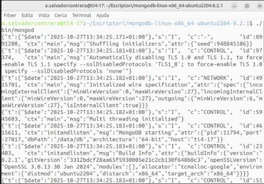
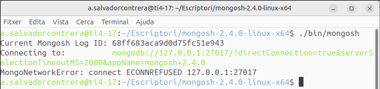
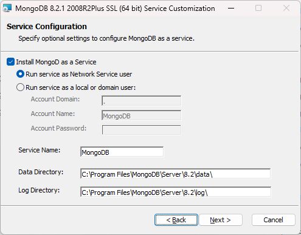
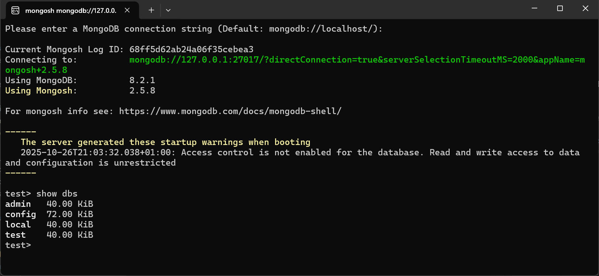

# Unidad 3. Acceso a Bases de Datos documentales

<span class="mi_h3">Revisiones</span>

| Revisión | Fecha      | Descripción                                                    |
|----------|------------|----------------------------------------------------------------|
| 1.0      | 31-10-2025 | Adaptación de los materiales a markdown                        |


## 3.1. Introducción

Las bases de datos documentales nativas (como MongoDB, Redis o Firebase) almacenan información en forma de documentos, usualmente codificados en JSON, BSON o XML, en lugar de filas y columnas como en las bases de datos relacionales.

Cada documento puede tener una estructura diferente, lo que permite mayor flexibilidad y agilidad en el desarrollo.

Sin embargo, si el dominio de la aplicación tiene muchas relaciones fuertes entre entidades y se necesita garantizar una integridad referencial estricta, una base de datos relacional puede ser más adecuada.

**Ventajas**{.azul}

| Ventaja                        | Descripción                                                                 |
|-------------------------------|-----------------------------------------------------------------------------|
| Flexibilidad del esquema      | No es necesario definir un esquema fijo antes de insertar datos. Ideal para estructuras dinámicas. |
| Escalabilidad horizontal      | Se adaptan bien al escalado distribuyendo los datos en múltiples servidores (sharding). |
| Rendimiento en lectura y escritura | Muy eficiente en operaciones de lectura y escritura sobre documentos completos. |
| Modelo cercano a objetos      | Almacenan los datos de manera similar a como se manejan en el código (objetos serializados como JSON). |
| Facilidad de integración con APIs REST | Los documentos JSON pueden ser enviados y recibidos fácilmente a través de APIs. |
| Ideal para datos semiestructurados | Útiles para trabajar con datos que no se ajustan a una estructura tabular, como respuestas de formularios, logs, etc. |


**Inconvenientes**{.azul}

| Inconveniente                         | Descripción                                                                 |
|--------------------------------------|-----------------------------------------------------------------------------|
| Falta de integridad referencial      | No hay claves foráneas como en las bases de datos relacionales, lo que puede causar inconsistencias si no se gestiona adecuadamente desde la aplicación. |
| Redundancia de datos                 | Se repite información entre documentos al no haber normalización; esto puede generar más uso de espacio. |
| Curva de aprendizaje                 | Requiere aprender nuevos conceptos como agregaciones, operadores específicos y estructuras de documentos. |
| Menor soporte para transacciones complejas | Aunque existen transacciones en algunas bases (como MongoDB), su uso es más limitado que en sistemas relacionales. |
| Consultas menos optimizadas en relaciones complejas | No es la mejor opción cuando los datos necesitan muchas relaciones y joins complejos. |


## 3.2. MongoDB

MongoDB es un sistema de gestión de bases de datos NoSQL **orientado a documentos**.
A diferencia de las bases de datos relacionales, que almacenan la información en tablas con filas y columnas, MongoDB guarda los datos en **colecciones** formadas por documentos en formato **BSON** (una representación binaria de JSON).


<span class="mi_h3">JSON</span>

**JSON** (JavaScript Object Notation) es un formato de texto ligero utilizado para almacenar e intercambiar información estructurada entre aplicaciones. Aunque su sintaxis proviene de JavaScript, hoy en día es independiente del lenguaje y se usa ampliamente en entornos como Kotlin, Java, Python, Node.js, bases de datos NoSQL, APIs REST, etc.

Un fichero JSON está compuesto por **pares clave–valor**, donde:

- Las **claves** siempre van entre comillas dobles " ".
- Los **valores** pueden ser:

    - Cadenas de texto ("texto")
    - Números (42)
    - Booleanos (true o false)
    - Objetos (otro conjunto de pares clave-valor { ... })
    - Arrays o listas ([ ... ])
    - Valor nulo (null)

**Ejemplos de estructuras JSON**

**Objeto simple**: Representa un único elemento con propiedades básicas.

    {
    "nombre": "Ana",
    "edad": 25,
    "ciudad": "Valencia"
    }

**Objeto con array**(lista de valores): Incluye un campo que contiene una lista.

    {
    "nombre": "Pedro",
    "aficiones": ["cine", "fútbol", "viajar"]
    }

**Objeto con otro objeto anidado**: Un campo puede contener a su vez otro objeto JSON.

    {
    "nombre": "Lucía",
    "edad": 30,
    "direccion": {
        "calle": "Gran Vía",
        "ciudad": "Madrid",
        "codigo_postal": 28013
    }
    }

**Array de objetos**: Cuando necesitamos almacenar varios elementos similares (por ejemplo, una lista de productos o alumnos).

    {
    "alumnos": [
        { "nombre": "Carlos", "nota": 8.5 },
        { "nombre": "María", "nota": 9.2 },
        { "nombre": "Laura", "nota": 7.8 }
    ]
    }

**Combinación compleja (objetos + arrays + anidamientos)**: Para representar datos estructurados, como los de una tienda online.

    {
    "pedido": {
        "id": 101,
        "fecha": "2025-10-11",
        "cliente": {
        "nombre": "Javier López",
        "email": "jlopez@example.com"
        },
        "productos": [
        { "nombre": "Ratón inalámbrico", "precio": 19.99, "cantidad": 1 },
        { "nombre": "Teclado mecánico", "precio": 49.95, "cantidad": 1 }
        ],
        "total": 69.94
    }
    }


**Array de objetos principales**: También se puede usar un array como estructura raíz, por ejemplo, para representar varios registros en un mismo fichero:

    [
        { "nombre": "Ana", "edad": 25 },
        { "nombre": "Pedro", "edad": 31 },
        { "nombre": "Lucía", "edad": 28 }
    ]


**Estructuras básicas de almacenamiento de información**

| Concepto       | Equivalente en BD relacional | Descripción                                      |
|----------------|------------------------------|--------------------------------------------------|
| **Base de datos** | Base de datos                | Conjunto de colecciones.                         |
| **Colección**     | Tabla                       | Agrupación de documentos relacionados.           |
| **Documento**     | Fila (registro)             | Unidad básica de almacenamiento. Es un objeto JSON. |
| **Campo**         | Columna                    | Atributo dentro del documento.                   |

En **MongoDB** cada documento es una **estructura flexible**, parecida a un objeto de programación, donde los datos se organizan en pares **clave–valor**. Esta flexibilidad permite que cada **documento** tenga una estructura diferente, lo que hace que MongoDB se adapte fácilmente a los cambios en los datos sin necesidad de modificar esquemas.

<span class="mis_ejemplos">Ejemplo 1: Plantas y jardineros</span>

A continuación tenemos información sobre algunas **plantas** y los **jardineros** que las cuidan. Dependiendo de cómo se deba acceder a la información, se pueden guardar las plantas con sus jardineros, o los jardineros con las plantas que cuidan.

De la primera manera podríamos tener una colección llamada **Plantas**. Observa cómo los objetos no tienen por qué tener la misma estructura y, en este caso, la forma de acceder al nombre de un jardinero sería la siguiente: **objeto.jardinero.nombre**:

```
{  
_id: 301,  
nombre: "Rosa silvestre",  
tipus: "Arbust",  
jardinero: {  
    nombre: "Eli",  
    apellidos: "Martínez Serra",  
    anyo_nacimiento: 1985  
    },  
localitzacio: "Jardí Mediterrani"  
},  
{  
_id: 302,  
nombre: "Ficus lyrata",  
tipus: "Planta d’interior",  
jardinero: {  
    nombre: "Pol",  
    apellidos: "Ribas Colomer",  
    pais: "Espanya"  
    },  
altura: 150,  
reg_setmanal: 2  
}
```  


De la segunda manera tendríamos la colección **Jardineros** donde la información estaría organizasa por jardineros y cada uno de ellos tendría un array con las plantas que cuida (los corchetes: [ ]):


```
{  
_id: 401,  
nom: "Laura",  
cognoms: "Martínez Serra",  
any_naixement: 1985,  
plantes: [  
    {  
    nom: "Rosa silvestre",  
    tipus: "Arbust",  
    localitzacio: "Jardí Mediterrani"  
    },  
    {  
    nom: "Lavanda officinalis",  
    localitzacio: "Parterre aromàtic"  
    }  
    ]  
},  
{  
_id: 402,  
nom: "Jordi",  
cognoms: "Ribas Colomer",  
pais: "Espanya",  
plantes: [  
    {  
    nom: "Ficus lyrata",  
    tipus: "Planta d’interior",  
    alçada_cm: 150,  
    reg_setmanal: 2  
    }  
    ]  
}
```

<span class="mi_h3">Instalación y administración</span>

**Opciones de instalación y despliegue**

| Opción                         | Descripción | Ideal para |
|--------------------------------|--------------|-------------|
| **MongoDB Community Server**   | Versión gratuita que se instala localmente en Windows, Linux o macOS. | Prácticas locales, entornos educativos. |
| **MongoDB en Docker**          | Se ejecuta como contenedor con `docker-compose` o comandos `docker run`. | Entornos de desarrollo rápidos y reproducibles. |
| **MongoDB Atlas**              | Servicio en la nube oficial de MongoDB. Permite crear clústeres gratuitos o de pago, gestionados por Mongo. | Proyectos web, microservicios, despliegues reales. |
| **MongoDB Local + Atlas Sync** | Permite sincronizar datos locales con una base remota en Atlas. | Aplicaciones con modo offline/online. |


**Herramientas de administración y visualización**

| Herramienta | Tipo | Descripción |
|--------------|------|--------------|
| **MongoDB Compass** | GUI oficial | Interfaz gráfica para consultar, insertar y analizar datos. |
| **DBeaver** | GUI universal | Permite conectarse a Mongo y a otras bases de datos (SQL y NoSQL). |
| **Robo 3T** *(antiguo Robomongo)* | GUI ligera | Muy utilizada para tareas básicas de exploración. |
| **mongosh** | Consola oficial | Shell de comandos moderno (sustituye a `mongo`). |


De entre todas las opciones posibles para instalar y administrar MongoDB, utilizaremos la versión **Community** junto con **Mongo Shell (mongosh)** por su simplicidad, ligereza y adecuación a los objetivos de esta unidad.


<span class="mi_h4">Instalación en Linux</span>

Para realizar la instalación básica no es necesario tener permisos de administrador. 

**Instalación del servidor (Linux)**

Desde la página oficial de MongoDB: [https://www.mongodb.com/try/download/community
](https://www.mongodb.com/try/download/community) vamos al menú **Products → Community Edition → Community Server** y descargamos la versión apropiada para nuestro sistema operativo.

Es recomendable elegir el paquete **.tgz**, ya que simplemente descomprimiendo el archivo se completa la instalación básica. Por ejemplo, para Ubuntu 22.04 de 64 bits, en el momento de redactar estos apuntes, el archivo sería: [https://fastdl.mongodb.org/linux/mongodb-linux-x86_64-ubuntu2204-8.2.1.tgz](https://fastdl.mongodb.org/linux/mongodb-linux-x86_64-ubuntu2204-8.2.1.tgz)

Una vez descargado, descomprimimos el archivo en el lugar que queramos, y con eso ya tendremos la instalación básica lista. Una vez instalado, crearemos el directorio de datos, que por defecto ha de estar ubicado en la raiz de la instalación:

    mkdir /data  
    mkdir /data/db

Si no somos administradores y no tenemos permisos para crear ese directorio, crearemos otro alternativo y, en el momento de arrancar el servidor, le indicaremos esa ubicación. La forma de arrancar el servidor será:

    <directoro raíz de MongoDB>./bin/mongod

Opcionalmente, podemos indicarle a MongoDB dónde se encuentra la base de datos (si no lo especificamos, asumirá por defecto que está en /data/db):

    <directorio raíz de MongoDB>./bin/mongod --dbpath <directorio_de_la_BD>

Una vez arrancamos el servidor, y si todo es correcto, aparecerán una serie de mensajes informativos y el servidor quedará en espera de recibir peticiones del cliente:





!!!Note ""
    Una vez que el servidor está en marcha, no debemos cerrar esa terminal, ya que al hacerlo detendríamos el servidor.


**Instalación del cliente MongoShell (Linux)**

Desde la página de MongoDB [https://www.mongodb.com/try/download/shell
](https://www.mongodb.com/try/download/shell) vamos al menú **Products → Tools → MongoDB Shell**, y descargamos la versión apropiada para nuestro sistema operativo.

Observa que, en el caso de Linux, existen muchas versiones para diferentes distribuciones.
Es recomendable elegir el paquete **.tgz**, ya que simplemente descomprimiendo el archivo se completa la instalación.

En el caso de Ubuntu 22.04 de 64 bits, seleccionaremos la opción genérica “Linux 64”, ya que es la que ofrece el paquete .tgz.

El archivo correspondiente es: [https://downloads.mongodb.com/compass/mongosh-2.4.0-linux-x64.tgz](https://downloads.mongodb.com/compass/mongosh-2.4.0-linux-x64.tgz)


Una vez descargado, descomprimimos el archivo en el lugar que queramos, y con eso ya tendremos la instalación básica lista. La forma de arrancar el cliente será:

    <directori raíz de  Mongosh>./bin/mongosh





## 🪟 Instalación en Windows

⚙️ **Instalación del servidor (Windows)**{.azul}

Desde la página oficial de MongoDB: [https://www.mongodb.com/try/download/community](https://www.mongodb.com/try/download/community) vamos al menú **Products → Community Edition → Community Server** y descargamos la versión apropiada para nuestro sistema operativo, que se distribuye como un archivo **.msi** ejecutable.

🔽En el momento de redactar estos apuntes, la versión de 64 bits más reciente: [https://fastdl.mongodb.org/windows/mongodb-windows-x86_64-8.2.1-signed.msi](https://fastdl.mongodb.org/windows/mongodb-ewindows-x86_64-8.2.1-signed.msi)

Durante la instalación, se te preguntará si deseas instalarlo como un servicio. Si eliges esta opción, el programa se iniciará automáticamente con el sistema y no tendrás que ejecutarlo manualmente cada vez.



🎯Si instalaste MongoDB como servicio, se inicia automáticamente al arrancar Windows, puedes comprobarlo con:

    net start | find "MongoDB"


!!!Note "Nota"
Si eliges **no** instalar MongoDB como servicio, deberás iniciarlo manualmente cada vez que quieras usarlo. En este caso, es necesario crear la carpeta donde se almacenarán los datos de la base de datos.

<!--
Si todo es correcto, debería aparecer una ventana o consola indicando que el servidor está en ejecución, como en la siguiente imagen:


-->

💻 **Instalación del cliente Mongo Shell (Windows)**{.azul}

Para conectarnos como clientes, debemos hacerlo desde un  terminal, utilizando mongosh.exe, que es la interfaz de línea de comandos (CLI) oficial de MongoDB.

Esta herramienta permite interactuar con la base de datos mediante comandos en JavaScript.


🔽Descargamos la versión correspondiente de MongoDB Shell para Windows desde la página oficial: [https://www.mongodb.com/try/download/shell](https://www.mongodb.com/try/download/shell)

🔽En el momento de redactar estos apuntes, la versión de 64 bits más reciente: [https://downloads.mongodb.com/compass/mongosh-2.5.8-x64.msi](https://downloads.mongodb.com/compass/mongosh-2.5.8-x64.msi)


Una vez el servidor esté activo, simplemente escribe:

    mongosh

Dentro del shell, prueba con:

    show dbs

Si ves las bases de datos (admin, config, local), todo está funcionando correctamente:



!!!Tip "Mongo Compass"
También podéis descargar la versión **MongoDB Compass**, que es la herramienta gráfica oficial de MongoDB, la cual permite visualizar, explorar y administrar bases de datos MongoDB sin necesidad de utilizar la línea de comandos.

    [https://downloads.mongodb.com/compass/mongodb-compass-1.45.3-win32-x64.exe](https://downloads.mongodb.com/compass/mongodb-compass-1.45.3-win32-x64.exe)

**Probar el funcionament**{.azul}

Para probar su funcionamiento, vamos a ejecutar un par de comandos: uno para guardar un documento y otro para recuperarlo.

En cualquier operación, debemos escribir db seguido del nombre de la colección, y después la operación que queremos realizar.
Con el siguiente comando:

    db.ejemplo.insertOne({ msg: "Hola, ¿qué tal?" })


Nos responderá con:

        {
        acknowledged: true,
        insertedId: ObjectId('68ff6004ab24a06f35cebea4')
        }


Indicando que se ha insertado un documento en la **colección ejemplo** (si no existía, la creará automáticamente).

Y con el siguiente comando recuperamos la información:

    db.ejemplo.find()


Lo que nos devolverá algo como:

    { "_id" : ObjectId("56cc1acd73b559230de8f71b"), "msg" : "Hola, ¿qué tal?" }


Todo esto se realiza en la misma terminal, y cada uno de nosotros obtendrá un número diferente en el campo **ObjectId**.
En la siguiente imagen pueden verse las dos operaciones.


En realidad, estamos conectados a una base de datos llamada test.
Podemos crear y utilizar más de una base de datos, pero en este curso será más que suficiente trabajar con esta.

Para comprobarlo, podemos ejecutar la siguiente instrucción, que nos devuelve **el nombre de la base de datos actual**:

    db.getName()


``` kotlin
import java
}
```

!!! success "Prueba y analiza el ejemplo 1"
1. Crea


!!! warning "Práctica 2: Crea tu "
1. Crea un nu.


!!! danger "Entrega 1"
Entrega en Aules la carpeta `main` de tu proyecto comprimida en formato .zip

    **IMPORTANTE**: El proyecto no debe contener código que no se utilice, ni restos de pruebas de los ejemplos y no debe estar separado por prácticas. Debe ser un proyecto totalmente funcional.


## 3.3. Firebase

En construcción


!!! success "Prueba y analiza el ejemplo 5"
Prueba el código de ejemplo y verifica que funciona correctamente.

!!! warning "Práctica 5: Amplía tu proyecto"
Incluye .


!!! danger "Entrega 2"
Entrega en Aules la carpeta `main/kotlin` de tu proyecto comprimida en formato .zip

    **IMPORTANTE**: El proyecto no debe contener código que no se utilice, ni restos de pruebas de los ejemplos y no debe estar separado por prácticas. Debe ser un proyecto totalmente funcional.


---

<span class="mi_h3">Autoría</span>

Obra realizada por Begoña Paterna Lluch basada en materiales desarrollados por Alicia Salvador Contreras. Publicada bajo licencia [Creative Commons Atribución/Reconocimiento-CompartirIgual 4.0 Internacional](https://creativecommons.org/licenses/by-sa/4.0/)