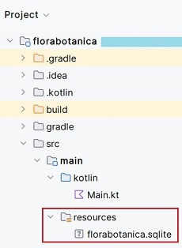

# Unidad 3. Acceso a Bases de Datos documentales

<span class="mi_h3">Revisiones</span>

| Revisión | Fecha      | Descripción                                                    |
|----------|------------|----------------------------------------------------------------|
| 1.0      | 31-10-2025 | Adaptación de los materiales a markdown                        |


## 3.1. Introducción

Las bases de datos documentales nativas (como MongoDB, Redis o Firebase) almacenan información en forma de documentos, usualmente codificados en JSON, BSON o XML, en lugar de filas y columnas como en las bases de datos relacionales.

Cada documento puede tener una estructura diferente, lo que permite mayor flexibilidad y agilidad en el desarrollo.

Sin embargo, si el dominio de la aplicación tiene muchas relaciones fuertes entre entidades y se necesita garantizar una integridad referencial estricta, una base de datos relacional puede ser más adecuada.

**Ventajas**{.azul}

| Ventaja                        | Descripción                                                                 |
|-------------------------------|-----------------------------------------------------------------------------|
| Flexibilidad del esquema      | No es necesario definir un esquema fijo antes de insertar datos. Ideal para estructuras dinámicas. |
| Escalabilidad horizontal      | Se adaptan bien al escalado distribuyendo los datos en múltiples servidores (sharding). |
| Rendimiento en lectura y escritura | Muy eficiente en operaciones de lectura y escritura sobre documentos completos. |
| Modelo cercano a objetos      | Almacenan los datos de manera similar a como se manejan en el código (objetos serializados como JSON). |
| Facilidad de integración con APIs REST | Los documentos JSON pueden ser enviados y recibidos fácilmente a través de APIs. |
| Ideal para datos semiestructurados | Útiles para trabajar con datos que no se ajustan a una estructura tabular, como respuestas de formularios, logs, etc. |


**Inconvenientes**{.azul}

| Inconveniente                         | Descripción                                                                 |
|--------------------------------------|-----------------------------------------------------------------------------|
| Falta de integridad referencial      | No hay claves foráneas como en las bases de datos relacionales, lo que puede causar inconsistencias si no se gestiona adecuadamente desde la aplicación. |
| Redundancia de datos                 | Se repite información entre documentos al no haber normalización; esto puede generar más uso de espacio. |
| Curva de aprendizaje                 | Requiere aprender nuevos conceptos como agregaciones, operadores específicos y estructuras de documentos. |
| Menor soporte para transacciones complejas | Aunque existen transacciones en algunas bases (como MongoDB), su uso es más limitado que en sistemas relacionales. |
| Consultas menos optimizadas en relaciones complejas | No es la mejor opción cuando los datos necesitan muchas relaciones y joins complejos. |


## 3.2. MongoDB

📚 MongoDB es un sistema de gestión de bases de datos NoSQL **orientado a documentos**.
A diferencia de las bases de datos relacionales, que almacenan la información en tablas con filas y columnas, MongoDB guarda los datos en **colecciones** formadas por documentos en formato **BSON** (una representación binaria de JSON).

Cada documento es una **estructura flexible**, parecida a un objeto de programación, donde los datos se organizan en pares **clave–valor**.
Esta flexibilidad permite que cada **documento** tenga una estructura diferente, lo que hace que MongoDB se adapte fácilmente a los cambios en los datos sin necesidad de modificar esquemas.

📂 **Estructura básica**

| Concepto       | Equivalente en BD relacional | Descripción                                      |
|----------------|------------------------------|--------------------------------------------------|
| **Base de datos** | Base de datos                | Conjunto de colecciones.                         |
| **Colección**     | Tabla                       | Agrupación de documentos relacionados.           |
| **Documento**     | Fila (registro)             | Unidad básica de almacenamiento. Es un objeto JSON. |
| **Campo**         | Columna                    | Atributo dentro del documento.                   |

!!!Tip "Ejemplo de estructura flexible"
Veamos algunos **ejemplos** de documentos JSON para guardar la información de **libros y autores**.

Dependiendo de cómo se deba acceder a la información, podemos plantearnos guardar los libros con sus autores, o guardar los autores con sus libros.
Incluso podríamos guardar ambas versiones, para poder acceder a los datos de todas las formas posibles, aunque eso implique duplicar la información.

De la primera manera, guardando los libros junto con su autor, podríamos tener documentos con esta estructura, que se podrían guardar en una colección llamada **Libros**:


    {  
        _id:101,  
        titol:"El secret de Khadrell",  
        autor: {  
        nom:"Pep",  
        cognoms:"Castellano Puchol",  
        any_naixement:1960  
        },  
        isbn:"84-95620-72-3"  
    },  
    {  
        _id:102,  
        titol:"L'Ombra del Vent",  
        autor: {  
        nom:"Carlos",  
        cognoms:"Ruiz Zafon",  
        pais:"Espanya"  
        },  
        pagines:490,  
        editorial:"Planeta"  
    }

Observa cómo los objetos no tienen por qué tener la misma estructura.
La forma de acceder al nombre de un autor sería la siguiente:
**objeto.autor.nombre**

Una manera alternativa de guardar la información, como habíamos comentado antes, sería organizarla por autores, junto con sus libros.
De este modo, podríamos ir completando la colección **Autores** con uno o más documentos de este estilo:

    {  
        _id: 201,  
        nom:"Pep",  
        cognoms:"Castellano Puchol",  
        any_naixement:1960,  
        llibres: [  
        {  
        titol:"El secret de Khadrell",  
        isbn:"84-95620-72-3"  
        },  
        {  
        titol:"Habitació 502",  
        editorial:"Tabarca"  
        }  
    ]  
    },  
    {  
        _id:202,  
        nom:"Carlos",  
        cognoms:"Ruiz Zafon",  
        pais:"Espanya",  
        llibres: [  
        {  
            titol:"L'Ombra del Vent",  
            pagines:490,  
            editorial:"Planeta"  
        }  
    ]  
    }

Observa cómo, para un autor, ahora tenemos un array (los corchetes: [ ]) con sus libros.

!!!Tip "¿Cuál de las dos formas es mejor para guardar la información?"
Pues depende del tipo de acceso que se vaya a realizar a los datos.
La mejor opción será probablemente aquella que, según las consultas que se necesiten hacer, devuelva la información de forma más rápida.


<span class="mis_ejemplos">Ejemplo 1: xxxxxxxx</span>

El siguiente ejemplo muestra xxxxxxxxxxxxx




``` kotlin
import java
}
```

!!! success "Prueba y analiza el ejemplo 1"
1. Crea


!!! warning "Práctica 2: Crea tu "
1. Crea un nu.


!!! danger "Entrega 1"
Entrega en Aules la carpeta `main` de tu proyecto comprimida en formato .zip

    **IMPORTANTE**: El proyecto no debe contener código que no se utilice, ni restos de pruebas de los ejemplos y no debe estar separado por prácticas. Debe ser un proyecto totalmente funcional.


## 3.3. Firebase

En construcción


!!! success "Prueba y analiza el ejemplo 5"
Prueba el código de ejemplo y verifica que funciona correctamente.

!!! warning "Práctica 5: Amplía tu proyecto"
Incluye .


!!! danger "Entrega 2"
Entrega en Aules la carpeta `main/kotlin` de tu proyecto comprimida en formato .zip

    **IMPORTANTE**: El proyecto no debe contener código que no se utilice, ni restos de pruebas de los ejemplos y no debe estar separado por prácticas. Debe ser un proyecto totalmente funcional.


---

<span class="mi_h3">Autoría</span>

Obra realizada por Begoña Paterna Lluch basada en materiales desarrollados por Alicia Salvador Contreras. Publicada bajo licencia [Creative Commons Atribución/Reconocimiento-CompartirIgual 4.0 Internacional](https://creativecommons.org/licenses/by-sa/4.0/)