# Unidad 4. Componentes (Spring Framework)

<span class="mi_h3">Revisiones</span>

| Revisión | Fecha      | Descripción                                          |
|----------|------------|------------------------------------------------------|
| 1.0      | 30-12-2025 | Adaptación de los materiales a markdown              |

## 4.1. Introducción

Spring es un framework de código abierto para crear aplicaciones en Java o Kotlin de forma más fácil, rápida y ordenada. Facilita el trabajo de crear objetos, conectar clases, preparar la base de datos y configurar servidores. 

Spring se basa principalmente en:

- **Inversión de Control (IoC):** Se encarga de crear y gestionar los objetos de la aplicación.

- **Inyección de Dependencias (DI):** Coloca los objetos donde hacen falta automáticamente.


Además tiene tres pilares:

**1. Autoconfiguración (Spring Boot): prepara el proyecto por ti**

- Servidor web.

- Conexión a base de datos.

- Estructura de proyecto.

- Dependencias necesarias.


**2. Starters: paquetes listos para usar según lo que quieras hacer**

| Starter                        | Descripción                   |
|--------------------------------|-------------------------------|
| spring-boot-starter-web        | para rutas y controladores    |
| spring-boot-starter-thymeleaf  | para páginas HTML             |
| spring-boot-starter-data-jpa   | para BD y CRUD                |


**3. Anotaciones: indican qué hace cada clase**

Las anotaciones son etiquetas especiales que se colocan encima de clases, funciones o atributos para decirle a Spring cómo debe comportarse con ese código. Las anotaciones son, por tanto, la forma en la que Spring entiende la aplicación. Spring tiene muchísimas anotaciones, porque es un framework muy grande y sirve para muchos tipos de proyectos (web MVC, microservicios, seguridad, batch, mensajería, etc.).

En nuestro caso, como vamos a trabajar únicamente con Spring Boot, API REST, vistas HTML y JPA, no es necesario aprender todas las anotaciones que ofrece Spring. Basta con conocer un conjunto reducido de anotaciones básicas, suficientes para desarrollar un backend completo y funcional.

En las siguientes tablas se recogen las anotaciones más importantes que utilizaremos a lo largo del tema (para API REST/vistas HTML + JPA) (a medida que avancemos, irán apareciendo otras anotaciones adicionales que se introducirán solo cuando sean necesarias para la aplicación): 

- Anotaciones de arranque de la app

| Anotación                | Dónde se usa           | Para qué sirve                          |
| ------------------------ | ---------------------- | --------------------------------------- |
| @SpringBootApplication | Clase principal        | Marca la clase de arranque de la aplicación Spring Boot y activa la auto-configuración y el escaneo de componentes |

- Anotaciones API REST

| Anotación          | Dónde se usa | Para qué sirve |
| ------------------ |--------------|----------------|
| @RestController    | Clase            | Indica que la clase es un controlador REST y que los métodos devuelven directamente datos (normalmente JSON). |
| @RequestMapping    | Clase o método   | Define la ruta base o una ruta concreta para acceder a un recurso                    |
| @GetMapping        | Método           | Atiende peticiones HTTP **GET** (lectura de datos)                                   |
| @PostMapping       | Método           | Atiende peticiones HTTP **POST** (creación de datos)                                 |
| @PutMapping        | Método           | Atiende peticiones HTTP **PUT** (actualización de datos)                             |
| @DeleteMapping     | Método           | Atiende peticiones HTTP **DELETE** (eliminación de datos)                            |
| @RequestBody       | Parámetro        | Permite recibir datos enviados en el cuerpo de la petición (JSON)                    |
| @PathVariable      | Parámetro        | Permite recoger valores de la URL (por ejemplo, un identificador)                    |


- Anotaciones MVC (vistas)

| Anotación        | Dónde se usa | Para qué sirve |
| ---------------- |--------------|----------------|
| @Controller      | Clase        | Marca una clase como controlador MVC tradicional, devolviendo vistas (HTML con Thymeleaf)       |


- Anotaciones de lógica de negocio

| Anotación       | Dónde se usa | Para qué sirve |
| --------------- |--------------|----------------|
| @Service        | Clase            | Marca una clase como servicio, donde se implementa la lógica de negocio                  |
| @Autowired      | Atributo o constructor | Inyecta automáticamente una dependencia gestionada por Spring                      |


- Anotaciones JPA / Base de datos

| Anotación       | Dónde se usa | Para qué sirve |
| --------------- |--------------|----------------|
| @Entity         | Clase        | Indica que la clase representa una tabla de la base de datos |
| @Table          | Clase        | Define el nombre de la tabla asociada a la entidad  |
| @Id             | Atributo     | Marca el atributo como clave primaria        |
| @GeneratedValue | Atributo     | Indica que el valor de la clave primaria se genera automáticamente |
| @Column         | Atributo     | Configura una columna de la tabla (nombre, restricciones, unicidad, etc.) |
| @OneToMany      | Atributo     | Define una relación uno-a-muchos entre entidades   |
| @ManyToOne      | Atributo     | Define una relación muchos-a-uno entre entidades    |
| @JoinColumn     | Atributo     | Especifica la columna usada como clave foránea en una relación |


- Anotaciones de acceso a datos

| Anotación   | Dónde se usa | Para qué sirve |
| ----------- |--------------|----------------|
| @Repository | Clase o interfaz | Indica que la clase o interfaz se encarga del acceso a datos y de la gestión de excepciones de base de datos |


Los componentes principales de Spring Framework son:

| Componente      | Descripción                                                                             |
|-----------------|-----------------------------------------------------------------------------------------|
| Spring Core     | El núcleo del framework, encargado de la inyección de dependencias                      |
| Spring Boot     | Facilita la creación de aplicaciones basadas en Spring con una configuración mínima     |
| Spring MVC      | Permite el desarrollo de aplicaciones web utilizando el patrón Modelo-Vista-Controlador |
| Spring Data     | Simplifica el acceso a datos con soporte para JPA, MongoDB, Redis, entre otros          |
| Spring Security | Proporciona herramientas para implementar seguridad en aplicaciones                     |
| Spring Cloud    | Ayuda en la construcción de aplicaciones distribuidas y microservicios                  |


## 4.2. Spring Boot

Para crear una aplicación se necesita crear el proyecto, desarrollar la aplicación y desplegarla en un servidor. **Spring Boot** simplifica las tareas de crear el proyecto y desplegar la aplicación ya que:

- Configura todo automáticamente.

- Trae un servidor web incorporado (permite crear aplicaciones que se ejecutan de forma independiente sin necesidad de un servidor web externo).

- Evita escribir XML.

- Permite arrancar una app con un botón.

- Usa starters (dependencias ya preparadas).

- Permite crear proyectos en segundos.


Para crear un proyecto **Spring Boot** Maven/Gradle con las dependencias necesarias tenemos dos opciones:

- Crear un proyecto Spring Boot utilizando la herramienta Spring Initializr desde la url [https://start.spring.io/](https://start.spring.io/) la cual genera un proyecto base con la estructura de una aplicación Spring Boot en un archivo .zip que podemos abrir directamente desde un IDE.

- Crear un proyecto Spring Boot utilizando un IDE que tenga instalados los plugins necesarios. En el caso de IntelliJ solamente es posible utilizar el plugin de Spring en la versión Ultimate.

Una vez creado el proyecto tendremos las configuraciones y dependencias en los archivos siguientes:

- **applicantion.properties:** configuración de aspectos como las conexiones a base de datos o el puerto por donde acceder a nuestra aplicación.

- **pom.xml:** dependencias necesarias para que la aplicación funcione.


**Dependencia Spring Web**

- Se utiliza para desarrollar aplicaciones web, ya sea basadas en REST o tradicionales con HTML dinámico.

- Incluye un servidor web embebido (por defecto, Tomcat) para ejecutar la aplicación sin necesidad de configurarlo manualmente.

- Facilita el manejo de rutas HTTP (GET, POST, PUT, DELETE, etc.) y parámetros de solicitud a través de métodos en los controladores.

- Usa la biblioteca Jackson (incluida por defecto) para convertir automáticamente objetos Kotlin/Java a JSON y viceversa.

- Ofrece herramientas para manejar errores y excepciones de forma global mediante @ControllerAdvice o controladores personalizados.


<span class="mis_ejemplos">Ejemplo 1: Aplicación Spring Boot con Spring Web</span>

A continuación se describen los pasos para a crear una aplicación que saluda al usuario utilizando Spring Web.

<span class="mi_sombreado">**PASO 1: Crear el proyecto**</span>

Accedemos a Spring Initializr desde la url [https://start.spring.io/](https://start.spring.io/), indicamos el nombre de la aplicación y añadimos la dependencia **Spring Web** (el resto de opciones las podemos dejar como se ve en la imagen). Por último hacemos clic en el botón GENERATE. Esto hará que se cree el proyecto y se descargue en un archivo .zip. 


<span class="mi_sombreado">**PASO 2: Abrir el proyecto y ejecutarlo**</span>

Descomprimimos el archivo obtenido en el paso anterior y lo abrimos con IntelliJ. Vemos que, además de los archivos **applicantion.properties** y **pom.xml** se ha creado automaticamente la clase **SaludoApplication** (con la anotación **@SpringBootApplication**) y la función de extensión **runApplication** que sirve para lanzar la aplicación.

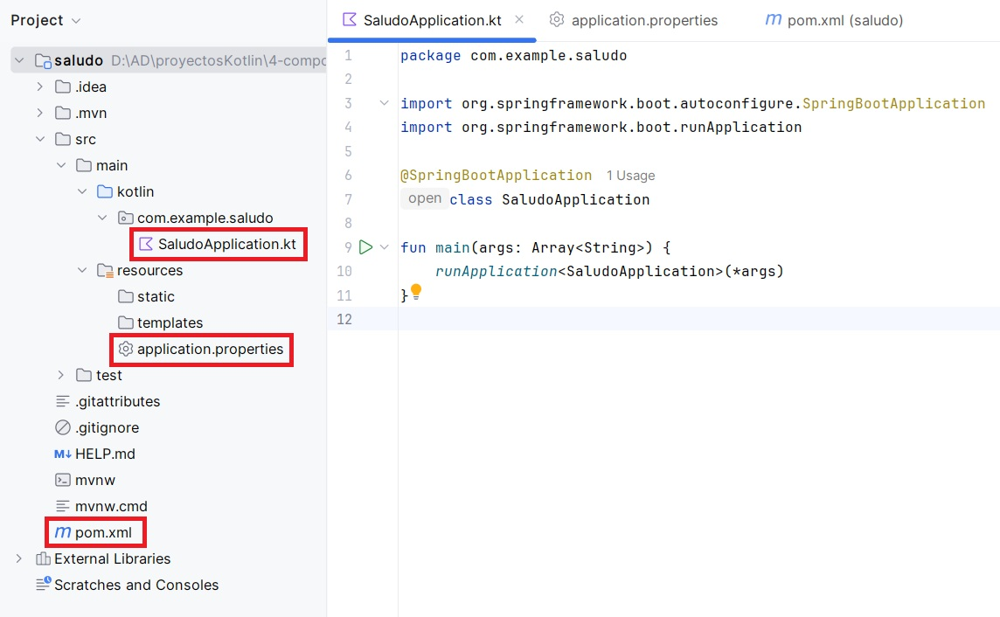

Por tanto deberemos ejecutar la aplicación usando la clase `SaludoApplication.kt` como clase principal. Al ejecutar la aplicación veremos por Consola la salida de los mensajes de registro de Spring.

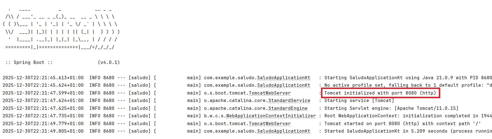

!!!Note ""
    Si el puerto 8080 está ocupado aparecerá un mensaje diciento que no se puede iniciar el servidor Tomcat. Puedes cambiar el puerto, por ejemplo al 8888, añadiendo la sigueinte línea en el archivo `application.properties` (que se encuentra en la carpeta resources del proyecto):
    ```
    server.port=8888
    ```

<span class="mi_sombreado">**PASO 3: Añadir el código para saludar**</span>

Añadimos a la clase principal `SaludoApplication` la función `sayHello()` con el código necesario para que nuestra aplicación envíe un saludo:

```kotlin
@SpringBootApplication
@RestController
class SaludoApplication{
    @GetMapping("/hello")
    fun sayHello(
        @RequestParam(value = "myName", defaultValue = "World") name: String): String
    {
        return "Hello $name!"
    }
}
```

Como puedes ver, se han incluido anotaciones e importaciones, a continuación se explica cada una de ellas:


* **@RestController**: se utiliza para que Spring reconozca la clase como un controlador que maneja solicitudes HTTP. Combina:
    * @Controller: Define la clase como un controlador web.
    * @ResponseBody: Indica que los métodos devolverán directamente el cuerpo de la respuesta (en este caso, texto plano en lugar de una vista HTML).

* **@GetMapping("/hello")**: Es una anotación de Spring que indica que este método debe manejar las solicitudes HTTP GET que lleguen a la URL /hello.
    * Enlaza la URL /hello con el método sayHello.
    * Cada vez que se acceda a la ruta [http://localhost:8080/hello](http://localhost:8080/hello) (asumiendo el puerto predeterminado 8080) en un navegador con un método GET, Spring ejecutará el método `sayHello`.

* **@RequestParam**: se usa para extraer un parámetro de la consulta (query parameter) enviado en la URL.
    * El método espera un parámetro de consulta llamado `myName`.
    * Si el cliente no incluye myName en la solicitud, el valor predeterminado será "World", gracias a defaultValue = "World".


<span class="mi_sombreado">**PASO 4: Volvemos a ejecutar la aplicación**</span>

Ejecutamos la aplicación para levantar el servidor y abrimos la dirección [http://localhost:8080/hello](http://localhost:8080/hello) o [http://localhost:8080/hello?myName=Atenea](http://localhost:8080/hello?myName=Atenea) en el navegador web. La aplicación responde con `Hello World!` o con `Hello Atenea!` (que es el nombre pasado como parámetro): 

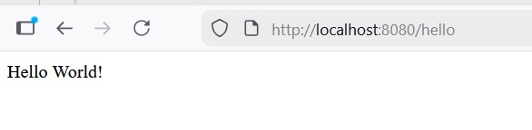


<span class="mi_sombreado">**PASO 5: Entender el funcionamiento**</span>

Spring Boot está configurado para servir automáticamente cualquier archivo colocado en:

- static/

- public/

- resources/

- META-INF/resources/


Esto significa que al poner un archivo estático ahí:

- el servidor embebido (Tomcat) lo devuelve tal cual.

- no pasa por ningún controlador.

- no necesita anotaciones.

- no tienes que hacer un @GetMapping.  


Los pasos que sigue la ejecución de la aplicación son los siguientes:

- **Inicio de la aplicación:** Se ejecuta el método main, lo que inicia un servidor web embebido (por defecto, `Tomcat`) en el puerto 8080.

- **Solicitudes HTTP:**  En nuestro caso la aplicación solamente está disponible en `/hello` y cuando un cliente envía una `solicitud GET` a [http://localhost:8080/hello](http://localhost:8080/hello) (con o sin el parámetro `myName`), el método `sayHello` maneja la solicitud. [http://localhost:8080](http://localhost:8080) dará error porque no hay ningún recurso raíz definido.

- **Respuesta:**  La aplicación devuelve un mensaje personalizado en texto plano según el parámetro `myName`.


<span class="mi_sombreado">**PASO 6: Añadir una página de inicio HTML**</span>

Creamos el archivo `index.html` en `src/main/resources/static/` y sustituimos su contenido por:

```html
<!DOCTYPE HTML>
<html>
<head>
    <title>Saludo</title>
    <meta http-equiv="Content-Type" content="text/html; charset=UTF-8" />
</head>
<body>
<a href="/hello">Link a saludar</a>

<form action="/hello" method="GET" id="nameForm">
    <div>
        <label for="nameField">Indica tu nombre</label>
        <input name="myName" id="nameField">
        <button>Saludar</button>
    </div>
</form>
</body>
</html>
```

Ahora la aplicación ya se ejecutará en [http://localhost:8080/](http://localhost:8080/) y servirá index.html como recurso raíz.


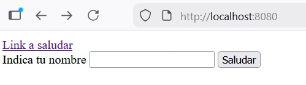


!!! success "Prueba y analiza el ejemplo 1"
    1. Crea un proyecto Spring Boot llamado `saludo` utilizando Spring Initializr. 
    2. Prueba el código del ejemplo, verifica que funciona correctamente y pregunta tus dudas.
    3. Modifica el archivo `index.html` utilizando css para que tenga una apariencia distinta a la del ejemplo.


## 4.3. Spring MVC

**Spring MVC** es el módulo de Spring orientado al desarrollo de aplicaciones web siguiendo el patrón **Modelo‑Vista‑Controlador (MVC)**, el cual organiza una aplicación en tres **componentes principales**:

* **Modelo**: Son los datos. Es responsable de:

    * Gestionar el estado de la aplicación.

    * Interactuar con la base de datos u otros servicios para obtener y procesar datos.

    * Proveer datos a la vista.

* **Vista**: Es lo que ve el usuario. Es responsable de:

    * Renderizar información en un formato adecuado, como HTML.

    * Mostrar al usuario los resultados de las acciones ejecutadas.

* **Controlador**: Actúa como intermediario entre el modelo y la vista. Es responsable de:

    * Procesar las solicitudes del usuario (peticiones HTTP).

    * Interactuar con el modelo para obtener o modificar datos.

    * Seleccionar y devolver la vista adecuada para responder al usuario.


Estos tres componentes trabajan de la siguiente forma:

1) El usuario interactúa con la **Vista** (interfaz). Envia un formulario o hace clic en un enlace.

2) La petición es enviada al **Controlador**.

3) El **Controlador** procesa la petición, interactúa con el **Modelo** si es necesario y selecciona la **Vista** que debe renderizar la respuesta.

4) La **Vista** presenta la respuesta al usuario.


Spring MVC forma parte del ecosistema Spring y se organiza siguiendo una arquitectura en capas en la que cada capa tiene una función concreta y se comunica únicamente con las capas adyacentes. Esta arquitectura encaja perfectamente con el patrón MVC (Model–View–Controller) y proporciona toda la infraestructura necesaria para manejar peticiones HTTP, invocar controladores y devolver vistas (HTML, JSON, etc.) lo que permite aplicaciones más mantenibles, escalables y fáciles de entender.  

En la siguiente tabla se muestran las capas más habituales en una aplicación Spring con su equivamencia en Spring MVC, sus anotaciones más habituales y la función que realiza cada una de ellas:

**Anotaciones por capa y correspondencia Spring ↔ MVC**

| Capas Spring      | Capa MVC    | Anotaciones  | Función           |
|-------------------|-------------|--------------|-------------------|
| Controller (Web)                    | Controller  | `@Controller`<br>`@RestController`<br>`@RequestMapping`<br>`@GetMapping`<br> `@RequestParam` <br> `@PostMapping`<br>`@PutMapping`<br>`@DeleteMapping` | Recibe peticiones HTTP, gestiona rutas y parámetros, llama a la capa Service y devuelve una vista o una respuesta (JSON)<br>**No contiene lógica de negocio ni acceso a datos**                         |
| Model (Entidades)<br>Service (Negocio)<br>Repository (Persistencia) | Model | `@Entity`, `@Table`, `@Id`<br>`@Service`, `@Transactional`<br>`@Repository` | Contiene las clases que modelan la información del negocio, aplica reglas y validaciones y accede a la base de datos para realizar operaciones CRUD (manteniendo aislada la BD del resto de la aplicación)        |
| View (Representación HTML / JSON)               | View | *(sin anotaciones)* | Representa los datos al usuario:<br>• Archivo HTML con sintaxis específica para contenido dinámico si se utiliza Thymeleaf / JSP 	(Ubicación Thymeleaf: `src/main/resources/templates/`)<br>• Datos en formato JSON / XML en apps REST (si no se utiliza un motor de plantillas). En REST, el JSON actúa como la vista |


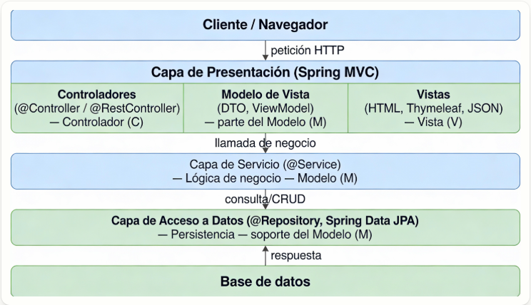


**Vistas con Thymeleaf**

Thymeleaf es un motor de plantillas que permite mezclar HTML con datos dinámicos proporcionados por el controlador en Spring MVC. Utiliza atributos especiales que comienzan con th: para manipular estos datos de forma dinámica. La siguiente tabla muestra los atributos Thymeleaf más comunes:

| **Atributo**    | **Descripción**                                                                                        | **Ejemplo**                                                                                           |
| --------------- | ------------------------------------------------------------------------------------------------------ | ----------------------------------------------------------------------------------------------------- |
| **`th:text`**   | Rellena el contenido de un elemento HTML con un valor dinámico.                                        | `<p th:text="${mensaje}">Texto por defecto</p>`                                                       |
| **`th:each`**   | Itera sobre una colección (lista, array, etc.) y genera un nuevo elemento HTML para cada item.         | `<ul><li th:each="planta : ${plantas}" th:text="${planta.nombre}">Nombre de la planta</li></ul>`      |
| **`th:if`**     | Muestra el contenido solo si la condición es verdadera.                                                | `<p th:if="${hayPlantas}">Hay plantas registradas</p>`                                                |
| **`th:unless`** | Muestra el contenido solo si la condición es falsa.                                                    | `<p th:unless="${hayPlantas}">No hay plantas registradas</p>`                                         |
| **`th:href`**   | Construye enlaces dinámicos para el atributo `href` de un enlace `<a>`.                                | `<a th:href="@{/planta/{id}(id=${planta.id})}">Ver detalles</a>`                                      |
| **`th:src`**    | Construye enlaces dinámicos para el atributo `src` de una imagen ``.                              | `` |
| **`th:action`** | Define la URL a la que se enviará un formulario cuando se haga submit.              | `<form th:action="@{/planta/guardar}" method="post"><button type="submit">Guardar</button></form>`    |
| **`th:object`**   | Asocia un objeto del modelo con el formulario, permitiendo vincular automáticamente sus atributos. | `<form th:object="${planta}" th:action="@{/planta/guardar}" method="post">...</form>`                |
| **`th:value`**  | Rellena el valor de un campo de formulario (`input`, `textarea`, etc.) con un valor dinámico.          | `<input type="text" th:value="${planta.nombre}" />`                            |
| **`th:field`**  | Asocia un campo de formulario con un atributo del modelo de Spring, vincula los datos automáticamente. | `<input type="text" th:field="*{nombre}" />`                                     |


<span class="mis_ejemplos">Ejemplo 2: Aplicación utilizando Spring MVC y Thymeleaf</span>

A continuación se describen los pasos para crear una aplicación que muestra una lista con nombres de planas y junto a cada nombre un enlace que mostrará los detalles de la planta. Desde la pantalla de detalles, se podrá acceder a un formulario para modificar la información de la planta. La estructura del proyecto será la siguiente:

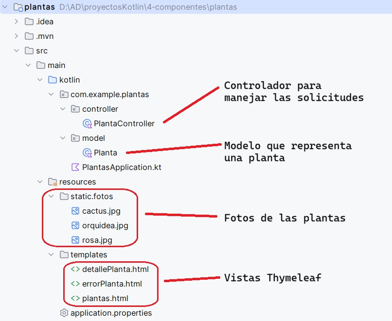


<span class="mi_sombreado">**PASO 1: Crear el proyecto**</span>

Accedemos a Spring Initializr desde la url [https://start.spring.io/](https://start.spring.io/), indicamos el nombre de la aplicación (`plantas`) y, en este caso, además de la dependencia **Spring Web** necesitamos también **Thymeleaf** (el resto de opciones las podemos dejar como se ve en la imagen). Por último hacemos clic en el botón GENERATE para descargar nuestro nuevo proyecto.

Opcionalmente podemos añadir **Spring Boot DevTools** que nos ahorrará tiempo de desarrollo ya que:

- Reinicia automáticamente la aplicación cuando cambias código.

- Recarga las plantillas Thymeleaf sin reiniciar manualmente.

Para tener estas funciones activas, además de añadir la dependencia, hay que configurar IntelliJ para que compile al guardar. Esto se consigue activando las opciones siguientes: 

- Build project automatically (Settings → Build, Execution, Deployment → Compiler)

- Allow auto-make to start even if developed application is currently running (Settings → Advanced Settings)

De esta forma, cuando realicemos un cambio en un archivo de código de nuestra aplicación, bastará con guardarlo y recargar el navegador (sin reiniciar la app) para ver los cambios inmediatamente.

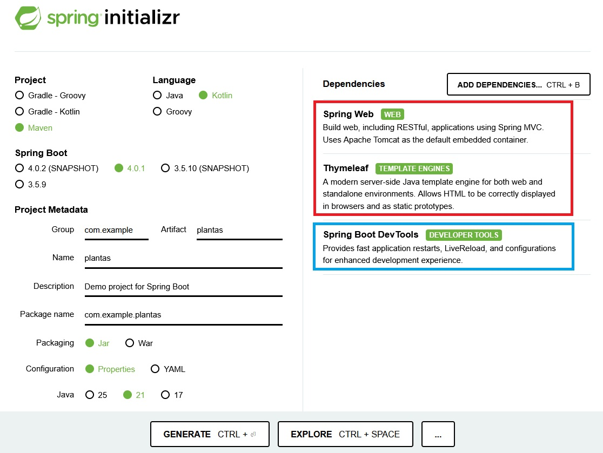


<span class="mi_sombreado">**PASO 2: Abrir el proyecto**</span>

Descomprimimos el archivo obtenido en el paso anterior y abrimos el proyecto con IntelliJ. Comprobamos que la clase principal de la aplicación es `PlantasApplication.kt`, que se encuentra en la carpeta `src/main/kotlin/com/example/plantas/` y que contiene el siguiente código:

```kotlin
package com.example.plantas

import org.springframework.boot.autoconfigure.SpringBootApplication
import org.springframework.boot.runApplication

@SpringBootApplication
class PlantasApplication

fun main(args: Array<String>) {
	runApplication<PlantasApplication>(*args)
}
```

<span class="mi_sombreado">**PASO 3: Añadir el controlador**</span>

En este caso, como la aplicación es muy sencilla el controlador maneja las solicitudes al recibir las peticiones HTTP, decide qué datos se usan y devuelve la vista adecuada. Para añadir el controlador, creamos el archivo `PlantaController.kt` dentro de la carpeta `src/main/kotlin/com/example/plantas/controller/` con el código siguiente:

```kotlin
package com.example.plantas.controller

import com.example.plantas.model.Planta
import org.springframework.stereotype.Controller
import org.springframework.ui.Model
import org.springframework.web.bind.annotation.GetMapping
import org.springframework.web.bind.annotation.PathVariable
import org.springframework.web.bind.annotation.PostMapping


@Controller
class PlantaController {

    private val plantas = mutableListOf(
        Planta(1, "Rosa", "Flor", 0.5, "rosa.jpg"),
        Planta(2, "Cactus", "Suculenta", 1.2, "cactus.jpg"),
        Planta(5, "Orquídea", "Flor", 0.3, "orquidea.jpg")
    )

    @GetMapping("/plantas")
    fun mostrarPlantas(model: Model): String {
        model.addAttribute("plantas", plantas)
        return "plantas" // vista de la lista de plantas (Nombre del archivo HTML en src/main/resources/templates)
    }

    // Detalles de una planta
    @GetMapping("/planta/{id_planta}")
    fun verPlanta(@PathVariable id_planta: Int, model: Model): String {
        // Buscar la planta por id
        val planta = plantas.find { it.id_planta == id_planta }

        // Comprobamos si existe
        if (planta == null) {
            return "errorPlanta" // vista de error sencilla
        }

        model.addAttribute("planta", planta)
        return "detallePlanta" // vista de detalle de una planta
    }

    // formulario para modificar
    @GetMapping("/planta/editar/{id_planta}")
    fun editarPlanta(
        @PathVariable id_planta: Int,
        model: Model
    ): String {

        val planta = plantas.find { it.id_planta == id_planta }
            ?: return "errorPlanta"

        model.addAttribute("planta", planta)
        return "editarPlanta"
    }

    @PostMapping("/planta/guardar")
    fun guardarCambios(plantaModificada: Planta): String {

        val planta = plantas.find { it.id_planta == plantaModificada.id_planta }

        if (planta != null) {
            planta.nombre = plantaModificada.nombre
            planta.tipo = plantaModificada.tipo
            planta.altura = plantaModificada.altura
            planta.foto = plantaModificada.foto
        }
        return "redirect:/planta/${plantaModificada.id_planta}"
    }
}
```

**Explicación del código**

`@Controller` Indica a Spring que esta clase maneja peticiones web y devuelve vistas HTML.

`@GetMapping` Muestra páginas HTML

| Función             | Descripción                              |
|--------------------|--------------------------------------------|
| `@GetMapping("/plantas")`    | Muestra una lista de todas las plantas en `plantas.html`.                        |
| `@GetMapping("/planta/{id_planta}")`  | Muestra información de detalle de una planta específica en `detallePlanta.html`. Si no existe, muestra `errorPlanta.html`. |
| `@GetMapping("/planta/editar/{id_planta}")`   |  Carga la planta en un formulario de edición `editarPlanta.html`.             |

`@PostMapping` Procesa el formulario para editar la información de una planta

| Función         | Descripción                                                  |
|--------------------|-------------------------------|
| `@PostMapping("/planta/guardar")`   | Actualiza la planta en memoria y redirige al detalle con `redirect:/planta/{id}`.  Se utiliza `redirect` para evitar el reenvío de formularios |


`Model`	Pasa datos a la vista

`@PathVariable`	Lee datos de la URL


<span class="mi_sombreado">**PASO 4: Añadir el modelo**</span>

El modelo representa los datos que maneja la aplicación. Para añadir el modelo creamos el archivo `Planta.kt` dentro de la carpeta `src/main/kotlin/com/example/plantas/model/` con el código siguiente:

```kotlin
package com.example.plantas.model

data class Planta(
    var id_planta: Int,
    var nombre: String,
    var tipo: String,
    var altura: Double,
    var foto: String
)
```

<span class="mi_sombreado">**PASO 5: Añadir las vistas con Thymeleaf**</span>

Para nuestra aplicación necesitamos cuatro vistas, una para la lista de plantas, otra para el detalle de una planta, una tercera para avisar en caso de producirse un error y la última para modificar la información de la planta. Por tanto tendremos cuatro archivos `html` todos ellos dentro de la carpeta `src/main/resources/templates/`.

- El archivo que mostrará la lista de plantas será `plantas.html` y su código es el siguiente:

```html
<!DOCTYPE html>
<html xmlns:th="http://www.thymeleaf.org">
<head>
    <meta charset="UTF-8">
    <title>Lista de Plantas</title>
</head>
<body>

<div class="container mt-4">

    <h1 class="mb-4">Plantas</h1>
    <p th:if="${plantas.size() > 0}">Aquí tienes una lista de todas las plantas:</p>
    <p th:unless="${plantas.size() > 0}">No se han encontrado plantas.</p>
    
    <p th:each="planta : ${plantas}">
        <label th:text="${planta.id_planta}">Id de la planta</label> -
        <label th:text="${planta.nombre}">Nombre de la planta</label> (<label th:text="${planta.altura}">Altura de la planta</label> m)

        <!-- Mostrar enlace a la página de detalles de la planta -->
        <a th:href="@{/planta/{id_planta}(id_planta=${planta.id_planta})}">Ver detalles</a>
    </p>
</div>
</body>
</html>
```

- El archivo que mostrará el detalle de una plantas será `detallePlanta.html` y su código es el siguiente:

```html
<!DOCTYPE html>
<html xmlns:th="http://www.thymeleaf.org">
<head>
    <meta charset="UTF-8">
    <title>Detalles de la Planta</title>
</head>
<body>

<!-- Mostrar foto de la planta -->


<h1 th:text="${planta.nombre}">Nombre de la planta</h1>
<p th:text="'Tipo: ' + ${planta.tipo}">Tipo de planta</p>
<p th:text="'Altura: ' + ${planta.altura} + ' metros'">Altura de la planta</p>

<a th:href="@{/planta/editar/{id_planta}(id_planta=${planta.id_planta})}">Modificar planta</a>

<p><a th:href="@{/plantas}">Volver a la lista de plantas</a></p>

</body>
</html>
```

- El archivo que mostrará el aviso en caso de error será `errorPlanta.html` y su código es el siguiente:

```html
<!DOCTYPE html>
<html xmlns:th="http://www.thymeleaf.org">
<head>
    <meta charset="UTF-8">
    <title>Planta no encontrada</title>
</head>
<body>

<h1>Error</h1>

<p>La planta que estás buscando no existe.</p>

<a th:href="@{/plantas}">Volver a la lista de plantas</a>

</body>
</html>
```

- El archivo que mostrará el formulario para modificar la información de una planta será `editarPlanta.html` y su código es el siguiente:

```html
<!DOCTYPE html>
<html xmlns:th="http://www.thymeleaf.org">
<head>
    <meta charset="UTF-8">
    <title>Editar planta</title>
</head>
<body>

<h1>Modificar planta</h1>

<form th:action="@{/planta/guardar}"
      th:object="${planta}"
      method="post">

    <input type="hidden" th:field="*{id_planta}">

    <p><label>Nombre: </label><input type="text" th:field="*{nombre}"></p>
    <p><label>Tipo: </label><input type="text" th:field="*{tipo}"></p>
    <p><label>Altura: </label><input type="number" step="0.1" th:field="*{altura}"></p>
    <p><label>Foto: </label><input type="text" th:field="*{foto}"></p>

    <button type="submit">Guardar cambios</button>
</form>

<p><a th:href="@{/planta/{id_planta}(id_planta=${planta.id_planta})}">Volver al detalle</a></p>

</body>
</html>
```


**Explicación de las vistas Thymeleaf**

Condicionales:

* th:if muestra un mensaje si hay plantas registradas.

* th:unless muestra un mensaje alternativo si no hay plantas.

Iteración sobre la colección:

* th:each="planta : ${plantas}" recorre la lista de plantas (plantas) y crea un bloque de código html (en este caso el que hay dentro de la etiqueta `<p>`) para cada planta.

Mostrar datos dinámicos:

* th:text="${planta.nombre}" muestra el nombre de la planta.

* th:text="'Tipo: ' + ${planta.tipo}" concatena el texto "Tipo: " con el tipo de la planta.

* th:text="'Altura: ' + ${planta.altura} + ' metros'" muestra la altura de la planta en metros.

Enlaces dinámicos:

* th:href="@{/planta/{id_planta}(id_planta=${planta.id_planta})}" genera un enlace a la página de detalles de la planta usando el id_planta de la planta.

Imágenes dinámicas:

* th:src="@{/fotos/{nombreImagen}(nombreImagen=${planta.foto})}" carga foto de la planta.


Formulario:

* th:action="@{/planta/guardar}" indica la URL a la que se enviarán los datos del formulario cuando se haga submit.

* th:object="${planta}" asocia un objeto del modelo de Spring (Model) con el formulario. En este caso `${planta}` hace referencia a la planta que se pasó al modelo desde el controlador: `model.addAttribute("planta", planta)`. Esto permite usar atributos de planta en los campos del formulario.


<span class="mi_sombreado">**PASO 6: Añadir las fotos de las plantas**</span>

Para poder mostrar las fotos de nuestras plantas en la vista de detalle, hemos guardado las fotos en una carpeta llamada `fotos` dentro de `src/main/resources/static/`.


<span class="mi_sombreado">**PASO 7: Comprobar y ejecutar**</span>

Ejecutamos la aplicación usando la clase `PlantasApplication.kt` como clase principal y abrimos la url [http://localhost:8080/plantas](http://localhost:8080/plantas) en el navegador. Las siguientes imágenes muestran el funcionamiento de nuestra aplicación:

- Lista de plantas:


- Detalle de la planta con id_planta = 1 (que aparece al hacer clic en el enlace `Ver detalles` junto al nombre de la planta):

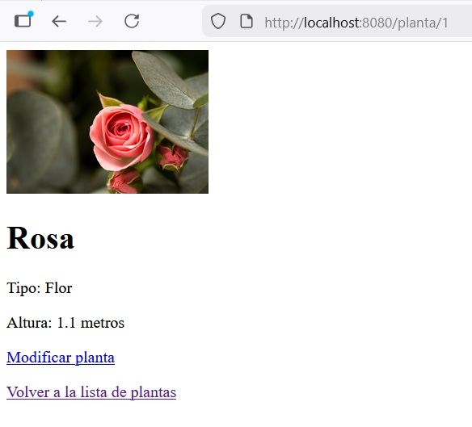

- Error (en este caso por indicar en la url el id_planta de una planta que no existe):


- Formulario de edición:


<span class="mi_sombreado">**PASO 8: Cambiar el aspecto**</span>

Como hemos visto en las capturas anteriores, nuestas vistas html no tienen aplicado ningún estilo. Vamos a darle a nuestra aplicación un aspecto más profesional utilizando `bootstrap`. Podemos encontrar mucha documentacion en internet sobre como utilizarlo. Por ejemplo en:

* [https://getbootstrap.com/docs/5.3/getting-started/introduction/](https://getbootstrap.com/docs/5.3/getting-started/introduction/)

* [https://www.w3schools.com/bootstrap5/](https://www.w3schools.com/bootstrap5/)


En nuestro caso vamos a descargarlo para incluirlo de forma local en nuestro proyecto y vamos a modificar nuestras vistas `html` para que lo utilicen. Para ello, seguiremos estos pasos:

1. Entrar en [https://getbootstrap.com](https://getbootstrap.com) 

2. Hacer clic en el botón `Download` y descargar la versión **Compiled CSS and JS**

3. Descomprir el ZIP y copiar la carpeta `bootstrap` en `src/main/resources/static/`

4. Modificar los archivos html para añadir la línea `<link rel="stylesheet" th:href="@{/bootstrap/css/bootstrap.min.css}">` dentro de la etiqueta `<head>` y añadir `<div class="container mt-5">` justo debajo de la etiqueta `<body>` (no olvides añadir tambien `</div>` justo antes de `</body>`).

Solamente con estos pequeños cambios nuestra aplicación cambiará su aspecto a:

- Lista de plantas:


- Detalle de la planta con id_planta = 1 (que aparece al hacer clic en el enlace `Ver detalles` junto al nombre de la planta):


- Error (en este caso por indicar en la url el id_planta de una planta que no existe):


- Formulario de edición:


!!! success "Prueba y analiza el ejemplo 2"
    1. Crea un proyecto Spring Boot llamado `plantas` utilizando Spring Initializr.
    2. Prueba el código del ejemplo, verifica que funciona correctamente y pregunta tus dudas.


<span class="mi_h3">Trabajando con ficheros</span>

En el ejemplo anterior, la información de las plantas se almacenaba en memoria mediante una lista y el controlador accedía directamente a ella. Ahora vamos a trabajar con los datos en un fichero CSV para disponer de persistencia y vamos a separar la responsabilidad de cada capa del patrón MVC de forma que:

- Controlador: interactúa con el usuario.

- Repositorio: maneja los datos.

- Servicio intermedio: hace de intermediario entre el controlador y el repositorio.


<span class="mis_ejemplos">Ejemplo 3: CRUD (CSV) con Spring MVC y Thymeleaf</span>

Este ejemplo modifica el anterior ampliando las funciones CRUD y definiendo las capas de la arquitectura MVC. La estructura del proyecto será la siguiente:

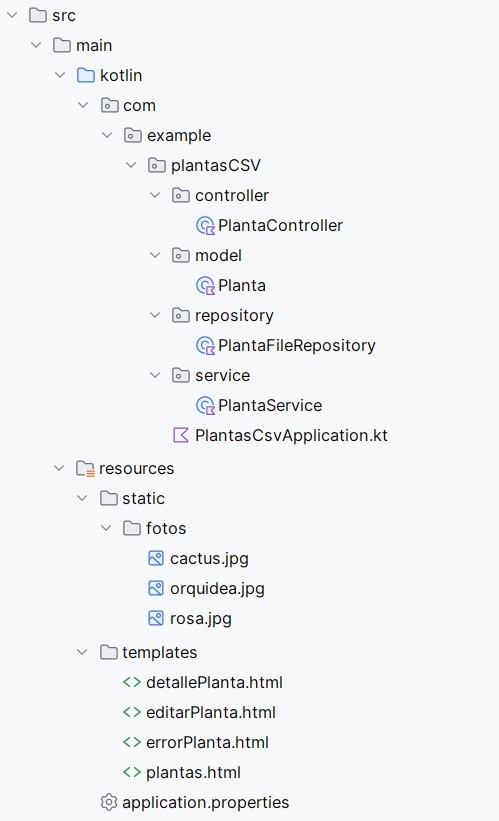


A continuación se describen los pasos necesarios para realizar dichos cambios:


<span class="mi_sombreado">**PASO 1: Crear el proyecto**</span>

Para crear el nuevo proyecto llamado `plantasCSV` a partir del anterior tenemos dos opciones:

Opción 1: Spring Initializr

- Crear un proyecto nuevo con Spring Initializr llamado `plantasCSV`.

- Copiar carpetas y archivos del proyecto del anterior.

- Actualizar todos los imports de `com.example.plantas` a `com.example.plantasCSV`


Opción 2: Duplicar el proyecto anterior

- Crear una copia de la carpeta del proyecto anterior y llamarla `plantasCSV`.

- Cambiar el nombre del proyecto en el archivo `pom.xml` (cambiando estas líneas):
```xml
  <name>plantasCSV</name>
  <artifactId>plantasCSV</artifactId>
```

- Renombrar el paquete base de com.example.plantas a com.example.plantasCSV haciendo clic derecho en la carpeta `plantas` dentro de `src/main/kotlin/com/example/` → Refactor → Rename.


<span class="mi_sombreado">**PASO 2: Crear el fichero CSV**</span>

Creamos un archivo llamado `plantas.csv` con los datos iniciales y lo ubicamos en la carpeta `src/main/resources/data/`. Su contenido inicial será:

```csv
1;Rosa;Flor;0.5;rosa.jpg
2;Cactus;Suculenta;1.2;cactus.jpg
3;Orquídea;Flor;0.3;orquidea.jpg
```


<span class="mi_sombreado">**PASO 3: Modificar el controlador**</span>

En la arquitectura MVC (Modelo-Vista-Controlador), el controlador es el encargado de recibir las peticiones del usuario (cuando hace clic en un enlace o envía un formulario en el navegador) y decidir qué respuesta dar (normalmente, mostrar una página HTML). Vamos a modificar el controlador que teníamos de la aplicación anterior para que solamente interactúe con el usuario y no acceda a los datos. Además añadiremos el código necesario para las funciones de crear nueva planta y borrar una existente. El código es el siguiente: 

```kotlin

package com.example.plantasCSV.controller

import com.example.plantasCSV.model.Planta
import com.example.plantasCSV.service.PlantaService

import org.springframework.stereotype.Controller
import org.springframework.ui.Model
import org.springframework.web.bind.annotation.*


@Controller
class PlantaController(
    private val plantaService: PlantaService
) {

    @GetMapping("/plantas")
    fun listar(model: Model): String {
        model.addAttribute("plantas", plantaService.listarPlantas())
        return "plantas"
    }
    
    @GetMapping("/planta/{id_planta}")
    fun detalle(@PathVariable id_planta: Int, model: Model): String {
        val planta = plantaService.buscarPorId(id_planta)
            ?: return "errorPlanta"

        model.addAttribute("planta", planta)
        return "detallePlanta"
    }
    
    // CREAR nueva planta
    @GetMapping("/plantas/nueva")
    fun nuevaPlanta(model: Model): String {
        // Pasamos un objeto vacío (o con ID 0/null) para el formulario
        // Como tu data class tiene tipos primitivos, pon valores por defecto dummy
        val plantaVacia = Planta(0, "", "", 0.0, "")
        model.addAttribute("planta", plantaVacia)
        model.addAttribute("titulo", "Nueva Planta")
        return "formularioPlanta"
    }
    
    // EDITAR planta existente
    @GetMapping("/plantas/editar/{id_planta}")
    fun editarPlanta(@PathVariable id_planta: Int, model: Model): String {
        val planta = plantaService.buscarPorId(id_planta) ?: return "redirect:/plantas"
        model.addAttribute("planta", planta)
        model.addAttribute("titulo", "Editar Planta")
        return "formularioPlanta"
    }

    // Procesar el GUARDADO (sirve para crear y editar)
    @PostMapping("/plantas/guardar")
    fun guardarPlanta(@ModelAttribute planta: Planta): String {
        plantaService.guardar(planta)
        return "redirect:/plantas"
    }

    // Procesar el BORRADO
    @GetMapping("/plantas/borrar/{id_planta}")
    fun borrarPlanta(@PathVariable id_planta: Int): String {
        plantaService.borrar(id_planta)
        return "redirect:/plantas"
    }
}
```


<span class="mi_sombreado">**PASO 4: Añadir la clase que maneja los datos**</span>

Esta clase se encarga de acceder a los datos y gestionarlos, es decir, leer, crear, actualizar y borrar información sobre plantas. Para añadirla creamos el archivo `PlantaFileRepository.kt` dentro de la carpeta `src/main/kotlin/com/example/plantas/repository/` con el siguiente código:

```kotlin
package com.example.plantasCSV.repository

import com.example.plantasCSV.model.Planta
import org.springframework.stereotype.Repository
import java.io.File

@Repository
class PlantaFileRepository {

    private val filePath = "src/main/resources/data/plantas.csv"

    fun findAll(): MutableList<Planta> =
        File(filePath).readLines().map { linea ->
            val partes = linea.split(";")
            Planta(
                id_planta = partes[0].toInt(),
                nombre = partes[1],
                tipo = partes[2],
                altura = partes[3].toDouble(),
                foto = partes[4]
            )
        }.toMutableList()
    
    fun save(planta: Planta) {
        val plantas = findAll()

        // Buscamos si la planta ya existe para saber si es EDITAR o CREAR
        val index = plantas.indexOfFirst { it.id_planta == planta.id_planta }

        if (index != -1) {
            // EDITAR: Reemplazamos la planta existente
            plantas[index] = planta
        } else {
            // CREAR: Calculamos nuevo ID (Simulación de Auto-Increment)
            val nuevoId = (plantas.maxOfOrNull { it.id_planta } ?: 0) + 1
            // Usamos copy porque los val son inmutables, asignando el nuevo ID
            plantas.add(planta.copy(id_planta = nuevoId))
        }
        escribirArchivo(plantas)
    }

    fun deleteById(id_planta: Int) {
        val plantas = findAll()
        plantas.removeIf { it.id_planta == id_planta }
        escribirArchivo(plantas)
    }

    private fun escribirArchivo(plantas: List<Planta>) {
        val contenido = plantas.joinToString(separator = "\n") { planta ->
            "${planta.id_planta};${planta.nombre};${planta.tipo};${planta.altura};${planta.foto}"
        }
        File(filePath).writeText(contenido)
    }
}
```

<span class="mi_sombreado">**PASO 5: Añadir la clase del servicio intermedio**</span>

En la arquitectura MVC el servicio actúa como el intermediario entre el controlador (parte que interactúa con el usuario) y el repositorio (parte que maneja los datos). Para añadirla creamos el archivo `PlantaService.kt` dentro de la carpeta `src/main/kotlin/com/example/plantas/service/` con el siguiente código:

```kotlin
package com.example.plantasCSV.service

import com.example.plantasCSV.model.Planta
import com.example.plantasCSV.repository.PlantaFileRepository
import org.springframework.stereotype.Service

@Service
class PlantaService(
    private val repository: PlantaFileRepository
) {

    fun listarPlantas(): MutableList<Planta> =
        repository.findAll()

    fun buscarPorId(id_planta: Int): Planta? =
        repository.findAll().find { it.id_planta == id_planta }

    fun guardar(planta: Planta) {
        repository.save(planta)
    }

    fun borrar(id_planta: Int) {
        repository.deleteById(id_planta)
    }
}
```


<span class="mi_sombreado">**PASO 6: Comprobar y ejecutar**</span>

Ejecutamos la aplicación usando la clase `PlantasApplication.kt` como clase principal y abrimos la url [http://localhost:8080/plantas](http://localhost:8080/plantas) en el navegador. Las siguientes imágenes muestran el funcionamiento de nuestra aplicación:


- Lista de plantas (en este caso se ha cambiado la lista por una tabla y se han añadido botones de acciones a cada planta):

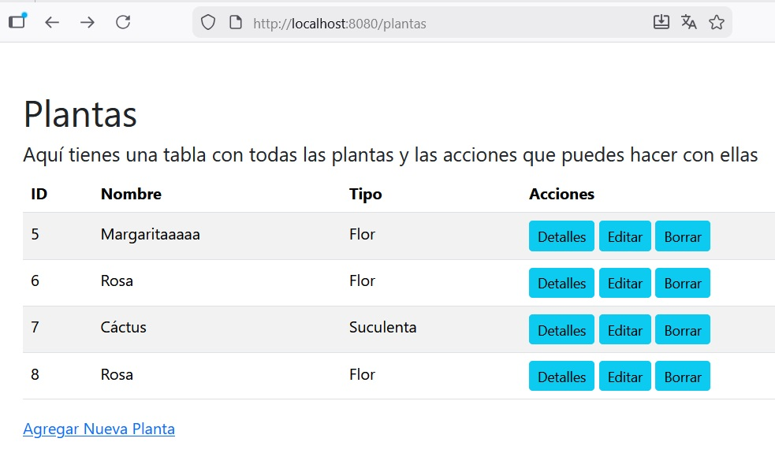

- Detalle de la planta:


- Formulario de edición (sirve tanto para añadir una nueva planta como para modificar una ya existente):


- Mensaje de confirmación de borrado:


<span class="mi_sombreado">**PASO 7: Entender el funcionamiento**</span>

Al ejecutar el programa se produce esta secuendia de acciones:

1. El **usuario** entra a /plantas.

2. El **controlador** recibe la petición y llama al **servicio (listarPlantas)**.

3. El **servicio** llama al **repositorio (findAll)**.

4. El **repositorio** lee el archivo plantas.csv, convierte el texto en objetos y los devuelve.

5. El **controlador** mete esos objetos en el **modelo** y carga la plantilla HTML plantas.html.

6. El **usuario** le la información de las plantas en su navegador.


!!! success "Prueba y analiza el ejemplo 3"
    1. Crea un proyecto Spring Boot llamado `plantasCSV` utilizando Spring Initializr o duplica el proyecto utilizado en el ejemplo anterior cambiando su nombre.
    2. Prueba el código del ejemplo, verifica que funciona correctamente y pregunta tus dudas.


!!! warning "Práctica 1: Trabaja en tu aplicación"
    1. Crea un nuevo proyecto Spring Boot (con el nombre de tu aplicación) utilizando Spring Initializr.
    2. Partiendo del un fichero CSV con información crea tu aplicación CRUD.
    3. Modifica el aspecto de tu aplicación aplicando alguna característica de `bootstrap` para que el resultado quede personalizado a tu gusto.


## 4.4. Spring Data

Spring Data proporciona herramientas y abstracciones para facilitar el acceso a bases de datos y otras fuentes de datos de manera **eficiente y consistente**. Su objetivo principal es **simplificar la interacción con diferentes tipos de bases de datos**, tanto **relacionales** (como PostgreSQL o MySQL) como **NoSQL** (por ejemplo MongoDB), reduciendo la cantidad  de código necesario y **unificando la forma de trabajar con los datos**. 

Se utiliza para:

**1. Acceso Simplificado a Datos:**

* Reduce la necesidad de escribir consultas SQL complejas o código JDBC al exponer métodos predefinidos para operaciones comunes.
* Permite realizar operaciones CRUD (Crear, Leer, Actualizar, Eliminar) con facilidad.

**2. Abstracción de Repositorios:** Ofrece la interfaz **Repository** y subinterfaces como **CrudRepository** y **JpaRepository** que proporcionan métodos estándar para la gestión de entidades en bases de datos relacionales.

**3. Consultas Personalizadas:** Permite escribir consultas personalizadas mediante anotaciones como **@Query**.
También admite la creación de métodos de consulta basados en el nombre del método, como **findByNombre(String nombre)**.

**4. Compatibilidad con Múltiples Tecnologías de Bases de Datos:**

* Relacionales: Mediante JPA (Java Persistence API).
* NoSQL: MongoDB, Redis, Neo4j, Cassandra, etc.
* Buscadores: Elasticsearch, Solr.

**5. Configuración Declarativa:** Al integrar Spring Data con Spring Boot, se pueden configurar muchas opciones mediante propiedades en **application.properties**, evitando configuraciones manuales detalladas.

**6. Integración con Spring Boot:** Con dependencias específicas como **spring-boot-starter-data-jpa** o **spring-boot-starter-data-mongodb**, Spring Data se integra perfectamente con el resto del ecosistema de Spring.

---

En lugar de proporcionar una única solución, Spring Data está compuesto por varios módulos, cada uno diseñado para un tipo concreto de tecnología de persistencia, como bases de datos relacionales, NoSQL o sistemas de búsqueda. Gracias a esta estructura modular, el desarrollador puede cambiar la tecnología de persistencia sin modificar la arquitectura general de la aplicación. Sus principales módulos son:

- **Spring Data JPA:** Proporciona una integración con JPA para bases de datos relacionales. Es ideal para trabajar con entidades Java mapeadas a tablas de bases de datos. JPA es la especificación para persistir, leer y gestionar data desde los objetos Java a la base de datos.
- **Spring Data MongoDB:** Facilita el acceso a bases de datos MongoDB, una base de datos NoSQL orientada a documentos.
- **Spring Data Redis:** Para aplicaciones que necesitan interactuar con Redis, una base de datos en memoria.
- **Spring Data Cassandra:** Proporciona soporte para bases de datos distribuidas como Cassandra.
- **Spring Data Elasticsearch:** Simplifica las interacciones con Elasticsearch, un motor de búsqueda y análisis.


### 4.4.1. Spring Data JPA

Spring Data JPA (Java Persistence API) es un módulo de Spring Data que sirve para simplificar el acceso a bases de datos relacionales utlizando objetos (clases) sin tener que escribir SQL ni código repetitivo. Con Spring Data JPA:

- Solo defines entidades (@Entity)

- Creas interfaces Repository

- Spring genera automáticamente el código


<span class="mi_h3">Anotaciones JPA</span>

Algunas de las anotaciones JPA son las siguientes:

**Anotaciones de Mapeo JPA**

* `@Entity` -  Marca una clase como una entidad JPA, mapeada a una tabla en la base de datos.

```
@Entity
data class User(
    @Id
    val id: Long,
    val name: String
)
```


* `@Table` - Especifica el nombre de la tabla que corresponde a la entidad.

```
@Entity
@Table(name = "users")
data class User(
    @Id
    val id: Long,
    val name: String
)
```


* `@Id` - Indica que un campo es la clave primaria de la tabla.

```
@Id
val id: Long
```

* `@GeneratedValue` - Define cómo se genera el valor de la clave primaria (`GenerationType.IDENTITY`, `GenerationType.SEQUENCE`, etc.)

```
@Id
@GeneratedValue(strategy = GenerationType.IDENTITY)
val id: Long
```


* `@Column` - Configura una columna de la tabla, como nombre, si es nula o única.

```
@Column(name = "user_name", nullable = false, unique = true)
val name: String
```


* `@JoinColumn` - Especifica la columna que actúa como clave foránea.

```
@ManyToOne
@JoinColumn(name = "department_id")
val department: Department
```


* `@Lob` - Indica que un campo es un objeto de gran tamaño (texto o binario).

```
@Lob
val description: String
```


* `@Transient` - Excluye un campo del mapeo de base de datos (no se almacena).

```
@Transient
val calculatedField: String
```


**Anotaciones de relaciones JPA**

* `@ManyToOne`, `@OneToMany`, `@OneToOne`, `@ManyToMany`: Definen relaciones entre entidades.

```
@ManyToOne
val department: Department
```

|  Anotación | Descripción | 
|----------|-------------|
|  `@ManyToOne` | Relación muchos a uno |
|   `@OneToMany` | Relación uno a muchos |
|   `@OneToOne` | Relación uno a uno |
|   `@ManyToMany` | Relación muchos a muchos |


**Anotaciones de Spring Data JPA**

* `@Repository` - Marca una interfaz o clase como repositorio Spring. El `_data class_` representa la entidad (tabla), mientras que el `@Repository` se encarga de las operaciones de acceso a datos sobre esa entidad.

```
@Repository
interface UserRepository : JpaRepository<User, Long>
```

* `@Query` - Define una consulta personalizada usando JPQL o SQL nativo.

```
//Ejemplo (JPQL):
@Query("SELECT u FROM User u WHERE u.name = :name")
fun findByName(@Param("name") name: String): List<User>

//Ejemplo (SQL nativo):
@Query(value = "SELECT * FROM users WHERE user_name = :name", nativeQuery = true)
fun findByNameNative(@Param("name") name: String): List<User>
```

* `@Param` - Define parámetros nombrados para consultas con `@Query`.

```
@Query("SELECT u FROM User u WHERE u.name = :name")
fun findByName(@Param("name") name: String): List<User>
```

* `@Modifying` - Se utiliza con consultas `@Query` para operaciones de actualización o eliminación.

```
@Modifying
@Query("UPDATE User u SET u.name = :name WHERE u.id = :id")
fun updateName(@Param("id") id: Long, @Param("name") name: String)
```

* `@EnableJpaRepositories` - Habilita la funcionalidad de Spring Data JPA y escanea paquetes para detectar repositorios.

```
@EnableJpaRepositories(basePackages = ["com.example.repository"])
```


* `@EntityGraph` - Especifica cómo cargar las relaciones en una consulta, evitando lazy loading.

```
@EntityGraph(attributePaths = ["roles"])
fun findByName(name: String): User
```


**Anotaciones de Transacciones**

* `@Transactional` - Marca un método o clase para ejecutar dentro de una transacción.

```
@Transactional
fun updateUserDetails(user: User) { ... }
```


* `@Rollback` - Utilizada para forzar la reversión de una transacción.

```
@Transactional
@Rollback
fun testSaveUser() { ... }
```


<span class="mi_h3">Consultas utilizando convención de nombres</span>

Spring Data JPA permite definir métodos en repositorios siguiendo una convención de nombres específica. Esto simplifica la escritura de consultas comunes sin necesidad de usar JPQL o SQL. Para ello analiza el nombre de los métodos en el repositorio e interpreta su significado para generar consultas automáticamente.

La **convención de nombres** se utiliza:

- En consultas sencillas y que no requieren lógica compleja ni múltiples combinaciones.

- Cuando quieres mantener un código más limpio y directo.


La estructura básica es: `findBy + NombreDeCampo + Condición` donde:

- **findBy**: Indica que se busca una entidad en la base de datos. Alternativas: **readBy** (lectura de datos), **queryBy** (consulta de datos) y **getBy** (obtener datos).


- **NombreDeCampo**: Debe coincidir exactamente con el nombre del atributo en la entidad. Se puede incluir navegación de atributos para relaciones (EntidadRelacionada.Atributo).


- **Condición** (opcional): Permite añadir operadores lógicos como And, Or, etc. Ejemplo: findByNombreAndEdad.


**Ejemplos de métodos según la convención**

* Consultas simples: Método **findByNombre(String nombre)**. Ejemplo de consulta generada:

            SELECT * FROM entidad WHERE nombre = ?


* Consultas con condiciones: Método **findByNombreAndEdad(String nombre, Integer edad)**. Ejemplo de consulta generada:

            SELECT * FROM entidad WHERE nombre = ? AND edad = ?


* Consultas con orden: Método **findByNombreOrderByEdadDesc(String nombre)**. Ejemplo de consulta generada:

            SELECT * FROM entidad WHERE nombre = ? ORDER BY edad DESC


* Consultas con relaciones. Si hay una relación entre entidades, se puede navegar por los campos relacionados: Método **findByComarcaNomC(String nomC)**. Ejemplo de consulta generada:

             SELECT * FROM entidad e JOIN comarca c ON e.comarca_id = c.id WHERE c.nomC = ?


**Palabras clave en la convención**

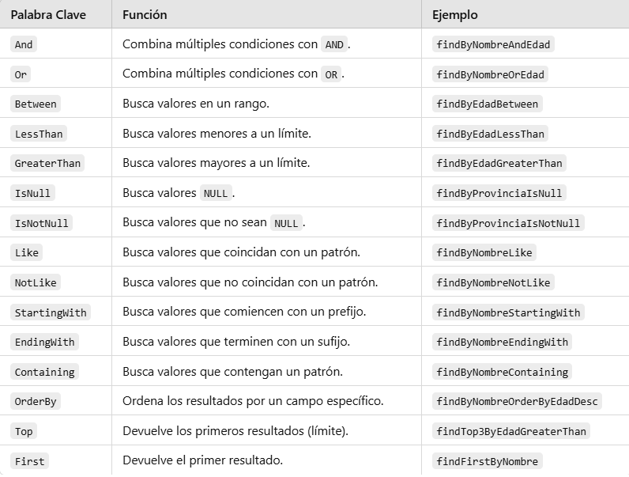

A tener en cuenta:

* **Coincidencia exacta del nombre del campo**: Los nombres deben coincidir con los atributos definidos en la entidad.

* **Relaciones**: Usa la notación _EntidadRelacionada.Atributo_ para navegar entre tablas relacionadas.

* **Orden**: Los métodos pueden incluir palabras clave de ordenación, como _OrderBy_.

* **Parámetros**: Los métodos generados reciben parámetros en el mismo orden en que se declaran en el nombre del método.


<span class="mi_h3">Consultas utilizando la anotación @Query</span>

La anotación **@Query** se utiliza:

* En consultas complejas que involucren múltiples tablas, condiciones avanzadas o subconsultas.

* Si prefieres optimizar manualmente las consultas.

* Cuando la convención de nombres generaría un nombre de método excesivamente largo.


La estructura básica es:

    @Query("SELECT e FROM EntityName e WHERE e.property = :value")
    fun findByProperty(@Param("value") value: String): List<EntityName>


* Se utilizan nombres de entidades y propiedades de las clases en lugar de nombres de tablas y columnas.

* Se puede navegar por relaciones entre entidades.

* _:nombreParametro_ para parámetros dinámicos.


**Ejemplo sencillo:**

    @Query("SELECT c FROM Comarca c WHERE c.provincia = :provincia")
    fun findByProvincia(@Param("provincia") provincia: String): List<Comarca>


**Ejemplo con relaciones:**

Siguiendo con nuestro ejemplo de geo_ad, la consulta para buscar Institutos en una Provincia por Población Mínima quedaría así:


    @Query("""
        SELECT i FROM Institut i
        JOIN i.poblacio p
        JOIN p.comarca c
        WHERE c.provincia = :provincia AND p.poblacion >= :minPoblacion
    """)
    fun findByProvinciaAndPoblacion(
        @Param("provincia") provincia: String,
        @Param("minPoblacion") minPoblacion: Int
    ): List<Institut>


**Este mismo ejemplo utilizando convención de nombres quedaría así:**{.verde}

    @Repository
    interface InstitutRepository : JpaRepository<Institut, String> {
        fun findByPoblacioComarcaProvinciaAndPoblacioPoblacionGreaterThanEqual(
            provincia: String,
            minPoblacion: Int
        ): List<Institut>
    }


* **findBy**: Indica que es un método de consulta.

* **PoblacioComarcaProvincia**: Navega por las relaciones de las entidades Institut  Poblacio -> Comarca para filtrar por la provincia.

* **AndPoblacioPoblacionGreaterThanEqual**: Navega por Institut -> Poblacio y aplica el filtro de población mínima.


<span class="mis_ejemplos">Ejemplo 4: CRUD con SQLite</span>


<!--

### 4.4.1. Spring Data MongoDB


<span class="mi_h3">Spring Data MongoDB</span>

-->


---

<span class="mi_h3">Autoría</span>

Obra realizada por Begoña Paterna Lluch basada en materiales desarrollados por Alicia Salvador Contreras. Publicada bajo licencia [Creative Commons Atribución/Reconocimiento-CompartirIgual 4.0 Internacional](https://creativecommons.org/licenses/by-sa/4.0/)

---
