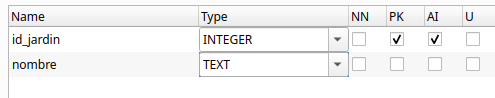

# Transacciones y excepciones

<span class="mi_h2">Transacciones</span>

Una transacción es una secuencia de una o más operaciones sobre una base de datos que deben ejecutarse como una unidad indivisible. El objetivo es asegurar que todas las operaciones se completen con éxito o, en caso de fallo, ninguna de ellas se aplique, manteniendo así la base de datos en un estado consistente. Por ejemplo, en una transferencia bancaria, si falla el abono en una cuenta, se cancela el débito en la otra.

Las transacciones se gestionan mediante comandos como BEGIN TRANSACTION (para iniciar), COMMIT (para confirmar los cambios) y ROLLBACK (para deshacer los cambios en caso de error). Este mecanismo protege la base de datos frente a fallos parciales y situaciones de concurrencia, asegurando que los datos siempre reflejen una realidad válida y coherente.


**Propiedades de una transacción (ACID)**

Las transacciones garantizan propiedades fundamentales, conocidas por el acrónimo ACID:

Propiedad|	Significado breve
---------|-------------------
Atomicidad|	Todas las operaciones se ejecutan o ninguna lo hace
Consistencia|	El sistema pasa de un estado válido a otro
Isolación|	No interfiere con otras transacciones simultáneas
Durabilidad| Una vez confirmada, el cambio permanece


**Comandos clave**

Para controlar correctamente una transacción desde el código, necesitamos usar tres comandos clave:


- **commit()**: Confirma los cambios realizados por la transacción, haciéndolos permanentes.
- **rollback()**: Revierte todos los cambios realizados durante la transacción actual, volviendo al estado anterior.

Por defecto, muchas conexiones JDBC están en modo **auto-commit**, es decir, cada operación se ejecuta y confirma automáticamente. Para usar transacciones de forma manual, debes desactivar este modo:

        conexion.autoCommit = false


<span class="mi_h2">Excepciones</span>

El manejo de excepciones en las transacciones es absolutamente necesario para garantizar que los datos de la base de datos no queden en un estado inconsistente o corrupto cuando ocurre un error durante una operación.

Una transacción sin control de errores no es una transacción segura. Siempre hay que estar preparado para deshacer todo si algo sale mal.

Cuando realizamos varias operaciones dentro de una misma transacción (por ejemplo, una transferencia bancaria), pueden ocurrir errores como:

- un fallo de conexión,
- un ID incorrecto,
- un valor nulo inesperado,
- un error lógico como saldo insuficiente.
  
Si no controlamos esos errores, la base de datos podría:

- Aplicar solo algunas de las operaciones
- Dejar datos parcialmente modificados
- Generar resultados incorrectos para otros usuarios

Para evitarlo se utiliza un bloque **try-catch** que:

- Llama a commit() si todo sale bien
- Llama a rollback() si ocurre cualquier excepción

``` kotlin
        try {
            conexion.autoCommit = false

            // Varias operaciones SQL...
            conexion.commit()  // Todo bien
        } catch (e: Exception) {
            conexion.rollback()  // Algo falló → revertir
            println("Error en la transacción. Cambios anulados.")
        }
``` 


<span class="mis_ejemplos">Ejemplo 6: commit y rollback</span> 

Para el siguiente ejemplo se ha ampliado la BD con dos tablas: `jardines`y  `jardines_plantas` la estructura de estas tablas es la siguiente:





Supongamos que queremos llevar varias unidades de una planta a un jardín. El programa debe actualizar el stock en la tabla `plantas` (restando las unidades que llevamos al jardín) en la `tabla` y añadir un registro en la tabla `jardines_plantas` indicando el jadín, la planta y la cantidad. Ambas operaciones deben realizarse juntas, o no realizarse ninguna. El código sería el siguiente:

``` kotlin
import java.sql.SQLException

fun llevarPlantasAJardin(id_jardin: Int, id_planta: Int, cantidad: Int) {
    FlorabotanicaBD.getConnection()?.use { conn ->
        try {
            conn.autoCommit = false  // Iniciar transacción manual

            // Restar stock a la planta
            val stock = conn.prepareStatement("UPDATE plantas SET stock = stock - $cantidad WHERE id_planta = ?")
            stock.setInt(1, id_planta)
            stock.executeUpdate()

            // Añadir línea en tabla jardines_plantas
            val plantar = conn.prepareStatement("INSERT INTO jardines_plantas(id_jardin, id_planta, cantidad) VALUES (?, ?, ?)")
            plantar.setInt(1, id_jardin)
            plantar.setInt(2, id_planta)
            plantar.setInt(3, cantidad)
            plantar.executeUpdate()

            // Confirmar cambios
            conn.commit()
            println("Transferencia realizada con éxito.")
        } catch (e: SQLException) {
            if (e.message?.contains("UNIQUE constraint failed") == true) {
                println("Error: intento de insertar clave duplicada")
                conn.rollback()
                println("Transacción revertida.")
            } else {
                throw e // otros errores, relanzamos
            }
        }
    }
}
```

La llamada sería:

``` kotlin
llevarPlantasAJardin(1,5,2)
```

Si no se produce ningún error se hará el `commit` y en caso contrario el `rollback`

!!! success "Realiza lo siguiente" 
    Prueba el código de ejemplo y verifica que funciona correctemente.

!!! warning "Práctica 5: Trabaja con tu base de datos" 
    Añade a tu aplicación alguna funcionalidad parecida a la del ejemplo para poder probar las transacciones sobre tu base de datos.

