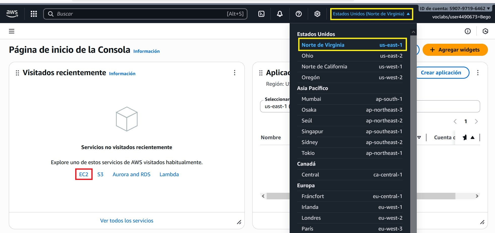
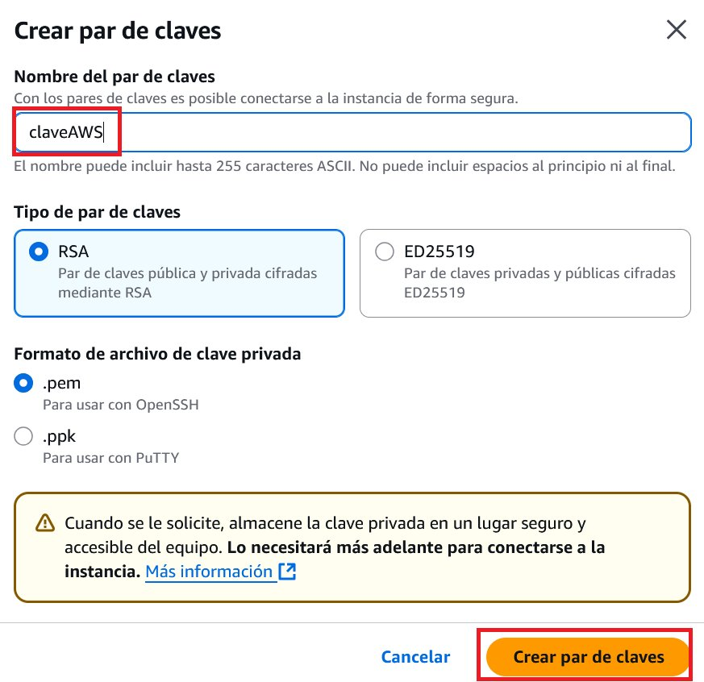
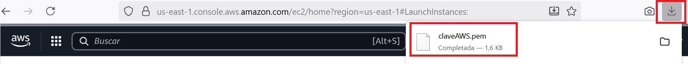
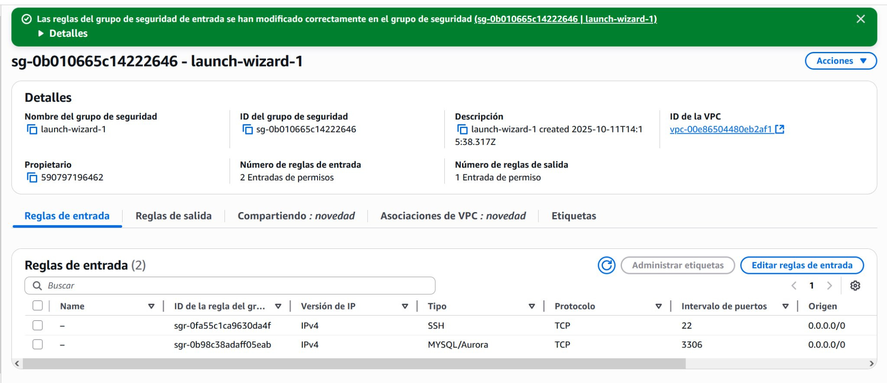

# Ubuntu Server en AWS Learner Lab

<span class="mi_h3">Revisiones</span>

|Revisión | Fecha| Descripción|
|---------|------|-------------|
|1.0 | 11-10-2025 | Adaptación de los materiales a markdown|


<span class="mi_h3">Instalación del servidor</span>

A continuación se describen los pasos para crear un servidor Ubuntu en un laboratorio de aprendizaje de AWS Academy.

1. Habrás recibido un correo electrónico de invitación, haz clic en el enlace y crea tu cuenta. Una vez completado el registro se abrirá el curso automaticamente. Haz clic en *Contenidos* y luego en el enlace *Lanzamiento del laboratorio* como se muestra en la siguiente imagen (la primera vez que entres deberás aceptar los términos de uso).
    

    Si te aparece el siguiente mensaje: *This assignment is locked till you access it through your respective LMS once, please use your LMS to access/unlock this assignment* vuelve a hacer clic en *Contenidos* y en el enlace *Lanzamiento del laboratorio*.

    Para entrar al curso en el futuro hazlo desde: [https://www.awsacademy.com/vforcesite/LMS_Login](https://www.awsacademy.com/vforcesite/LMS_Login):
    

    Luego haz clic en el nombre del curso y, una vez dentro, haz clic en *Contenidos* y luego en el enlace *Lanzamiento del laboratorio* como hiciste la primera vez que accediste a él.
    
    

    
2. Cuando aparezca la pantalla con el laboratorio, haz clic en el botón *Start Lab* (verás que el círculo junto al enlace *AWS* cambia de color rojo a amarillo y permanece de ese color mientras arranca el laboratorio).
    

3. Cuando el laboratorio haya arrancado, el círculo cambiará a color verde. Entonces haz clic en el enlace *AWS* para acceder a la *Página de inicio de la Consola* (puedes ver que la región es *North Virginia (us-east-1)* que es la región por defecto de los laboratorios de aprendizaje) y después haz clic en *EC2* para acceder a la consola de instancias EC2.
    

4. Haz clic en el botón *Lanzar la instancia*.
    

5. Escribe el nombre de la instancia y elige una *Amazon Machine Image (AMI)* en este caso Ubuntu (al seleccionar ubuntu nos aparece la Ubuntu Server 24.04 LTS que es apta para utilizar de forma gratuita).
    

6. Más abajo aparece el tipo de instancia.
    

7. Crea un par de claves.
    
    

8. Verás que el navegador descarga la clave automáticamente:
    
    <span class="mis_avisos">**Muy importante:** guarda el fichero de la clave en lugar seguro porque te hará falta para conectar a tu servidor por SSH.</span>

9. Deja el resto de opciones como están y, en la parte derecha dentro del apartado *Resumen*, haz clic en el botón *Lanzar instancia*. Cuando la instancia termine de lanzarse aparecerá la siguiente imagen:
    

10. Puedes hacer clic en el botón *Conectarse a la instancia* para ver las instrucciones de conexión al servidor, por ejemplo en la pestaña SSH aparece lo siguiente:
    

11. Prueba la conexión. Para ello escribe en una ventana de comandos la instrucción siguiente::

    ```bash
    ssh -i claveAWS.pem ubuntu@ec2-13-218-241-87.compute-1.amazonaws.com
    ```
    Asegurate que el archivo .pem está en la carpeta desde la que lanzas el comando y sustituye el nombre de tu archiv .pem y el nombre de tu servidor. Si la conexión se ha establecido correctamente verás la siguiente información:

    


<span class="mi_h3">Instalación de MySQL</span>

1. Actualiza la lista de paquetes del servidor:
    ```bash
    sudo apt update
    ```
2. Instala el servidor MySQL y las dependencias necesarias:
    ```bash
    sudo apt install mysql-server
    ```
3. Ejecuta el script de seguridad para establecer una contraseña de usuario root, eliminar usuarios anónimos y deshabilitar el inicio de sesión remoto del usuario root:
    ```bash
    sudo mysql_secure_installation
    ```
    
    

4. Comprueba que el servicio de MySQL se esté ejecutando correctamente (si no está activo, puedes iniciarlo con `sudo systemctl start mysql`):
    ```bash
    sudo systemctl status mysql
    ```
    
    
5. Permite conexiones externas. Para ello edita el fichero de configuración
`sudo nano /etc/mysql/mysql.conf.d/mysqld.cnf` y cambia lo siguiente:
    - Comenta `bind-address = 127.0.0.1`

    - Añade la línea `bind-address = 0.0.0.0`


    Para que el fichero de configuración quede como se ve en la siguiente imagen:
    


6. Reinicia el servicio:
    ```bash
    sudo systemctl restart mysql
    ```


<span class="mi_h3">Configuración de un usuario MySQL</span>

1. Entra al servidor MySQL (dejar la contraseña en blanco)
    ```bash
    sudo mysql -u root -p 
    ```

2. Crea el usuario con su contraseña
    ```sql
    CREATE USER 'bpl2'@'%' IDENTIFIED BY 'holaHOLA01+';

    GRANT ALL PRIVILEGES ON *.* TO 'bpl2'@'%';
    
    FLUSH PRIVILEGES;
    
    SHOW GRANTS FOR 'bpl2'@'%';
    
    exit
    ```

3. Añade una regla en el servidor para permitir el tráfico entrante del puerto 3306.
    -  Ve a la consola de AWS y encuentra tu instancia EC2.
    -  Haz clic en la pestaña "Security" y luego en el enlace del Security Group asociado.
    -  Ve a la sección "Inbound rules" y haz clic en "Edit inbound rules".
    -  Haz clic en "Add rule" y configura:
        *   **Type**: Custom TCP
        *   **Port range**: 3306
        *   **Source**: Puedes especificar una IP concreta o `0.0.0.0/0` para permitir acceso desde cualquier lugar (menos seguro).
    -  Guarda las reglas.

    


4. Prueba a conectar a tu base de datos.


<!--
```bash
sudo ufw allow 3306
```
-->


<!--
### ss -tulnp | grep 3306

**antes de habilitar acceso externo**
```
tcp LISTEN 0 151 127.0.0.1:3306 0.0.0.0:*
tcp LISTEN 0 70 127.0.0.1:33060 0.0.0.0:*
```

**después de habilitar acceso externo**
```
tcp LISTEN 0 70 127.0.0.1:33060 0.0.0.0:*
tcp LISTEN 0 151 0.0.0.0:3306 0.0.0.0:*
```
-->


