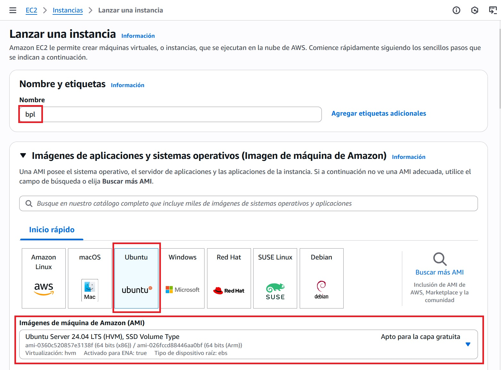

# Ubuntu Server en AWS Learner Lab

<span class="mi_h3">Revisiones</span>

| Revisión | Fecha      | Descripción                                |
|----------|------------|--------------------------------------------|
| 1.0      | 11-10-2025 | Adaptación de los materiales a markdown    |
| 1.1      | 21-10-2025 | Reorganización de algunas secciones        |
| 1.2      | 06-11-2025 | Ampliación sección de exportación de la BD |

<span class="mi_h3">Acceso al laboratorio</span>

A continuación se describen los pasos para acceder al laboratorio de aprendizaje de AWS Academy.

1. **Crea tu cuenta**

    Habrás recibido un correo electrónico de invitación, haz clic en el enlace y crea tu cuenta. Una vez completado el registro se abrirá el entorno de AWS Academy automáticamente. Haz clic en `Contenidos` y luego en el enlace `Lanzamiento del laboratorio` como se muestra en la siguiente imagen (la primera vez que entres deberás aceptar los términos de uso)

    

    !!!Note ""
        Si te aparece el siguiente mensaje: *"This assignment is locked till you access it through your respective LMS once, please use your LMS to access/unlock this assignment"* vuelve a hacer clic en *Contenidos* y en el enlace *Lanzamiento del laboratorio*

    Para entrar al curso en el futuro hazlo desde: [https://www.awsacademy.com/vforcesite/LMS_Login](https://www.awsacademy.com/vforcesite/LMS_Login)

    

    Luego haz clic en el nombre del curso y, una vez dentro, haz clic en `Contenidos` y en el enlace `Lanzamiento del laboratorio` como hiciste la primera vez 

    
    

    
2. **Inicia el laboratorio**

    Cuando aparezca la pantalla con el laboratorio, haz clic en el botón `Start Lab` (verás que el círculo junto al enlace `AWS` cambia de color rojo a amarillo y permanece de ese color mientras arranca el laboratorio)

    

3. **Accede a la consola**

    Cuando el laboratorio haya arrancado, el círculo cambiará a color verde. Entonces haz clic en el enlace `AWS` para acceder a la `Página de inicio de la Consola` (puedes ver que la región es *North Virginia (us-east-1)* que es la región por defecto de los laboratorios de aprendizaje, **NO LO CAMBIES**). Después haz clic en `EC2` para acceder a la consola de instancias EC2

    


<span class="mi_h3">Instalación del servidor</span>

A continuación se describen los pasos para crear un servidor Ubuntu en un laboratorio de aprendizaje de AWS Academy.

1. **Crea la instancia**

    Dentro del panel `EC2` haz clic en el botón `Lanzar la instancia`. Luego Escribe el nombre de la instancia y elige una `Amazon Machine Image (AMI)` en este caso Ubuntu (al seleccionar ubuntu nos aparece la Ubuntu Server 24.04 LTS que es apta para utilizar de forma gratuita). Más abajo también aparece el tipo de instancia que es

    
    
    

2. **Crea un par de claves**

    Haz clic en el enlace `Crear un nuevo par de claves`, introduce el nombre para el fichero de claves y haz clic en el botón `Crear par de claves`

    
    

    <span class="mis_avisos">**Muy importante:** Verás que el navegador descarga el fichero .pem de tu clave automáticamente. Guárdalo en lugar seguro porque te hará falta para conectar a tu servidor por SSH.</span>

3. **Lanzar instancia**
 
    Deja el resto de opciones como están y, en la parte derecha dentro del apartado `Resumen`, haz clic en el botón `Lanzar instancia`. Cuando la instancia termine de lanzarse aparecerá la siguiente imagen

    


4. **IP pública fija**

    Para que el servidor tenga siempre la misma IP pública y facilitar así trabajar con él, vamos a asignarle una IP fija. Para ello haz clic en el enlace `Direcciones IP elásticas` y luego haz clic en el botón `Asignar dirección IP elástica` 
   
    
    

    En la siguiente pantalla deja las opciones por defecto y haz clic en el botón `Asignar`. Verás la nueva IP
   
    
    

    Selecciona la nueva IP, haz clic en el desplegable `Acciones` y entra en `Dirección IP elástica asociada`, luego indica la instancia a la que asignar la IP y haz clic en `Asociado`. La IP quedará asociada a tu instancia

    
    
    

    Vuelve a la lista de instancias para comprobar que tu instancia ya tiene la IP
    

5. **Prueba la conexión**

    Haz clic en el botón `Conectarse a la instancia` para ver las diferentes opciones de conexión y sus instrucciones, por ejemplo en la pestaña `Cliente SSH` (que es la que vamos a utilizar) aparece lo siguiente:

    

    Para conectar, abre una ventana de comandos y escribe la instrucción siguiente (puedes utilizar el nombre del servidor o su IP pública)

    ```bash
    ssh -i nombre_clave ubuntu@nombre_IP_servidor
    ```
    Asegurate que el archivo .pem está en la carpeta desde la que lanzas el comando y sustituye `nombre_clave` por el de tu archivo .pem y `nombre_IP_servidor` por el nombre o la IP pública de tu servidor. Si la conexión se ha establecido correctamente verás la siguiente información

    

