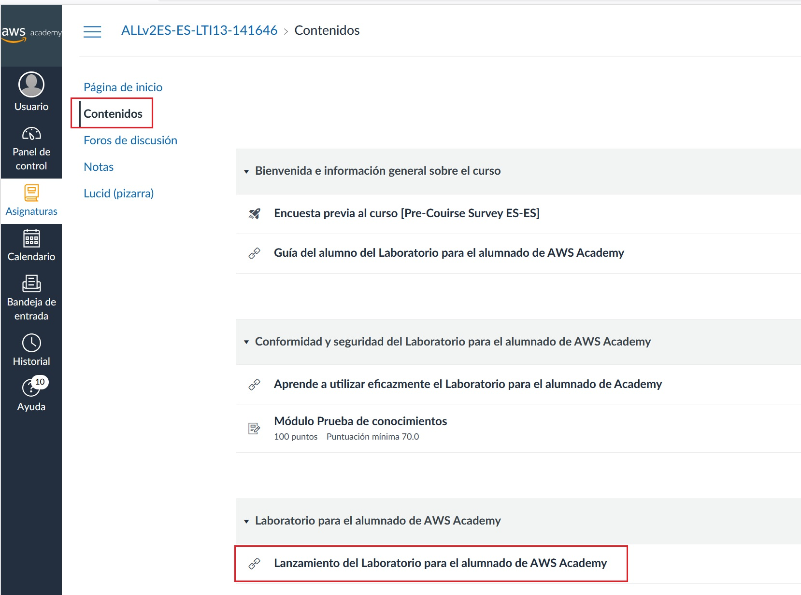
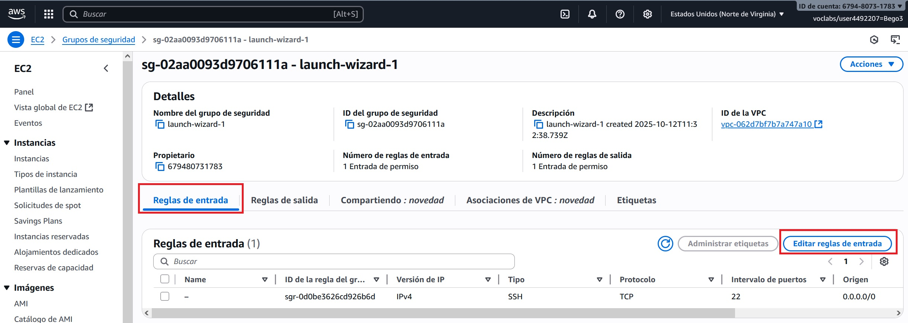
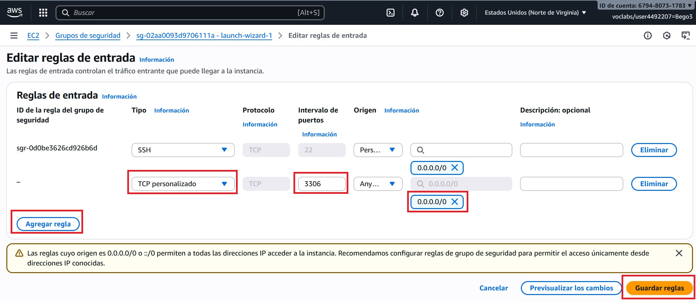

# Ubuntu Server en AWS Learner Lab

<span class="mi_h3">Revisiones</span>

| Revisión | Fecha      | Descripción                                |
|----------|------------|--------------------------------------------|
| 1.0      | 11-10-2025 | Adaptación de los materiales a markdown    |
| 1.1      | 21-10-2025 | Reorganización de algunas secciones        |
| 1.2      | 06-11-2025 | Ampliación sección de exportación de la BD |

<span class="mi_h3">Acceso al laboratorio</span>

A continuación se describen los pasos para acceder al laboratorio de aprendizaje de AWS Academy.

1. **Crea tu cuenta**

    Habrás recibido un correo electrónico de invitación, haz clic en el enlace y crea tu cuenta. Una vez completado el registro se abrirá el entorno de AWS Academy automáticamente. Haz clic en `Contenidos` y luego en el enlace `Lanzamiento del laboratorio` como se muestra en la siguiente imagen (la primera vez que entres deberás aceptar los términos de uso)

    

    !!!Note ""
        Si te aparece el siguiente mensaje: *"This assignment is locked till you access it through your respective LMS once, please use your LMS to access/unlock this assignment"* vuelve a hacer clic en *Contenidos* y en el enlace *Lanzamiento del laboratorio*

    Para entrar al curso en el futuro hazlo desde: [https://www.awsacademy.com/vforcesite/LMS_Login](https://www.awsacademy.com/vforcesite/LMS_Login)

    

    Luego haz clic en el nombre del curso y, una vez dentro, haz clic en `Contenidos` y en el enlace `Lanzamiento del laboratorio` como hiciste la primera vez 

    
    

    
2. **Inicia el laboratorio**

    Cuando aparezca la pantalla con el laboratorio, haz clic en el botón `Start Lab` (verás que el círculo junto al enlace `AWS` cambia de color rojo a amarillo y permanece de ese color mientras arranca el laboratorio)

    

3. **Accede a la consola**

    Cuando el laboratorio haya arrancado, el círculo cambiará a color verde. Entonces haz clic en el enlace `AWS` para acceder a la `Página de inicio de la Consola` (puedes ver que la región es *North Virginia (us-east-1)* que es la región por defecto de los laboratorios de aprendizaje, NO LO CAMBIES). Después haz clic en `EC2` para acceder a la consola de instancias EC2

    


<span class="mi_h3">Instalación del servidor</span>

A continuación se describen los pasos para crear un servidor Ubuntu en un laboratorio de aprendizaje de AWS Academy.

1. **Crea la instancia**

    Dentro del panel `EC2` haz clic en el botón `Lanzar la instancia`. Luego Escribe el nombre de la instancia y elige una `Amazon Machine Image (AMI)` en este caso Ubuntu (al seleccionar ubuntu nos aparece la Ubuntu Server 24.04 LTS que es apta para utilizar de forma gratuita). Más abajo también aparece el tipo de instancia que es

    
    
    

2. **Crea un par de claves**

    Haz clic en el enlace `Crear un nuevo par de claves`, introduce el nombre para el fichero de claves y haz clic en el botón `Crear par de claves`

    
    

    <span class="mis_avisos">**Muy importante:** Verás que el navegador descarga el fichero .pem de tu clave automáticamente. Guárdalo en lugar seguro porque te hará falta para conectar a tu servidor por SSH.</span>

3. **Lanzar instancia**
 
    Deja el resto de opciones como están y, en la parte derecha dentro del apartado `Resumen`, haz clic en el botón `Lanzar instancia`. Cuando la instancia termine de lanzarse aparecerá la siguiente imagen

    


4. **IP pública fija**

    Para que el servidor tenga siempre la misma IP pública y facilitar así trabajar con él, vamos a asignarle una IP fija. Para ello haz clic en el enlace `Direcciones IP elásticas` y luego haz clic en el botón `Asignar dirección IP elástica` 
   
    
    

    En la siguiente pantalla deja las opciones por defecto y haz clic en el botón `Asignar`. Verás la nueva IP
   
    
    

    Selecciona la nueva IP, haz clic en el desplegable `Acciones` y entra en `Dirección IP elástica asociada`, luego indica la instancia a la que asignar la IP y haz clic en `Asociado`. La IP quedará asociada a tu instancia

    
    
    

    Vuelve a la lista de instancias para comprobar que tu instancia ya tiene la IP
    

5. **Prueba la conexión**

    Haz clic en el botón `Conectarse a la instancia` para ver las diferentes opciones de conexión y sus instrucciones, por ejemplo en la pestaña `Cliente SSH` (que es la que vamos a utilizar) aparece lo siguiente:

    

    PAra conectar, abre una ventana de comandos y escribe la instrucción siguiente (puedes utilizar el nombre del servidor o su IP pública)

    ```bash
    ssh -i nombre_clave ubuntu@nombre_IP_servidor
    ```
    Asegurate que el archivo .pem está en la carpeta desde la que lanzas el comando y sustituye `nombre_clave` por el de tu archivo .pem y `nombre_IP_servidor` por el nombre o la IP pública de tu servidor. Si la conexión se ha establecido correctamente verás la siguiente información

    


<span class="mi_h3">Instalación de MySQL</span>

1. Actualiza la lista de paquetes del servidor
    ```bash
    sudo apt update
    ```

2. Instala el servidor MySQL y las dependencias necesarias
    ```bash
    sudo apt install mysql-server
    ```

3. Comprueba que el servicio de MySQL se esté ejecutando correctamente (Si no está activo, puedes iniciarlo con `sudo systemctl start mysql`)
    ```bash
    sudo systemctl status mysql
    ```
    
    

<span class="mi_h3">Crea un usuario y una base de datos</span>

1. Entra al servidor MySQL (cuando te pida contraseña déjala en blanco y pulsa `INTRO`)
    ```bash
    sudo mysql -u root -p 
    ```

2. Crea el usuario con su contraseña. Ejecuta los comandos siguientes cambiando el usuario y la contraseña de ejemplo por los tuyos (en el ejemplo el usuario es `bpl3`, la contraseña es `holaHOLA01+` y el `%` indica que el usuario podrá conectarse desde cualquier sitio)
    ```sql
    CREATE USER 'bpl3'@'%' IDENTIFIED BY 'holaHOLA01+';
    GRANT ALL PRIVILEGES ON *.* TO 'bpl3'@'%';    
    FLUSH PRIVILEGES;
    SHOW GRANTS FOR 'bpl3'@'%';
    ```

3. Crea la base de datos (cambia el nombre del ejemplo por el de tu BD)
    ```sql
    create database florabotanica;
    ```

4. Sal del servidor MySQL
    ```bash
    exit
    ```


<span class="mi_h3">Configura MySQL y el servidor para permtir conexiones externas</span>

1. Edita el fichero de configuración
`sudo nano /etc/mysql/mysql.conf.d/mysqld.cnf`
    - Comenta `bind-address = 127.0.0.1`

    - Añade la línea `bind-address = 0.0.0.0`

    El fichero de configuración debe quedar como se muestra en la siguiente imagen

    

2. Reinicia el servicio y comprueba que ha arrancado correctamente
    ```bash
    sudo systemctl restart mysql
    sudo systemctl status mysql
    ```

3. Añade una regla en el servidor para permitir el tráfico entrante del puerto 3306. Para ello sigue estos pasos

    Haz clic en la pestaña `Seguridad` y luego en el enlace de `Grupos de seguridad`

    


    Entra en `Reglas de entrada`y haz clic en el botón `Editar reglas de entrada`
    
    
    Haz clic en `Agregar regla`, configura el tipo, el puerto y la IP de origen `0.0.0.0/0` para permitir acceso desde cualquier lugar y por último haz clic en el botón `Guardar reglas`
    

    En unos segundos aparecerá tu nueva regla en la lista
    


4. Prueba a conectar a tu base de datos desde [DBeaver](dbeaver.html)


<span class="mi_h3">Exportación de la BD</span>

Los pasos para exportar la BD son los siguientes:

1. Conectar al servidor con el comando:

    ssh -i [nombre_certificado] ubuntu@[IP_nombre_servidor]

    Ejemplo: `ssh -i bpl.pem ubuntu@100.25.102.165`

2. Hacer un `dump` de la BD con el comando:

    mysqldump -u [usuario_BD] -p [nombre_BD] > [nombre_archivo_dump]

    Ejemplo: `mysqldump -u bpl3 -p florabotanica > dump_florabotanica.sql`

3. Comprobar que el archivo se ha creado y cerrar sesión.

5. Descargar al equipo local con el comando:

	scp -i [nombre_certificado] ubuntu@[IP_nombre_servidor]:[ruta_archivo_dump] [ruta_destino] 

    Ejemplo: `scp -i bpl.pem ubuntu@100.25.102.165:/home/ubuntu/dump_florabotanica.sql /home/b.paternalluch/.`

6. Comprobar que el archivo se ha descargado correctamente y abrirlo con un editor para ver que su contenido es correcto.


---

<span class="mi_h3">Autoría</span>

Obra realizada por Begoña Paterna Lluch basada en materiales desarrollados por Alicia Salvador Contreras. Publicada bajo licencia [Creative Commons Atribución/Reconocimiento-CompartirIgual 4.0 Internacional](https://creativecommons.org/licenses/by-sa/4.0/)


<!--
```bash
sudo ufw allow 3306
```
-->


<!--
### ss -tulnp | grep 3306

**antes de habilitar acceso externo**
```
tcp LISTEN 0 151 127.0.0.1:3306 0.0.0.0:*
tcp LISTEN 0 70 127.0.0.1:33060 0.0.0.0:*
```

**después de habilitar acceso externo**
```
tcp LISTEN 0 70 127.0.0.1:33060 0.0.0.0:*
tcp LISTEN 0 151 0.0.0.0:3306 0.0.0.0:*
```
-->


<!-- 

de la instalación de MySQL
3. Ejecuta el script de seguridad para establecer una contraseña de usuario root, eliminar usuarios anónimos y deshabilitar el inicio de sesión remoto del usuario root:
    ```bash
    sudo mysql_secure_installation
    ```
    
    

-->

