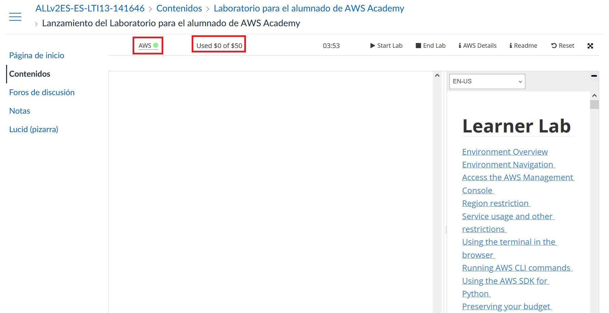
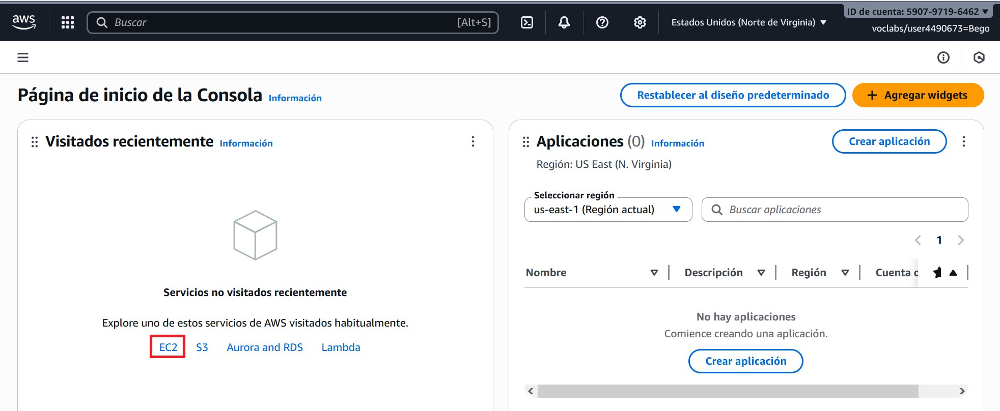

# Ubuntu Server en AWS Learner Lab

<span class="mi_h3">Revisiones</span>

|Revisión | Fecha| Descripción|
|---------|------|-------------|
|1.0 | 11-10-2025 | Adaptación de los materiales a markdown|


<span class="mi_h3">Instalar el servidor</span>

A continuación se describen los pasos para crear un servidor Ubuntu en un laboratorio de aprendizaje de AWS Academy.

1. Habrás recibido un correo electrónico de invitación, haz clic en el enlace y crea tu cuenta.

2. Entra al curso y haz clic en el enlace **Lanzamiento del laboratorio** (la primera vez que entres deberás aceptar los términos de uso). Para entrar en el futuro, utiliza el enlace: [https://www.awsacademy.com/vforcesite/LMS_Login](https://www.awsacademy.com/vforcesite/LMS_Login)
    
    
3. Haz clic en el botón **Start Lab** (el círculo cambiará a color amarillo mientras arranca el laboratorio).
    

4. Cuando el laboratorio haya arrancado, el círculo estará de color verde y aparecerá el saldo consumido y disponible.
    

5. Haz clic en AWS para acceder a la **Página de inicio de la Consola** cuya región es **North Virginia (us-east-1)**, la región por defecto de los laboratorios de aprendizaje.
    

6. Haz clic en **EC2** para acceder a la consola de instancias EC2.
    

7. Haz clic en **Lanzar la instancia**:
    

8. Escribe el nombre de la instancia y elige una **Amazon Machine Image (AMI)** en este caso Ubuntu (al seleccionar ubuntu nos aparece la Ubuntu Server 24.04 LTS que es apta para utilizar de forma gratuita).
    

9. Más abajo aparece el tipo de instancia:
    

10. Crea un par de claves:
    
    

11. Verás que el navegador descarga la clave automáticamente:
    

    !!!Note ""
        **Muy importante:** guarda el fichero de la clave en lugar seguro porque te hará falta para conectar a tu servidor por SSH.


12. Deja el resto de opciones como están y, en la parte derecha dentro del apartado **Resumen**, haz clic en el botón **Lanzar instancia**. Cuando la instancia termine de lanzarse aparecerá:
    

13. Haz clic en el botón **Conectarse a la instancia** para ver las instrucciones de conexión al servidor en la pestaña SSH:
    

14. Prueba la conexión. Para ello escribe en una ventana de comandos (el archivo .pem ha de estar en la carpeta desde la que lanzamos el comando) lo siguiente (sustituye el nombre de tu archiv .pem y el nombre de tu servidor):

    ```bash
    ssh -i claveAWS.pem ubuntu@ec2-13-218-241-87.compute-1.amazonaws.com
    ```

    


<span class="mi_h3">Instalar mySQL</span>


1.  Actualiza tu lista de paquetes:
    ```bash
    sudo apt update
    ```
2.  Instala el servidor MySQL y las dependencias necesarias:
    ```bash
    sudo apt install mysql-server
    ```
3.  Ejecuta el script de seguridad para establecer una contraseña de usuario root, eliminar usuarios anónimos y deshabilitar el inicio de sesión remoto del usuario root:
    ```bash
    sudo mysql_secure_installation
    ```
4.  Comprueba que el servicio de MySQL se esté ejecutando correctamente:
    ```bash
    sudo systemctl status mysql
    ```
    Si no está activo, puedes iniciarlo con `sudo systemctl start mysql`

### Permitir conexiones externas
`sudo nano /etc/mysql/mysql.conf.d/mysqld.cnf`

comentar `bind-address = 127.0.0.1`
y añadir `bind-address = 0.0.0.0`

```bash
sudo systemctl restart mysql
```

### Configurar el usuario MySQL para conectar desde fuera:
```bash
sudo mysql -u root -p (dejar la contraseña en blanco)
```

```sql
CREATE USER 'bpl2'@'%' IDENTIFIED BY 'holaHOLA01+';
GRANT ALL PRIVILEGES ON *.* TO 'bpl2'@'%';
FLUSH PRIVILEGES;
SHOW GRANTS FOR 'bpl2'@'%';
exit```

```bash
sudo ufw allow 3306
```

### Configura los Security Groups de AWS

1.  Ve a la consola de AWS y encuentra tu instancia EC2.
2.  Haz clic en la pestaña "Security" y luego en el enlace del Security Group asociado.
3.  Ve a la sección "Inbound rules" y haz clic en "Edit inbound rules".
4.  Haz clic en "Add rule" y configura:
    *   **Type**: Custom TCP
    *   **Port range**: 3306
    *   **Source**: Puedes especificar una IP concreta o `0.0.0.0/0` para permitir acceso desde cualquier lugar (menos seguro).
5.  Guarda las reglas.

### ss -tulnp | grep 3306

**antes de habilitar acceso externo**
```
tcp LISTEN 0 151 127.0.0.1:3306 0.0.0.0:*
tcp LISTEN 0 70 127.0.0.1:33060 0.0.0.0:*
```

**después de habilitar acceso externo**
```
tcp LISTEN 0 70 127.0.0.1:33060 0.0.0.0:*
tcp LISTEN 0 151 0.0.0.0:3306 0.0.0.0:*
```

# Conectar con dbeaver

**Error "Public Key Retrieval is not allowed" - how to fix**

1.  Open DBeaver and navigate to your database connection. Right-click on the connection and select "Edit Connection".
2.  Go to the “Driver Properties” section. Locate the property named "allowPublicKeyRetrieval”. By default, it is set to “false”. Change the value of "allowPublicKeyRetrieval” to “TRUE”.

**otras herramientas: Workbench, Sequel Pro o DataGrip.**


