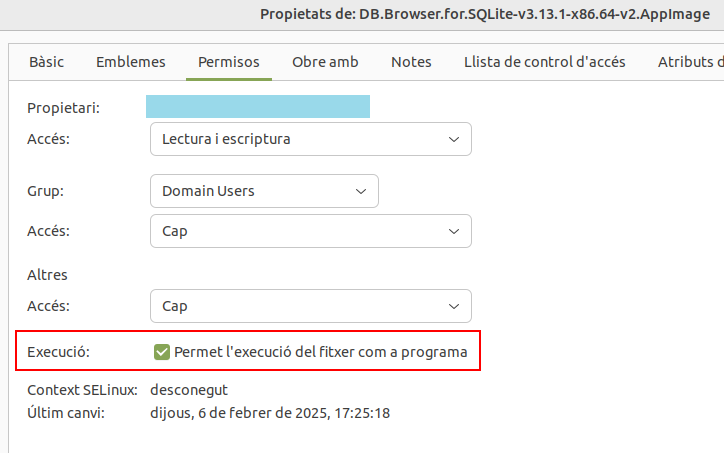
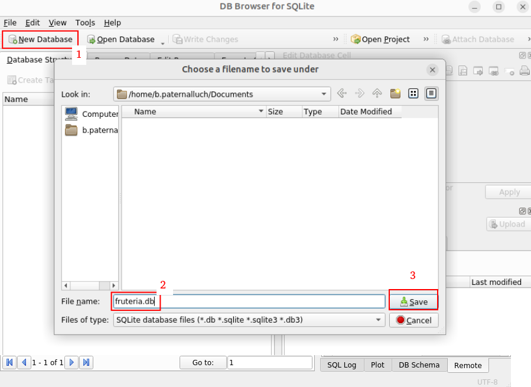
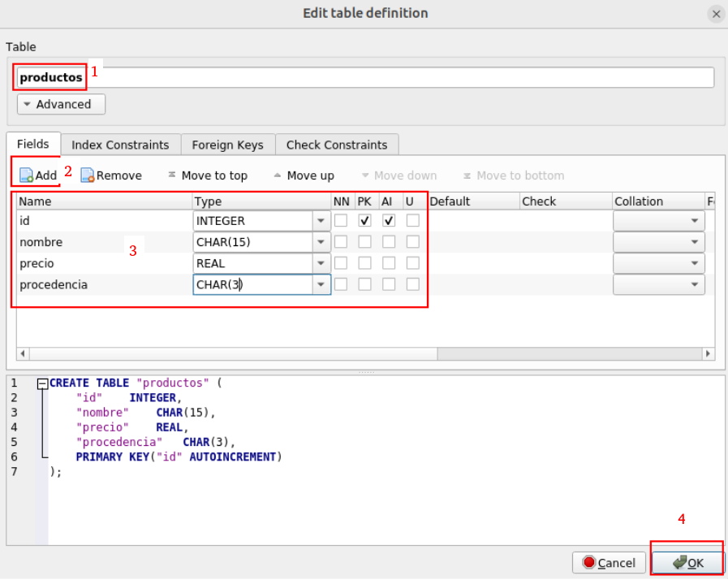
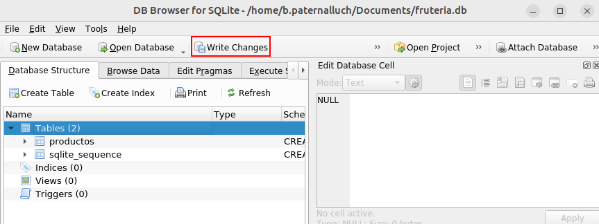
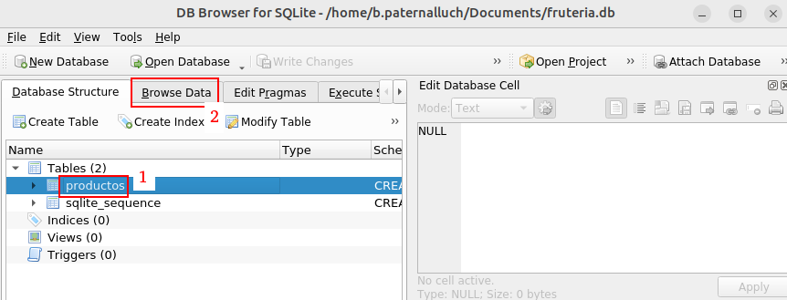
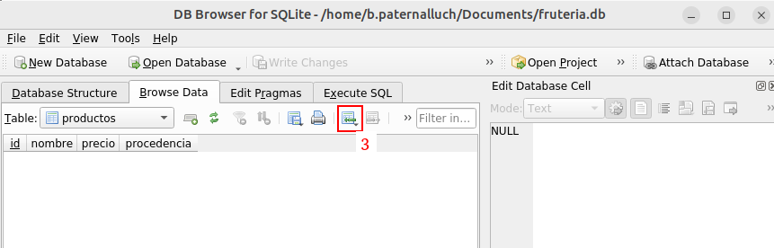
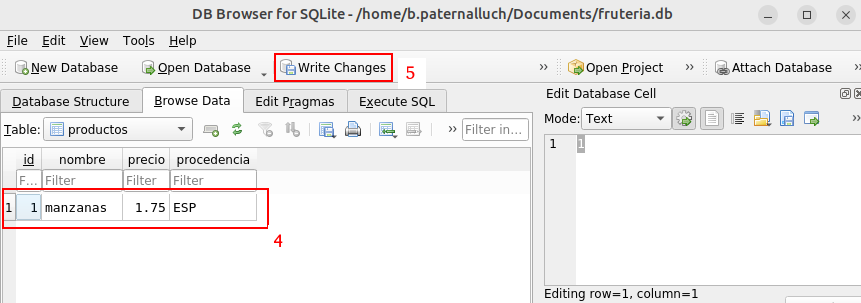

# DB Browser for SQLite

Siempre que desarrollamos aplicaciones que acceden a una base de datos es recomendable disponer de un visor / editor adecuado al sistema gestor de bases de datos con el que estamos trabajando para poder realizar comprobaciones. Con la herramienta DB Browser for SQLite podemos crear, modificar y consultar la estructura de una base de datos.

Se puede descargar desde el siguiente enlace 
[https://sqlitebrowser.org/dl/](https://sqlitebrowser.org/dl/)

Para Linux puedes descargar la AppImage que no necesita instalación desde: 
[https://sqlitebrowser.org/dl/#linux](https://sqlitebrowser.org/dl/#linux)

Una vez descargada, para poder ejecutarla con doble clic, sigue estos pasos:

- Haz clic con el botón derecho y entra en Propiedades.

- Entra en la pestaña Permisos.

- Marca la casilla Permite la ejecución del fichero como programa.

A continuación se describen los pasos a seguir para crear una base de datos llamada **fruteria.db** con una tabla llamada **productos** con la siguiente estructura:

| Campo | Tipo de Dato | Descripción |
| --- | --- | --- |
| id | INTEGER (PK, AUTOINCREMENT) | Identificador único. |
| nombre | CHAR(15) | Nombre. |
| precio | REAL | Precio (con decimales). |
| procedencia | CHAR(3) | Código de país de procedencia. |

---
**Crear la base de datos**

---
**Crear la tabla y los campos**

---
**Añadir información a la tabla**

