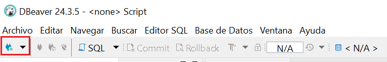
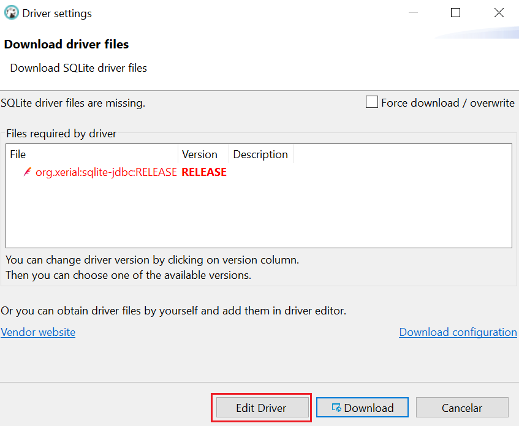
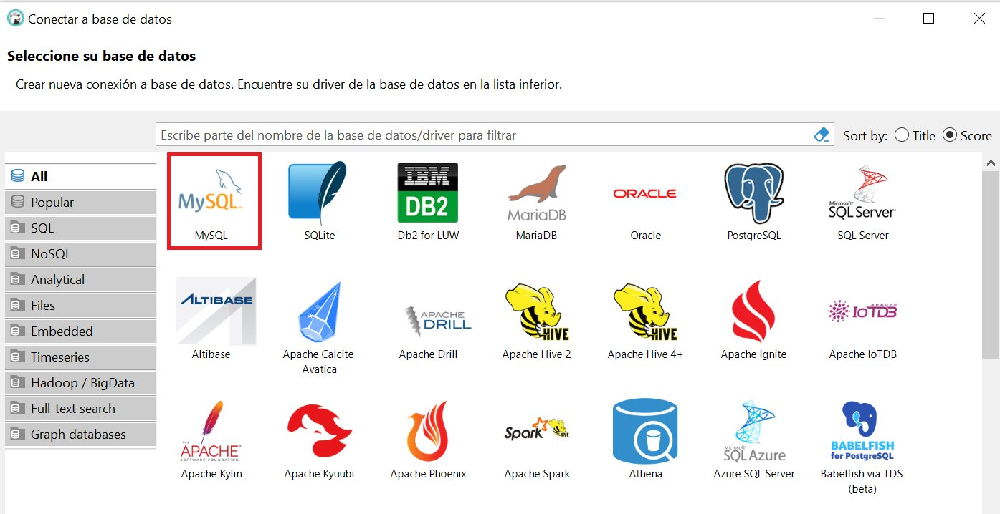
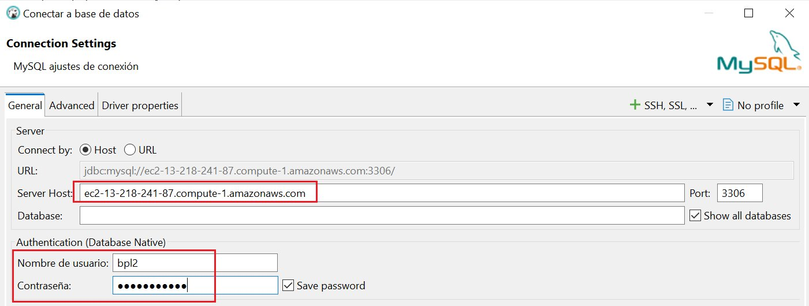
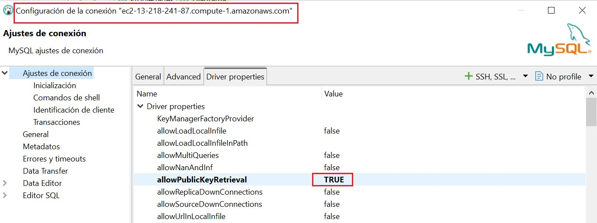
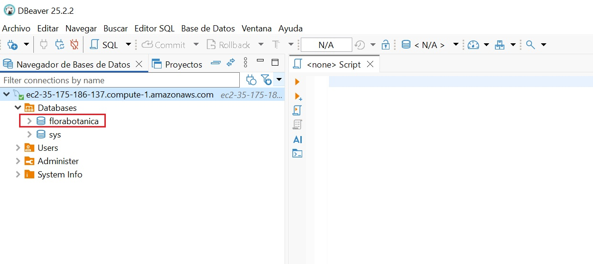

# DBeaver

Revisiones

|Revisión | Fecha| Descripción|
|---------|------|-------------|
|1.0 | 11-10-2025 | Adaptación de los materiales a markdown|

Introducción

**DBeaver** es una herramienta gráfica y gratuita que permite gestionar múltiples bases de datos de forma visual. Algunas de las acciones que podemos realizar con esta herramienta son las siguientes:

- Explorar la estructura de la base de datos (tablas, vistas, claves, relaciones…).

- Consultar datos.

- Modificar tablas, añadir registros o ejecutar scripts SQL sin salir del proyecto.

- Probar consultas antes de implementarlas en el programa.

<!--

## Conexión a SQLite

Los siguientes pasos ilustran como conectar a la BD **florabotanica.sqlite** de nuestro proyecto.

Para conectar a una base de datos, una vez iniciado el programa hay que hacer clic en el botón **Nueva conexión** (ícono de enchufe) o ir al menú `Archivo > Nueva conexión`.

Luego hay que seleccionar el tipo de base de datos a la que se quiere conectar. A continuación de describen los pasos para conectar a SQLite y a MySQL.

1. Selecciona el tipo de base de datos **SQlite** y pulsa **Siguiente**.

2. Introduce la ruta donde se encuentra la BD y haz clic en el botón *probar conexión*

    Si todo está correcto, verás un mensaje de éxito.  
    
    Si DBeaver necesita un controlador (driver), te lo ofrecerá para descargar automáticamente.
    

    Si la descarga falla, ve a https://github.com/xerial/sqlite-jdbc/releases y descarga el archivo **sqlite-jdbc-3.50.3.0.jar**

    

3. Haz clic en **Finalizar*. La nueva conexión aparecerá en el panel lateral izquierdo.  
Desde allí puedes:

- Ver tablas, vistas, funciones y procedimientos
- Ejecutar sentencias SQL
- Consultar y modificar registros
- Exportar datos en distintos formatos

FALTA
-->

Conexión a MySQL

Para conectar a una base de datos *MySQL* sigue estos pasos:

1. Haz clic en el botón `Nueva conexión` (ícono de enchufe) o entra al menú `Archivo > Nueva conexión`

2. Selecciona `MySQL` y pulsa en el botón `Siguiente`

3. Indica los datos del `servidor`, `usuario` y `contraseña`. Si quieres ver todas las bases de datos a las que el usuario puede acceder deja marcada la casilla `Show all database`y no indiques nada en la casilla `database` 

    !!!Note ""
        Si aparece `Error "Public Key Retrieval is not allowed"` haz clic con el botón derecho en tu conexión y selecciona `Editar conexión` luego ve a la pestaña `Driver Properties` y cambia la propiedad `allowPublicKeyRetrieval` a `TRUE` (por defecto está a `false`). Luego haz clic en el botón `Aceptar`.
        

4. Una vez conectado, verás las bases de datos del servidor

<!--
**otras herramientas: Workbench, Sequel Pro o DataGrip.**

-->
