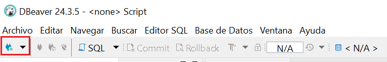
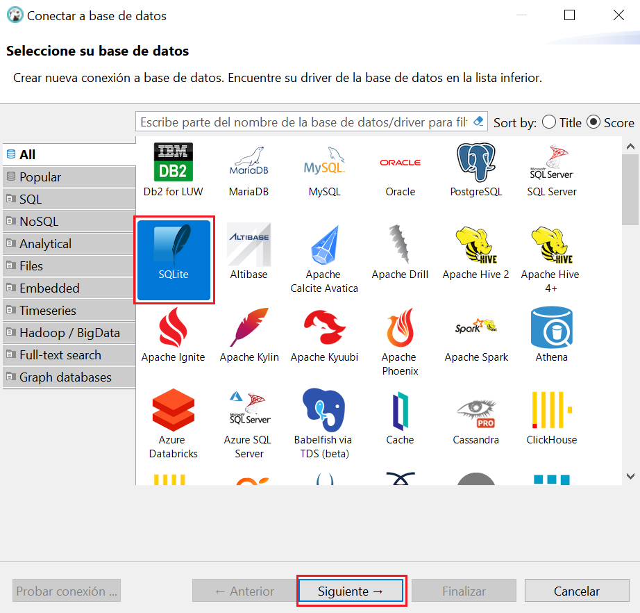
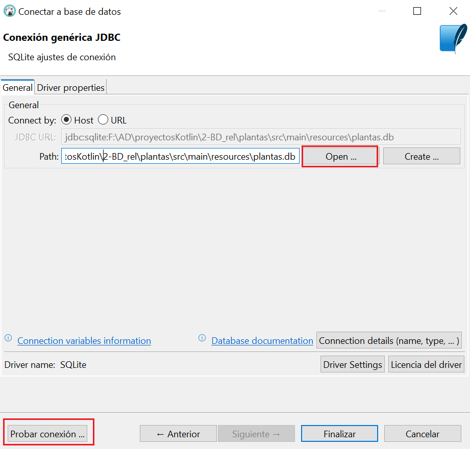
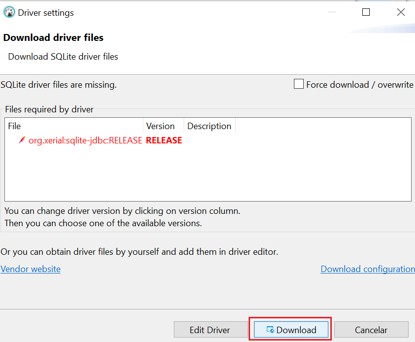

# DBeaver

**DBeaver** es una herramienta gráfica y gratuita que permite gestionar múltiples bases de datos de forma visual. Algunas de las acciones que podemos realizar con esta herramienta son las siguientes:

- Explorar la estructura de la base de datos (tablas, vistas, claves, relaciones…).

- Consultar datos.

- Modificar tablas, añadir registros o ejecutar scripts SQL sin salir del proyecto.

- Probar consultas antes de implementarlas en el programa.

Los siguientes pasos ilustran como conectar a la BD de ejemplo **plantas.db** que ya tenemos copiada a la carpeta **resources** de nuestro proyecto.

**1. Abre DBeaver**

Inicia el programa y haz clic en el botón **"Nueva conexión"** (ícono de enchufe) o ve al menú `Archivo > Nueva conexión`.

**2. Selecciona el tipo de base de datos**

En la ventana de selección, elige **SQlite** y pulsa **Siguiente**.

**3. Introduce la ruta donde se encuentra la BD y prueba conexión**

Haz clic en **"Probar conexión"**. Si todo está correcto, verás un mensaje de éxito.  
Si DBeaver necesita un controlador (driver), te lo ofrecerá para descargar automáticamente.

Si la descarga falla, ve a https://github.com/xerial/sqlite-jdbc/releases y descarga el archivo **sqlite-jdbc-3.50.3.0.jar**

**5. Finaliza y explora**

Haz clic en **"Finalizar"**. La nueva conexión aparecerá en el panel lateral izquierdo.  
Desde allí puedes:

- Ver tablas, vistas, funciones y procedimientos
- Ejecutar sentencias SQL
- Consultar y modificar registros
- Exportar datos en distintos formatos

