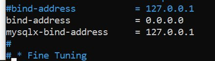

# Instalación de MySQL en EC2


<span class="mi_h3">Revisiones</span>

| Revisión | Fecha      | Descripción                                                       |
|----------|------------|-------------------------------------------------------------------|
| 1.0      | 10-11-2025 | Adaptación de los materiales a markdown                           |


<span class="mi_h3">Introducción</span>

MySQL es un sistema de gestión de bases de datos relacional (RDBMS), basado en el lenguaje SQL (Structured Query Language). Fue desarrollado originalmente por MySQL AB, luego adquirido por Sun Microsystems y actualmente es propiedad de Oracle Corporation. Se utiliza ampliamente en aplicaciones web y empresariales para almacenar, organizar y acceder a datos de manera eficiente.

MySQL funciona bajo una arquitectura cliente-servidor, en la cual el servidor MySQL es el componente encargado de almacenar, gestionar y proteger las bases de datos, mientras que los clientes son las aplicaciones o usuarios que se conectan a él para consultar o manipular los datos mediante el lenguaje SQL. 

En estos apuntes vamos a utilizar como servidor una instancia ECS de AWS, puedes ver como instalarlo desde  [AWS Learner Lab](AWSlab.html). Una vez tengas tu servidor funcionando, ya puedes instalar el servidor MySQL en él.

<span class="mi_h3">Instalación de MySQL en EC2</span>

**1. Conectar al servidor por ssh**

Para conectar, abre una ventana de comandos y escribe la instrucción siguiente (puedes utilizar el nombre del servidor o su IP pública)

    ssh -i nombre_clave ubuntu@nombre_IP_servidor

Asegurate que el archivo .pem está en la carpeta desde la que lanzas el comando y sustituye nombre_clave por el de tu archivo .pem y nombre_IP_servidor por el nombre o la IP pública de tu servidor. Por ejemplo:

    ssh -i bpl.pem ubuntu@100.25.102.165

**2. Actualiza la lista de paquetes del servidor**

```bash
    sudo apt update
```

**3. Instala el servidor MySQL y las dependencias necesarias**

```bash
    sudo apt install mysql-server
```

**4. Comprueba el estado del servicio**

Comprueba que el servicio de MySQL se esté ejecutando correctamente (Si no está activo, puedes iniciarlo con `sudo systemctl start mysql`)

```bash
    sudo systemctl status mysql
```


<span class="mi_h3">Crea un usuario y una base de datos</span>

**1. Entra al servidor**

Entra al servidor MySQL (cuando te pida contraseña déjala en blanco y pulsa `INTRO`)

```bash
    sudo mysql -u root -p 
```

**2. Crea el usuario con su contraseña** 

Ejecuta los comandos siguientes (el `%` indica que el usuario podrá conectarse desde cualquier sitio):

`CREATE USER '[usuario]'@'%' IDENTIFIED BY '[contraseña]';`

`GRANT ALL PRIVILEGES ON *.* TO '[usuario]'@'%';`

`FLUSH PRIVILEGES;`

`SHOW GRANTS FOR '[usuario]'@'%';`

Por ejemplo para el usuario `bpl3` y contraseña `holaHOLA01+` sería:

```sql
   CREATE USER 'bpl3'@'%' IDENTIFIED BY 'holaHOLA01+';
   GRANT ALL PRIVILEGES ON *.* TO 'bpl3'@'%';    
   FLUSH PRIVILEGES;
   SHOW GRANTS FOR 'bpl3'@'%';
```

**3. Crea la base de datos**

Por ejemplo (cambia el nombre del ejemplo por el de tu BD)

```sql
    create database florabotanica;
```

**4. Sal del servidor**

```bash
    exit
```


<span class="mi_h3">Configura MySQL y el servidor para permtir conexiones externas</span>

**1. Edita el fichero de configuración**

```bash
   sudo nano /etc/mysql/mysql.conf.d/mysqld.cnf
```
Comenta la línea `bind-address = 127.0.0.1`

Añade la línea `bind-address = 0.0.0.0`

El fichero de configuración debe quedar como se muestra en la siguiente imagen:



**2. Reinicia el servicio**

Rainicia y comprueba que ha arrancado correctamente

```bash
    sudo systemctl restart mysql
    sudo systemctl status mysql
```

**3. Configura el servidor para permitir tráfico entrante** 

Añade una regla en el servidor para permitir el tráfico entrante del puerto 3306. Para ello haz clic en la pestaña `Seguridad` y luego en el enlace de `Grupos de seguridad`


Entra en `Reglas de entrada`y haz clic en el botón `Editar reglas de entrada`


    
Haz clic en `Agregar regla`, configura el tipo, el puerto y la IP de origen `0.0.0.0/0` para permitir acceso desde cualquier lugar y por último haz clic en el botón `Guardar reglas`


En unos segundos aparecerá tu nueva regla en la lista


**4. Prueba de conexión**

Prueba a conectar a tu base de datos desde [DBeaver](dbeaver.html)


<span class="mi_h3">Exportación de la BD</span>

**1. Conecta al servidor**

Para ello utiliza el comando `ssh -i [nombre_certificado] ubuntu@[IP_nombre_servidor]` Por ejemplo:

```bash
    ssh -i bpl.pem ubuntu@100.25.102.165
```

**2. Crea un archivo con la exportación**

Para hacer un `dump` de la BD se utiliza el comando `mysqldump -u [usuario_BD] -p [opciones] [nombre_BD] > [nombre_archivo_dump]` Por ejemplo:

```bash
    mysqldump -u bpl3 -p --routines florabotanica > dump_florabotanica.sql
```

Después comprueba que el archivo se ha creado y cierra sesión con el comando `exit`

**Descarga el archivo** 

Para descargar al equipo local utiliza el comando `scp -i [nombre_certificado] ubuntu@[IP_nombre_servidor]:[ruta_archivo_dump] [ruta_destino]` Por ejemplo:

```bash
    scp -i bpl.pem ubuntu@100.25.102.165:/home/ubuntu/dump_florabotanica.sql /home/b.paternalluch/.
```

Para finalizar comprueba que el archivo se ha descargado correctamente y que su contenido es correcto.


---

<span class="mi_h3">Autoría</span>

Obra realizada por Begoña Paterna Lluch. Publicada bajo licencia [Creative Commons Atribución/Reconocimiento-CompartirIgual 4.0 Internacional](https://creativecommons.org/licenses/by-sa/4.0/)


