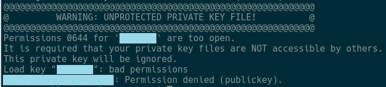
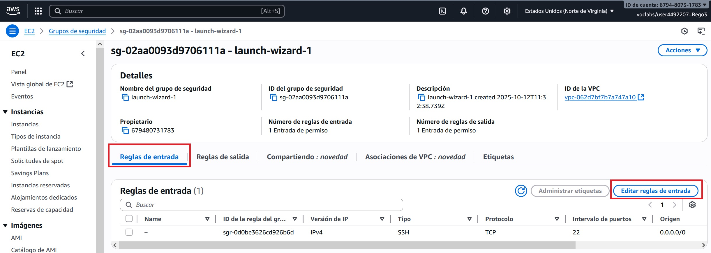
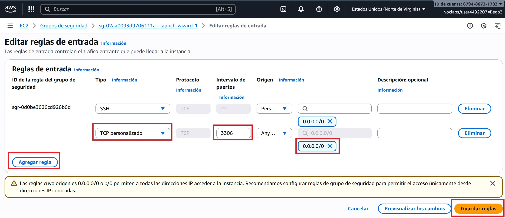

# MySQL


<span class="mi_h3">Revisiones</span>

| Revisión | Fecha      | Descripción                             |
|----------|------------|-----------------------------------------|
| 1.0      | 10-11-2025 | Adaptación de los materiales a markdown |
| 1.0      | 15-01-2026 | Instalación en Docker                   |


## 1. Introducción

MySQL es un sistema de gestión de bases de datos relacional (RDBMS), basado en el lenguaje SQL (Structured Query Language). Fue desarrollado originalmente por MySQL AB, luego adquirido por Sun Microsystems y actualmente es propiedad de Oracle Corporation. Se utiliza ampliamente en aplicaciones web y empresariales para almacenar, organizar y acceder a datos de manera eficiente.

MySQL funciona bajo una arquitectura cliente-servidor, en la cual el servidor MySQL es el componente encargado de almacenar, gestionar y proteger las bases de datos, mientras que los clientes son las aplicaciones o usuarios que se conectan a él para consultar o manipular los datos mediante el lenguaje SQL. 

En estos apuntes vamos a utilizar como servidor una instancia ECS de AWS, puedes ver como instalarlo desde  [AWS Learner Lab](AWSlab.html). Una vez tengas tu servidor funcionando, ya puedes instalar el servidor MySQL en él.


## 2. Instalación en EC2

**1. Conectar al servidor por ssh**

Para conectar, abre una ventana de comandos y asegurate que el archivo .pem está en la carpeta desde la que lanzas el siguiente comando (puedes utilizar el nombre del servidor o su IP pública):
```
ssh -i [nombre_clave] ubuntu@[nombre_IP_servidor]
```

!!!Note ""
    Si aparece el siguiente aviso:

    
    
    Ejecuta el comando siguiente:
    ```
    chmod 400 [nombre_clave]
    ```

**2. Actualiza la lista de paquetes del servidor**
```bash
sudo apt update
```

**3. Instala el servidor MySQL y las dependencias necesarias**
```bash
sudo apt install mysql-server
```

**4. Comprueba el estado del servicio**

Comprueba que el servicio de MySQL se esté ejecutando correctamente (Si no está activo, puedes iniciarlo con `sudo systemctl start mysql`)

```bash
sudo systemctl status mysql
```


<span class="mi_h3">Crea un usuario y una base de datos</span>

**1. Entra al servidor**

Entra al servidor MySQL (cuando te pida contraseña déjala en blanco y pulsa `INTRO`)

```bash
sudo mysql -u root -p 
```

**2. Crea el usuario con su contraseña** 

Ejecuta los comandos siguientes (el `%` indica que el usuario podrá conectarse desde cualquier sitio). Cambia `[tu_usuario]` y `[tu_contraseña]` por el usuario y contraseña que quieras:

```sql
CREATE USER '[tu_usuario]'@'%' IDENTIFIED BY '[tu_contraseña]';
GRANT ALL PRIVILEGES ON *.* TO '[tu_usuario]'@'%';    
FLUSH PRIVILEGES;
SHOW GRANTS FOR '[tu_usuario]'@'%';
```

**3. Crea la base de datos**

Por ejemplo (cambia el nombre del ejemplo por el de tu BD)

```sql
create database [nombre_BD];
```

**4. Sal del servidor**

```bash
exit
```


<span class="mi_h3">Configura MySQL y el servidor para permtir conexiones externas</span>

**1. Edita el fichero de configuración**

```bash
sudo nano /etc/mysql/mysql.conf.d/mysqld.cnf
```

Busca la instrucción siguiente:
```
bind-address = 127.0.0.1
```
Modifícalo para que quede así:
```
# bind-address = 127.0.0.1
bind-address = 0.0.0.0
```
Guarda los cambios, reinicia el servicio y comprueba que ha arrancado correctamente

```
sudo systemctl restart mysql
sudo systemctl status mysql
```

**2. Configura el servidor para permitir tráfico entrante** 

Añade una regla en el servidor para permitir el tráfico entrante del puerto 3306. Para ello haz clic en la pestaña `Seguridad` y luego en el enlace de `Grupos de seguridad`


Entra en `Reglas de entrada`y haz clic en el botón `Editar reglas de entrada`


    
Haz clic en `Agregar regla`, configura el tipo, el puerto y la IP de origen `0.0.0.0/0` para permitir acceso desde cualquier lugar y por último haz clic en el botón `Guardar reglas`



En unos segundos aparecerá tu nueva regla en la lista


**3. Prueba de conexión**

Prueba a conectar a tu base de datos desde [DBeaver](dbeaver.html)


<span class="mi_h3">Exportación de la BD</span>

**1. Conecta al servidor por ssh**

Para conectar, abre una ventana de comandos y asegurate que el archivo .pem está en la carpeta desde la que lanzas el siguiente comando (puedes utilizar el nombre del servidor o su IP pública):
```
ssh -i [nombre_clave] ubuntu@[nombre_IP_servidor]
```

**2. Crea un archivo con la exportación**

Para hacer un `dump` de la BD ejecuta ():

```bash
mysqldump -u [tu_usuario] -p --routines [tu_BD] > [nombre_archivo_dump].sql
```

Después comprueba que el archivo se ha creado y cierra sesión con el comando `exit`

**3. Descarga el archivo** 

Para descargar al equipo local utiliza el comando (luego comprueba que el archivo se ha descargado correctamente y que su contenido es correcto):

```bash
scp -i [nombre_certificado] ubuntu@[IP_nombre_servidor]:[ruta_archivo_dump].sql [ruta_destino]
```


## 3. Instalación en Docker

Partimos de un sistema operativo con Docker ya funcionando y listo para poder crear contenedores.

**Algunos comandos útiles para manejarnos en docker**

* Comprobar si Docker está instalado en nuestro sistema operativo

```
   docker --version
```

* Ver los contenedores creados (incluidos los detenidos)

```
   docker ps -a
```

* Iniciar un contenedor

```
   docker start <nombre_o_id_del_contenedor>
```

* Detener un contenedor

```
   docker stop <nombre_o_id_del_contenedor>
```

* Eliminar un contenedor (detenerlo antes)

```
   docker rm <nombre_o_id_del_contenedor>
```


**Crear el contenedor MySQL**

A continuación se describen los pasos para crear un contenedor que hará de servidor MySQL. En la configuración se establece la contraseña del usuario `root` para el servidor y se crea una base de datos llamada `florabotanica` con un usuario y contraseña para acceder a ella.

Crear archivo llamado `docker-compose.yml` con el contenido siguiente:

```
version: '3.8'

services:
    mysql:
        image: mysql:8.0
        container_name: mysql-server
        ports:
            - "3306:3306"
        environment:
            MYSQL_ROOT_PASSWORD: <password>
            MYSQL_DATABASE: florabotanica
            MYSQL_USER: flora
            MYSQL_PASSWORD: <password>
```

Desde una ventana de terminal o utilizando la línea de comandos ejecutar:

```
docker compose up -d
```


**Crear tabla una tabla en la base de datos**

Para entrar al contenedor ejecutar:

```
docker exec -it mysql-server bash
```

Conectarse a la base de datos `florabotanica` con el usuario `flora` (pedirá contraseña) con el comando:

```
mysql -u flora -p florabotanica
```

Crear una tabla llamada `plantas` ejecutando las líneas:

```
CREATE TABLE plantas (
id_planta INT AUTO_INCREMENT PRIMARY KEY,
nombre TEXT NOT NULL,
tipo TEXT NOT NULL,
foto TEXT,
altura DOUBLE) ENGINE=InnoDB;
```

Comprobar que se ha creado correctamente con el comando:

```
SHOW TABLES;
```

Realizar alguna inserción, por ejemplo:

```
INSERT INTO plantas (nombre, tipo, altura) VALUES ('Rosa', 'Flor', 1.2);
```

Comprobar que la tabla contiene los datos con el comando:

```
SELECT * FROM plantas;
```

**Exportación de nuestra base de datos**

El siguiente comando crea un archivo llamado `florabotanica.sql` con la estructura y datos de la base de datos llamada `florabotanica` que está alojada en un servidor MySQL en un contenedor Docker llamado `mysql-server`. Al ejecutar el comando (desde terminal o línea de comandos) el sistema pedirá la contraseña de root y el archivo se creará en la carpeta desde donde nos encontramos):

```
docker exec -i mysql-server mysqldump --no-tablespaces -u root -p florabotanica > florabotanica.sql
```

**Importación de nuestra base de datos (opción 1)**
   
Para importar en otro contenedor con un servidor MySQL la estructura y datos de la base de datos llamada `florabotanica`, ejecutar desde terminal o línea de comandos en la carpeta donde está ubicado el archivo `florabotanica.sql` el siguiente comando (pedirá la contraseña de root). Se asume que el contendor se llama `mysql-server2`:

```
docker exec -i mysql-server2 mysql -u root -p florabotanica < florabotanica.sql
```

**Importación de nuestra base de datos (opción 2)**

Si la opción anterior da problemas de permisos seguir estos pasos (se asumen los mismos nombres de contenedor, base de datos y fichero que en la opción anterior):

Abrir terminal o cmd y copiar el archivo .sql al contenedor

```
docker cp florabotanica.sql mysql-server2:/tmp/florabotanica.sql
```

Abrir shell Bash dentro del contenedor:

```
docker exec -it mysql-server bash
```

Entrar a mysql como root

```
mysql -p
```

Crear BD y restaurar

```
mysql> CREATE DATABASE florabotanica;
mysql> USE florabotanica;
mysql> SOURCE /tmp/florabotanica.sql;
```


---

<span class="mi_h3">Autoría</span>

Obra realizada por Begoña Paterna Lluch. Publicada bajo licencia [Creative Commons Atribución/Reconocimiento-CompartirIgual 4.0 Internacional](https://creativecommons.org/licenses/by-sa/4.0/)

---